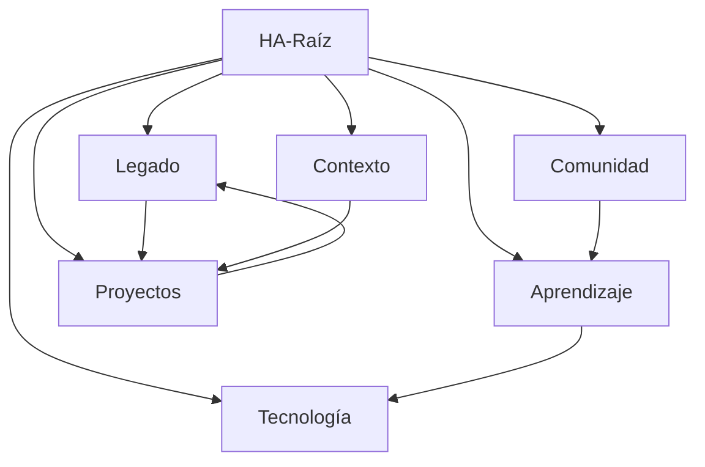

# HA-Raíz

El agente raíz coordina las 6 dimensiones y mantiene coherencia del sistema.

## Dimensiones

- [[1-legado]] — Driver estratégico
- [[2-comunidad]] — Habilitador social
- [[3-aprendizaje]] — Motor evolutivo
- [[4-tecnología]] — Infraestructura
- [[5-contexto]] — Sensibilidad del entorno
- [[6-proyectos]] — Ejecución

## Funciones del Agente Raíz

1. Coordinar agentes dimensionales
2. Gestionar permisos y trazabilidad
3. Asegurar alineación con el [[1-legado]]
4. Activar escenarios desde [[5-contexto]]
5. Orquestar [[6-proyectos]]

## Conexiones Clave

---

*Este nodo es el punto central del grafo HA*
