```
{nombre-proyecto}/
│
├── .ha/                              # Configuración HA
│   ├── config.yaml
│   ├── agents/
│   └── mcp.json
│
├── ha_manifests/                     # MANIFIESTOS DE GOBERNANZA
│   ├── legacy_manifest.json
│   ├── community_graph.json
│   ├── okrs.yaml
│   ├── policies.yaml
│   ├── skills.toml
│   ├── review_cadence.yaml
│   └── memory_schema.json
│
├── ha_memory/                        # SISTEMA DE MEMORIA
│   ├── episodic.jsonl
│   ├── semantic.jsonl
│   ├── procedural.jsonl
│   └── metacognitive.jsonl
│
├── ha_ontology/                      # ONTOLOGÍA FORMAL
│   ├── ha.ttl
│   └── rules.yaml
│
├── 00-legacy/                        # DIMENSIÓN: LEGADO
│   ├── README.md                     # Índice de la dimensión
│   ├── vision/
│   │   ├── vision_statement.md       # Declaración de visión
│   │   ├── future_state.md           # Estado futuro deseado
│   │   └── north_star.yaml           # Métricas norte
│   ├── mission/
│   │   ├── mission_statement.md      # Declaración de misión
│   │   ├── purpose.md                # Propósito fundamental
│   │   └── scope.md                  # Alcance del proyecto
│   ├── goals/
│   │   ├── strategic_goals.yaml      # Objetivos estratégicos
│   │   ├── okrs.yaml                 # OKRs del proyecto
│   │   └── kpis.yaml                 # Indicadores clave
│   ├── values/
│   │   ├── core_values.md            # Valores fundamentales
│   │   ├── principles.md             # Principios rectores
│   │   └── code_of_conduct.md        # Código de conducta
│   └── impact/
│       ├── impact_thesis.md          # Tesis de impacto
│       ├── beneficiaries.yaml        # Beneficiarios
│       ├── success_criteria.yaml     # Criterios de éxito
│       └── impact_metrics.yaml       # Métricas de impacto
│
├── 01-community/                     # DIMENSIÓN: COMUNIDAD
│   ├── README.md
│   ├── stakeholders/
│   │   ├── stakeholders.db.yaml      # [Database] Registro de stakeholders
│   │   ├── personas/                 # Arquetipos de usuarios
│   │   │   └── {persona}.md
│   │   ├── engagement_matrix.yaml    # Matriz de engagement
│   │   └── power_interest.md         # Análisis poder/interés
│   ├── team/
│   │   ├── team.db.yaml              # [Database] Miembros del equipo
│   │   ├── roles.yaml                # Definición de roles
│   │   ├── responsibilities.yaml     # RACI matrix
│   │   ├── org_chart.md              # Estructura organizacional
│   │   └── onboarding/               # Guías de onboarding
│   │       └── checklist.md
│   ├── network/
│   │   ├── partners.yaml             # Socios estratégicos
│   │   ├── collaborators.yaml        # Colaboradores externos
│   │   ├── communities.yaml          # Comunidades relacionadas
│   │   └── ecosystem_map.md          # Mapa del ecosistema
│   ├── governance/
│   │   ├── governance_model.md       # Modelo de gobernanza
│   │   ├── decision_rights.yaml      # Derechos de decisión
│   │   ├── voting_rules.yaml         # Reglas de votación
│   │   └── committees.yaml           # Comités y grupos
│   └── communication/
│       ├── channels.yaml             # Canales de comunicación
│       ├── cadence.yaml              # Cadencia de reuniones
│       ├── templates/                # Plantillas de comunicación
│       │   ├── status_update.md
│       │   ├── announcement.md
│       │   └── meeting_notes.md
│       └── stakeholder_comms.yaml    # Plan de comunicación
│
├── 02-learning/                      # DIMENSIÓN: APRENDIZAJE
│   ├── README.md
│   ├── knowledge-base/
│   │   ├── index.md                  # Índice del conocimiento
│   │   ├── concepts/                 # Conceptos clave
│   │   │   └── {concept}.md
│   │   ├── guides/                   # Guías y tutoriales
│   │   │   └── {guide}.md
│   │   ├── faqs.md                   # Preguntas frecuentes
│   │   └── glossary.yaml             # Glosario de términos
│   ├── skills-matrix/
│   │   ├── skills.db.yaml            # [Database] Inventario de skills
│   │   ├── competency_model.yaml     # Modelo de competencias
│   │   ├── team_skills.yaml          # Skills por persona
│   │   └── gaps_analysis.md          # Análisis de brechas
│   ├── training/
│   │   ├── training_plan.yaml        # Plan de capacitación
│   │   ├── courses/                  # Cursos y materiales
│   │   │   └── {course}/
│   │   │       ├── syllabus.md
│   │   │       └── materials/
│   │   ├── certifications.yaml       # Certificaciones
│   │   └── learning_paths.yaml       # Rutas de aprendizaje
│   ├── lessons-learned/
│   │   ├── lessons.db.jsonl          # [Database] Registro de lecciones
│   │   ├── retrospectives/           # Retrospectivas
│   │   │   └── {date}_retro.md
│   │   ├── post_mortems/             # Post-mortems
│   │   │   └── {incident}.md
│   │   └── best_practices.md         # Mejores prácticas
│   └── research/
│       ├── research_agenda.yaml      # Agenda de investigación
│       ├── papers/                   # Papers y referencias
│       │   └── {paper}.md
│       ├── experiments/              # Experimentos
│       │   └── {experiment}/
│       │       ├── hypothesis.md
│       │       └── results.md
│       └── benchmarks/               # Benchmarks
│           └── {benchmark}.yaml
│
├── 03-technology/                    # DIMENSIÓN: TECNOLOGÍA
│   ├── README.md
│   ├── architecture/
│   │   ├── overview.md               # Vista general
│   │   ├── c4_model/                 # Diagramas C4
│   │   │   ├── context.md
│   │   │   ├── containers.md
│   │   │   └── components.md
│   │   ├── adrs/                     # [Database] Architecture Decision Records
│   │   │   ├── adr_index.yaml        # Índice de ADRs
│   │   │   ├── template.md           # Plantilla ADR
│   │   │   └── {NNN}-{title}.md      # ADRs individuales
│   │   ├── patterns.md               # Patrones arquitectónicos
│   │   └── diagrams/                 # Diagramas adicionales
│   │       └── {diagram}.mermaid
│   ├── stack/
│   │   ├── stack_overview.yaml       # Vista del stack
│   │   ├── languages.yaml            # Lenguajes de programación
│   │   ├── frameworks.yaml           # Frameworks utilizados
│   │   ├── libraries.yaml            # Bibliotecas principales
│   │   └── versions.yaml             # Versiones y compatibilidad
│   ├── infrastructure/
│   │   ├── infra_overview.md         # Vista de infraestructura
│   │   ├── environments.yaml         # Ambientes (dev/staging/prod)
│   │   ├── cloud_resources.yaml      # Recursos cloud
│   │   ├── networking.md             # Configuración de red
│   │   ├── security.md               # Configuración de seguridad
│   │   └── iac/                      # Infrastructure as Code
│   │       ├── terraform/
│   │       └── pulumi/
│   ├── tools/
│   │   ├── development.yaml          # Herramientas de desarrollo
│   │   ├── ci_cd.yaml                # CI/CD configuration
│   │   ├── monitoring.yaml           # Herramientas de monitoreo
│   │   ├── testing.yaml              # Herramientas de testing
│   │   └── setup_guides/             # Guías de setup
│   │       └── {tool}_setup.md
│   └── integrations/
│       ├── integrations_map.yaml     # Mapa de integraciones
│       ├── apis/                     # APIs externas
│       │   └── {api}/
│       │       ├── overview.md
│       │       └── config.yaml
│       ├── webhooks.yaml             # Webhooks configurados
│       └── data_flows.md             # Flujos de datos
│
├── 04-context/                       # DIMENSIÓN: CONTEXTO
│   ├── README.md
│   ├── environment/
│   │   ├── market_analysis.md        # Análisis de mercado
│   │   ├── competitive_landscape.md  # Panorama competitivo
│   │   ├── regulatory.md             # Marco regulatorio
│   │   ├── trends.yaml               # Tendencias relevantes
│   │   └── pestel.md                 # Análisis PESTEL
│   ├── constraints/
│   │   ├── technical.yaml            # Restricciones técnicas
│   │   ├── business.yaml             # Restricciones de negocio
│   │   ├── legal.yaml                # Restricciones legales
│   │   ├── resource.yaml             # Restricciones de recursos
│   │   └── timeline.yaml             # Restricciones de tiempo
│   ├── assumptions/
│   │   ├── assumptions.db.yaml       # [Database] Registro de supuestos
│   │   ├── validation_status.yaml    # Estado de validación
│   │   └── assumption_log.md         # Historial de cambios
│   ├── risks/
│   │   ├── risk_register.db.yaml     # [Database] Registro de riesgos
│   │   ├── risk_matrix.md            # Matriz probabilidad/impacto
│   │   ├── mitigation_plans/         # Planes de mitigación
│   │   │   └── {risk}_mitigation.md
│   │   └── risk_reviews/             # Revisiones periódicas
│   │       └── {date}_review.md
│   └── opportunities/
│       ├── opportunities.yaml        # Oportunidades identificadas
│       ├── swot.md                   # Análisis SWOT
│       ├── growth_vectors.md         # Vectores de crecimiento
│       └── partnerships.yaml         # Oportunidades de alianzas
│
├── 05-projects/                      # DIMENSIÓN: PROYECTOS
│   ├── README.md
│   ├── active/
│   │   ├── projects.db.yaml          # [Database] Proyectos activos
│   │   └── {project-slug}/           # Carpeta por proyecto
│   │       ├── project_brief.md      # Brief del proyecto
│   │       ├── charter.yaml          # Project charter
│   │       ├── status.yaml           # Estado actual
│   │       ├── tasks.yaml            # Tareas del proyecto
│   │       ├── resources.yaml        # Recursos asignados
│   │       └── deliverables/         # Entregables
│   ├── backlog/
│   │   ├── backlog.db.yaml           # [Database] Backlog de proyectos
│   │   ├── prioritization.yaml       # Criterios de priorización
│   │   └── ideas/                    # Ideas y propuestas
│   │       └── {idea}.md
│   ├── completed/
│   │   ├── archive_index.yaml        # Índice de proyectos completados
│   │   └── {project-slug}/           # Archivos de proyectos cerrados
│   │       ├── final_report.md
│   │       ├── lessons_learned.md
│   │       └── artifacts/
│   └── milestones/
│       ├── milestones.db.yaml        # [Database] Hitos principales
│       ├── roadmap.yaml              # Roadmap general
│       ├── dependencies.yaml         # Dependencias entre hitos
│       └── timeline.md               # Línea de tiempo visual
│
├── timeline/                         # EJE: TIEMPO
│   ├── {YYYY}/
│   │   ├── {MM}/
│   │   │   └── {YYYY-MM-DD}.md
│   │   └── annual_review.md
│   └── changelog.md
│
├── contributions/                    # PRUEBA DE CONTRIBUCIÓN
│   ├── contributions.db.jsonl
│   └── contributors/
│       └── {contributor}.yaml
│
├── conversations/                    # CONVERSACIONES/GRABACIONES
│   ├── meetings/
│   │   └── {YYYY-MM-DD}_{topic}.md
│   ├── interviews/
│   └── recordings/
│
├── daily/                            # NOTAS DIARIAS
│   └── {YYYY-MM-DD}.md
│
├── reports/                          # REPORTES AUDITABLES
│   ├── weekly/
│   ├── monthly/
│   ├── quarterly/
│   └── annual/
│
├── admin/                            # ADMINISTRACIÓN
│   ├── contracts/
│   ├── invoices/
│   ├── budget/
│   └── compliance/
│
├── src/                              # CÓDIGO FUENTE
│   └── ...
│
├── docs/                             # DOCUMENTACIÓN PÚBLICA
│   └── ...
│
└── assets/                           # RECURSOS
    ├── images/
    ├── templates/
    └── branding/

```

---

## Formato de Archivos Database (.db.yaml / .db.jsonl)

Los elementos marcados como [Database] usan un formato estructurado para facilitar queries:

### Ejemplo: `stakeholders.db.yaml`

```yaml
# 01-community/stakeholders/stakeholders.db.yaml
_meta:
  schema_version: "1.0"
  last_updated: 2025-01-05
  primary_key: id

records:
  - id: STK-001
    name: "Cliente Principal"
    type: external
    category: customer
    influence: high
    interest: high
    contact: "email@example.com"
    engagement_strategy: "Monthly reviews"
    tags: [primary, decision-maker]

  - id: STK-002
    name: "Equipo de TI"
    type: internal
    category: implementer
    influence: medium
    interest: high
    contact: "it-team@company.com"
    engagement_strategy: "Weekly standups"
    tags: [technical, core-team]

```

### Ejemplo: `lessons.db.jsonl`

```
{"id":"LL-001","date":"2025-01-05","project":"proj-alpha","category":"technical","title":"API rate limiting","description":"Implementar rate limiting desde el inicio","impact":"high","status":"applied"}
{"id":"LL-002","date":"2025-01-04","project":"proj-beta","category":"process","title":"Early stakeholder alignment","description":"Alinear stakeholders antes de comenzar desarrollo","impact":"medium","status":"documented"}

```

### Ejemplo: `risk_register.db.yaml`

```yaml
# 04-context/risks/risk_register.db.yaml
_meta:
  schema_version: "1.0"
  last_updated: 2025-01-05

records:
  - id: RSK-001
    title: "Dependencia de proveedor único"
    category: technical
    probability: medium    # low | medium | high
    impact: high           # low | medium | high
    risk_score: 6          # 1-9 (prob x impact)
    status: active         # identified | active | mitigated | closed
    owner: "Oscar"
    mitigation: "Evaluar alternativas, documentar APIs"
    contingency: "Plan de migración preparado"
    review_date: 2025-02-01
    created: 2025-01-05
    tags: [vendor, critical]

```

### Ejemplo: `adrs/adr_index.yaml`

```yaml
# 03-technology/architecture/adrs/adr_index.yaml
_meta:
  schema_version: "1.0"
  last_updated: 2025-01-05
  template: template.md

records:
  - id: "001"
    title: "Usar PostgreSQL como base de datos principal"
    status: accepted      # proposed | accepted | deprecated | superseded
    date: 2025-01-01
    deciders: [Oscar, Team]
    tags: [database, infrastructure]

  - id: "002"
    title: "Adoptar arquitectura de microservicios"
    status: proposed
    date: 2025-01-05
    deciders: [Oscar]
    supersedes: null
    tags: [architecture]

```

---

## Convenciones de Nombrado

|Tipo|Convención|Ejemplo|
|---|---|---|
|Carpetas dimensión|`{NN}-{nombre}`|`00-legacy/`|
|Subcarpetas|`kebab-case`|`knowledge-base/`|
|Archivos database|`{nombre}.db.{ext}`|`team.db.yaml`|
|ADRs|`{NNN}-{titulo}.md`|`001-usar-postgresql.md`|
|Notas diarias|`{YYYY-MM-DD}.md`|`2025-01-05.md`|
|Retrospectivas|`{YYYY-MM-DD}_retro.md`|`2025-01-05_retro.md`|
|Proyectos|`{project-slug}/`|`upu-postal-metrics/`|

---

---

# Horizons Architecture - Mapa de Relaciones entre Dimensiones

## Visión General del Sistema

```
┌─────────────────────────────────────────────────────────────────────────────────┐
│                           HORIZONS ARCHITECTURE                                  │
│                         Sistema de 6 Dimensiones                                 │
├─────────────────────────────────────────────────────────────────────────────────┤
│                                                                                  │
│    ┌──────────────┐         ┌──────────────┐         ┌──────────────┐          │
│    │  00-LEGACY   │────────▶│ 05-PROJECTS  │◀────────│ 04-CONTEXT   │          │
│    │   (WHY)      │         │   (WHAT)     │         │   (WHERE)    │          │
│    └──────┬───────┘         └──────┬───────┘         └──────┬───────┘          │
│           │                        │                        │                   │
│           │         ┌──────────────┼──────────────┐         │                   │
│           │         │              │              │         │                   │
│           ▼         ▼              ▼              ▼         ▼                   │
│    ┌──────────────┐         ┌──────────────┐         ┌──────────────┐          │
│    │ 01-COMMUNITY │◀───────▶│ 02-LEARNING  │◀───────▶│ 03-TECHNOLOGY│          │
│    │   (WHO)      │         │   (HOW)      │         │   (WITH)     │          │
│    └──────────────┘         └──────────────┘         └──────────────┘          │
│                                                                                  │
│    ┌─────────────────────────────────────────────────────────────────────────┐  │
│    │                         EJES TRANSVERSALES                              │  │
│    │  timeline/ │ contributions/ │ conversations/ │ daily/ │ reports/       │  │
│    └─────────────────────────────────────────────────────────────────────────┘  │
│                                                                                  │
│    ┌─────────────────────────────────────────────────────────────────────────┐  │
│    │                         SISTEMAS DE SOPORTE                             │  │
│    │  .ha/ │ ha_manifests/ │ ha_memory/ │ ha_ontology/                       │  │
│    └─────────────────────────────────────────────────────────────────────────┘  │
│                                                                                  │
└─────────────────────────────────────────────────────────────────────────────────┘

```

---

## Matriz de Relaciones Inter-Dimensionales

### Relaciones Primarias (Flujo Directo)

|Origen|Destino|Tipo de Relación|Descripción|
|---|---|---|---|
|00-Legacy/Vision|05-Projects/Milestones|`defines`|La visión define los hitos estratégicos|
|00-Legacy/Goals|05-Projects/Active|`drives`|Los objetivos impulsan los proyectos activos|
|00-Legacy/Values|01-Community/Governance|`shapes`|Los valores dan forma a la gobernanza|
|00-Legacy/Impact|05-Projects/Completed|`measures`|El impacto mide los proyectos completados|
|01-Community/Team|05-Projects/Active|`executes`|El equipo ejecuta los proyectos|
|01-Community/Stakeholders|04-Context/Constraints|`imposes`|Los stakeholders imponen restricciones|
|01-Community/Team|02-Learning/Skills-Matrix|`has`|El equipo tiene competencias registradas|
|02-Learning/Knowledge-Base|03-Technology/Architecture|`documents`|El KB documenta la arquitectura|
|02-Learning/Lessons-Learned|05-Projects/Completed|`extracts-from`|Las lecciones se extraen de proyectos|
|03-Technology/Stack|05-Projects/Active|`enables`|El stack habilita los proyectos|
|03-Technology/Infrastructure|04-Context/Constraints|`bounded-by`|La infra está limitada por restricciones|
|04-Context/Risks|05-Projects/Active|`threatens`|Los riesgos amenazan proyectos|
|04-Context/Opportunities|05-Projects/Backlog|`feeds`|Las oportunidades alimentan el backlog|
|05-Projects/Active|timeline/|`logs-to`|Los proyectos registran en timeline|
|05-Projects/Active|contributions/|`tracks-in`|Las contribuciones se rastrean|

### Relaciones Secundarias (Flujo Indirecto)

|Origen|Destino|Tipo de Relación|Descripción|
|---|---|---|---|
|00-Legacy/Mission|01-Community/Communication|`guides`|La misión guía la comunicación|
|01-Community/Network|04-Context/Opportunities|`identifies`|La red identifica oportunidades|
|02-Learning/Training|01-Community/Team|`develops`|El training desarrolla al equipo|
|02-Learning/Research|03-Technology/Stack|`evaluates`|La investigación evalúa tecnologías|
|03-Technology/Tools|02-Learning/Training|`requires`|Las herramientas requieren capacitación|
|03-Technology/ADRs|02-Learning/Lessons-Learned|`contributes-to`|Los ADRs contribuyen a lecciones|
|04-Context/Assumptions|05-Projects/Active|`conditions`|Los supuestos condicionan proyectos|
|04-Context/Environment|00-Legacy/Goals|`influences`|El entorno influye en los objetivos|

---

## Diagrama de Relaciones Detallado

```mermaid
flowchart TB
    subgraph LEGACY["00-LEGACY (WHY)"]
        L_V[Vision]
        L_M[Mission]
        L_G[Goals/OKRs]
        L_Val[Values]
        L_I[Impact]
    end

    subgraph COMMUNITY["01-COMMUNITY (WHO)"]
        C_S[Stakeholders]
        C_T[Team]
        C_N[Network]
        C_Gov[Governance]
        C_Com[Communication]
    end

    subgraph LEARNING["02-LEARNING (HOW)"]
        Lr_KB[Knowledge Base]
        Lr_SK[Skills Matrix]
        Lr_TR[Training]
        Lr_LL[Lessons Learned]
        Lr_R[Research]
    end

    subgraph TECHNOLOGY["03-TECHNOLOGY (WITH)"]
        T_A[Architecture/ADRs]
        T_S[Stack]
        T_Inf[Infrastructure]
        T_Tools[Tools]
        T_Int[Integrations]
    end

    subgraph CONTEXT["04-CONTEXT (WHERE)"]
        Ctx_E[Environment]
        Ctx_C[Constraints]
        Ctx_A[Assumptions]
        Ctx_R[Risks]
        Ctx_O[Opportunities]
    end

    subgraph PROJECTS["05-PROJECTS (WHAT)"]
        P_A[Active Projects]
        P_B[Backlog]
        P_C[Completed]
        P_M[Milestones]
    end

    subgraph TRANSVERSAL["EJES TRANSVERSALES"]
        TL[timeline/]
        CONT[contributions/]
        CONV[conversations/]
        DAY[daily/]
        REP[reports/]
    end

    subgraph SUPPORT["SISTEMAS DE SOPORTE"]
        HA[.ha/]
        MAN[ha_manifests/]
        MEM[ha_memory/]
        ONT[ha_ontology/]
    end

    %% Legacy -> Projects
    L_V -->|defines| P_M
    L_G -->|drives| P_A
    L_I -->|measures| P_C

    %% Legacy -> Community
    L_Val -->|shapes| C_Gov
    L_M -->|guides| C_Com

    %% Community -> Projects
    C_T -->|executes| P_A
    C_S -->|prioritizes| P_B

    %% Community -> Learning
    C_T -->|has| Lr_SK
    Lr_TR -->|develops| C_T

    %% Community -> Context
    C_S -->|imposes| Ctx_C
    C_N -->|identifies| Ctx_O

    %% Learning -> Technology
    Lr_KB -->|documents| T_A
    Lr_R -->|evaluates| T_S
    T_Tools -->|requires| Lr_TR

    %% Learning -> Projects
    Lr_LL -->|extracts-from| P_C
    Lr_KB -->|supports| P_A

    %% Technology -> Projects
    T_S -->|enables| P_A
    T_Inf -->|hosts| P_A
    T_A -->|contributes-to| Lr_LL

    %% Technology -> Context
    T_Inf -->|bounded-by| Ctx_C

    %% Context -> Projects
    Ctx_R -->|threatens| P_A
    Ctx_O -->|feeds| P_B
    Ctx_A -->|conditions| P_A
    Ctx_E -->|influences| L_G

    %% Projects -> Transversal
    P_A -->|logs-to| TL
    P_A -->|tracks-in| CONT
    P_A -->|records-in| CONV
    P_A -->|generates| REP

    %% Support connections
    MAN -.->|governs| LEGACY
    MAN -.->|governs| COMMUNITY
    MEM -.->|captures| LEARNING
    ONT -.->|formalizes| TECHNOLOGY
    HA -.->|configures| PROJECTS

```



---

## Relaciones con Sistemas de Soporte

### ha_manifests/ ↔ Dimensiones

|Manifest|Dimensión|Relación|
|---|---|---|
|`legacy_manifest.json`|00-Legacy|Serializa vision/mission/values|
|`community_graph.json`|01-Community|Grafo de stakeholders y relaciones|
|`skills.toml`|02-Learning|Catálogo de competencias|
|`okrs.yaml`|00-Legacy + 05-Projects|OKRs con tracking de progreso|
|`policies.yaml`|01-Community/Governance|Políticas formalizadas|
|`review_cadence.yaml`|05-Projects|Cadencia de revisiones|
|`memory_schema.json`|ha_memory/|Schema de tipos de memoria|

### ha_memory/ ↔ Dimensiones

|Tipo de Memoria|Fuente Principal|Uso|
|---|---|---|
|`episodic.jsonl`|daily/, conversations/|Eventos específicos con timestamp|
|`semantic.jsonl`|02-Learning/Knowledge-Base|Hechos y conceptos extraídos|
|`procedural.jsonl`|02-Learning/Lessons-Learned|Procedimientos y how-tos|
|`metacognitive.jsonl`|reports/, retrospectives|Reflexiones sobre el proceso|

### ha_ontology/ ↔ Dimensiones

|Archivo|Propósito|Dimensiones que Formaliza|
|---|---|---|
|`ha.ttl`|Ontología RDF/Turtle|Todas (clases y propiedades)|
|`rules.yaml`|Reglas de inferencia|Validación de relaciones|

---

## Flujos de Información

### Flujo 1: Estrategia → Ejecución

```
00-Legacy/Vision
    │
    ├──▶ 00-Legacy/Goals ──▶ ha_manifests/okrs.yaml
    │         │
    │         ▼
    │    05-Projects/Milestones
    │         │
    │         ▼
    │    05-Projects/Backlog ──▶ 05-Projects/Active
    │                                   │
    │                                   ▼
    │                            01-Community/Team (executes)
    │                                   │
    │                                   ▼
    └──────────────────────────▶ 00-Legacy/Impact (measures)

```

### Flujo 2: Aprendizaje Continuo

```
05-Projects/Completed
    │
    ├──▶ 02-Learning/Lessons-Learned
    │         │
    │         ├──▶ ha_memory/procedural.jsonl
    │         │
    │         ▼
    │    02-Learning/Knowledge-Base
    │         │
    │         ├──▶ ha_memory/semantic.jsonl
    │         │
    │         ▼
    │    03-Technology/ADRs (informs future decisions)
    │         │
    │         ▼
    └──▶ 05-Projects/Active (applies learnings)

```

### Flujo 3: Gestión de Riesgos

```
04-Context/Environment
    │
    ├──▶ 04-Context/Risks ◀── 04-Context/Constraints
    │         │
    │         ▼
    │    05-Projects/Active (mitigation plans)
    │         │
    │         ▼
    │    reports/ (risk reviews)
    │         │
    │         ▼
    └──▶ 04-Context/Risks (updated register)

```

### Flujo 4: Desarrollo del Equipo

```
01-Community/Team
    │
    ├──▶ 02-Learning/Skills-Matrix (assessment)
    │         │
    │         ▼
    │    02-Learning/Skills-Matrix/gaps_analysis.md
    │         │
    │         ▼
    │    02-Learning/Training (plan)
    │         │
    │         ├──▶ 03-Technology/Tools (requires training)
    │         │
    │         ▼
    └──▶ 01-Community/Team (developed skills)

```

---

## Matriz de Dependencias de Datos

### Bases de Datos y sus Consumidores

|Database|Ubicación|Consumido Por|
|---|---|---|
|`stakeholders.db.yaml`|01-Community|Governance, Communication, Projects|
|`team.db.yaml`|01-Community|Skills-Matrix, Projects, Contributions|
|`skills.db.yaml`|02-Learning|Team, Training, Projects (resource allocation)|
|`lessons.db.jsonl`|02-Learning|Knowledge-Base, ADRs, Projects|
|`adr_index.yaml`|03-Technology|Knowledge-Base, Projects|
|`assumptions.db.yaml`|04-Context|Projects, Risks|
|`risk_register.db.yaml`|04-Context|Projects, Reports|
|`projects.db.yaml`|05-Projects|All dimensions|
|`backlog.db.yaml`|05-Projects|Milestones, Opportunities|
|`milestones.db.yaml`|05-Projects|Goals, Timeline, Reports|
|`contributions.db.jsonl`|contributions/|Team, Reports, Impact|

---

## Reglas de Integridad Referencial

```yaml
# ha_ontology/rules.yaml (extracto)

rules:
  # Todo proyecto activo debe tener un owner del team
  - name: project_has_owner
    when: "05-projects/active/{project}/charter.yaml exists"
    then: "owner IN 01-community/team/team.db.yaml[records].id"

  # Todo riesgo activo debe tener un mitigation plan
  - name: risk_has_mitigation
    when: "04-context/risks/risk_register.db.yaml[status=active]"
    then: "04-context/risks/mitigation_plans/{risk_id}_mitigation.md exists"

  # Toda skill debe tener al menos un team member
  - name: skill_has_owner
    when: "02-learning/skills-matrix/skills.db.yaml[record] exists"
    then: "skill_id IN 02-learning/skills-matrix/team_skills.yaml"

  # Todo ADR aceptado debe estar en knowledge base
  - name: adr_documented
    when: "03-technology/architecture/adrs/{adr}[status=accepted]"
    then: "02-learning/knowledge-base/concepts/{adr_concept}.md exists"

  # Todo milestone debe estar vinculado a un OKR
  - name: milestone_has_okr
    when: "05-projects/milestones/milestones.db.yaml[record] exists"
    then: "okr_id IN 00-legacy/goals/okrs.yaml[objectives]"

```

---

## Eventos y Triggers entre Dimensiones

|Evento|Origen|Acción|Destino|
|---|---|---|---|
|Proyecto completado|05-Projects/Active|Crear lesson learned|02-Learning/Lessons-Learned|
|Proyecto completado|05-Projects/Active|Mover a completed|05-Projects/Completed|
|Proyecto completado|05-Projects/Active|Actualizar impact metrics|00-Legacy/Impact|
|Nuevo team member|01-Community/Team|Crear skill assessment|02-Learning/Skills-Matrix|
|Nuevo team member|01-Community/Team|Iniciar onboarding|01-Community/Team/Onboarding|
|ADR aceptado|03-Technology/ADRs|Actualizar knowledge base|02-Learning/Knowledge-Base|
|Riesgo materializado|04-Context/Risks|Crear post-mortem|02-Learning/Lessons-Learned|
|Milestone alcanzado|05-Projects/Milestones|Actualizar OKR progress|00-Legacy/Goals|
|Milestone alcanzado|05-Projects/Milestones|Generar report|reports/|
|Review completada|reports/|Actualizar risk register|04-Context/Risks|
|Skill gap identificado|02-Learning/Skills-Matrix|Crear training plan|02-Learning/Training|

---

## Índice de Referencias Cruzadas

### Por Archivo Clave

|Archivo|Referencias Entrantes|Referencias Salientes|
|---|---|---|
|`okrs.yaml`|Vision, Goals, Milestones|Projects, Reports|
|`team.db.yaml`|Stakeholders, Governance|Skills, Projects, Contributions|
|`risk_register.db.yaml`|Environment, Constraints|Projects, Reports|
|`projects.db.yaml`|Goals, Team, Stack|Timeline, Contributions, Reports|
|`skills.db.yaml`|Research, Training|Team, Projects|
|`lessons.db.jsonl`|Projects, ADRs|Knowledge-Base, Training|

### Archivo de Configuración Central

```yaml
# .ha/config.yaml

project:
  name: "{nombre-proyecto}"
  version: "1.0.0"
  created: "2025-01-05"

dimensions:
  legacy:
    path: "00-legacy"
    primary_files:
      - "vision/vision_statement.md"
      - "goals/okrs.yaml"
    exports_to:
      - "ha_manifests/legacy_manifest.json"
      - "ha_manifests/okrs.yaml"

  community:
    path: "01-community"
    databases:
      - "stakeholders/stakeholders.db.yaml"
      - "team/team.db.yaml"
    exports_to:
      - "ha_manifests/community_graph.json"

  learning:
    path: "02-learning"
    databases:
      - "skills-matrix/skills.db.yaml"
      - "lessons-learned/lessons.db.jsonl"
    memory_types:
      - semantic
      - procedural

  technology:
    path: "03-technology"
    databases:
      - "architecture/adrs/adr_index.yaml"
    exports_to:
      - "ha_ontology/ha.ttl"

  context:
    path: "04-context"
    databases:
      - "assumptions/assumptions.db.yaml"
      - "risks/risk_register.db.yaml"

  projects:
    path: "05-projects"
    databases:
      - "active/projects.db.yaml"
      - "backlog/backlog.db.yaml"
      - "milestones/milestones.db.yaml"

transversal:
  - path: "timeline"
    pattern: "{YYYY}/{MM}/{YYYY-MM-DD}.md"
  - path: "contributions"
    database: "contributions.db.jsonl"
  - path: "conversations"
    subfolders: ["meetings", "interviews", "recordings"]
  - path: "daily"
    pattern: "{YYYY-MM-DD}.md"
  - path: "reports"
    subfolders: ["weekly", "monthly", "quarterly", "annual"]

```