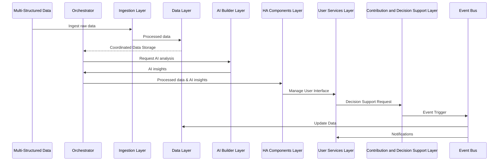

This is HA: 

### Abstract

Complex endeavors are an inherent part of life, requiring profound thought systems, large amounts of data processing, and collective efforts to bring contributions to life. This white paper introduces Horizons Architecture (HA), a new system-thinking framework designed to enhance human-machine interactions and improve the transformation of complex endeavors. HA combines various system theories, computational methods, and transdisciplinary approaches to address complex challenges and opportunities when humans and machines collaborate. The framework comprises three stand-alone or interconnected components: a system thinking framework, an AI and data system, and a multi-user fractal network. By providing a structured approach for understanding complex adaptive systems, leveraging advanced technologies for data storage and processing, and facilitating collaboration among stakeholders, HA holds significant potential for transforming complex endeavors. This paper details the importance of the HA system framework, its dimensions, axes, and components, paving the way for future research and applications in various domains.

### 1. Introduction

Complexity is an inherent part of life. Individuals and organizations often face complex endeavors that require profound thought systems, large amounts of data processing, and collective efforts to bring solutions to life. As problems become more complex, they span multiple domains and involve many stakeholders, making coordinating efforts and finding sustainable courses of action difficult. In this perspective, individuals and organizations (Governments, companies, NGOs, educational institutions, etc.) may benefit from incorporating system thinking frameworks to provide a structured approach to problem-solving, opportunity seizing, and decision-making. Enabling users to analyze a network of agents and break down complex issues into manageable parts could enhance their cognitive and actionable capacities. By utilizing these frameworks, users could more effectively identify the critical factors contributing to the project's complexity and prioritize their efforts accordingly. Additionally, system thinking frameworks can help identify potential solutions and evaluate their trade-offs while mitigating the risk of unintended consequences, such as negative externalities.

However, as powerful as systems thinking frameworks are, when it comes to complex phenomena, they may need to catch up due to the amount of data, agents, and processing involved in a complex endeavor. Therefore, incorporating AI and computational techniques might be necessary to unlock the full potential of individuals and organizations when tackling wicked efforts. The paradox is that we live in an era where data and technology surround us. Nevertheless, it is still difficult for most individuals and organizations to leverage AI and advanced computational techniques. This disconnection may be due to lack of training, database access, and data processing power to utilize these technologies effectively. AI and advanced computational techniques can arguably complement and enhance human cognitive capacities, such as critical, creative, and systems thinking, by processing, generating, and analyzing large amounts of data quickly and accurately. This human-machine symbiosis enables individuals and organizations to identify patterns, detect anomalies, and make informed decisions to address complex challenges efficiently and sustainably. Likewise, by providing objective and data-driven insights, computational techniques and AI can help individuals and organizations overcome cognitive biases, such as confirmation or anchoring biases. The potential value of data utilization is widely recognized across various sectors and locations. Still, most individuals and organizations require more methods, data structures, and processing power to utilize data in complex endeavors effectively.

Furthermore, many of these wicked problems require intense transdisciplinary collaboration. Therefore, transdisciplinary methods also aid individuals and organizations in their thought processes and applied techniques (human and computational) when facing complex endeavors. Transdisciplinary approaches involve bringing together people with diverse perspectives, knowledge, and skills from various disciplines to solve problems or seize opportunities collaboratively. For example, transdisciplinary research is crucial to effectively addressing climate change, which involves complex interactions between natural systems, human behavior, and socio-economic factors. There is evidence that multidisciplinary teams are more effective at problem-solving than homogeneous teams because they bring diverse perspectives and knowledge. In addition, complex endeavors also need to be conceptualized for scalability and coordination among transdisciplinary users in ever-evolving contexts and challenges. In this context, Horizons Architecture (HA) seeks to provide a systematic and integrated system thinking framework, drawing on various system theories, computational methods (AI, NLP, ML, etc.), and transdisciplinary approaches to break down complex challenges. HA proposes a taxonomy for complex general-purpose endeavors consisting of two axes (time and simultaneous complexity) and six dimensions (Legacy, Community, Learning, Technology, Context, and Projects). The HA framework consists of a system thinking framework, a HA AI & data system, and an HA collaborative fractal network that can function as stand-alone or interconnected components, all based on the same structure. The following section will describe the importance of the HA system framework, its dimensions, axes, and three stand-alone components.

# 2. Horizons Architecture (HA)

### 2.1 **What is HA:**

> Horizons Architecture (HA) is a system thinking framework that aims to enhance human-machine interactions to transform complex endeavors.
> 

It is an approach designed to address the complex challenges and opportunities when humans and machines work together to achieve a —human—collective goal. By understanding and optimizing the relationship between people and machines, HA aims to drive transformation in various domains.

### Key concepts of the definition

The following section will dissect the definition into its main components. By examining each of the Horizons Architecture (HA) components that define it, we can better understand this definition and its HA potential to improve human-machine interactions to transform the outcomes of a complex endeavor.

### 2.2 HA as a System Thinking Framework

The system thinking framework is the core structure of HA. It organizes, processes and executes information on two axes and six dimensions:

| **Axis** | **Dimensions** |
| --- | --- |
| 1. Time
 | 1. Legacy |
| 2. Simultaneous complexity. | 2. Community |
|  | 3. Learning |
|  | 4. Technology |
|  | 5. Context |
|  | 6. Projects |

This foundational structure serves as a starting point for users to organize and utilize the information when dealing with a complex endeavor, regardless of its nature. The design consists of two main axes: a non-linear timeline that includes time series and time stamps, showcasing simultaneous events occurring across multiple dimensions that influence each other during the ongoing transformation process. This timeline emphasizes the importance of studying the endeavor's past, present, and future to enable its transformation. The framework's six dimensions provide a multi-domain perspective when approaching a complex effort.

*Note: A detailed description of each axes and dimensions will appear in the following sections.* 

### 2.3 HA and Human-Machine Interaction

The HA paradigm posits that computational techniques, emerging technologies, and AI can be leveraged to enhance human-machine interactions ethically and productively. Central to the HA perspective is that intelligent machines can serve as practical mechanisms for augmenting human abilities and supporting the achievement of complex goals. HA aims to foster a more seamless and practical exchange between humans and machines, thereby enabling the transformation of complex endeavors by leveraging the strengths of both partakers (humans and machines). The precise manifestation of this enhancement may vary depending on each HA project's specific context and objectives. Still, it could include techniques such as natural language processing, machine learning algorithms, visualization tools, sensory feedback mechanisms, and other technological features that optimize usability and enhance the user experience.

### 2.4 Complex endeavors

Within the framework of Horizons Architecture, a “complex endeavor” refers to the process of pursuing a desired transformation of complex phenomenon, challenge, or opportunity by an individual, organization, or a network of agents. These endeavors are characterized by high complexity, uncertainty, and ambiguity, regardless of their discipline, sector, or nature; they entail multiple interrelated systems, stakeholders, and processes.

### 2.5 Transformation of Complex Endeavors

In the context of Horizons Architecture, the term "transform complex endeavors" refers to using the HA approach to address complex endeavors and achieve desired outcomes. Such transformations may involve a range of functions, including, but not limited to:

- Gaining a deeper understanding of the current state of affairs (A) and the underlying systems and relationships contributing to the challenge
- Defining a clear vision and outcomes for the desired future state of affairs (B),
- Developing a systematic and transdisciplinary course of action to achieve these desired outcomes by leveraging the System Thinking Framework, the AI & Data System, and the Multi-user Fractal Network of Horizons Architecture.

Notably, these transformations often involve feedback loops, where each step informs —and is informed by— other agents, processes, or events. For example, as users gain a deeper understanding of the current state of affairs, they may uncover new information that requires them to redefine their course of action. Consequently, adaptability is a key feature of the Horizons Architecture approach, enabling users to iterate and refine their processes as they gain new insights, encounter unforeseen events, and receive further information. The objective of transforming complex endeavors lies at the heart of Horizons Architecture. By providing a starting point for committed users, this approach seeks to help tackle the most challenging problems facing individuals, organizations, and societies today, increasing their chances of creating a desirable future transformation.

### 1.5 A three stand-alone or interconnected components of HA

Having defined the principal constituents of the definition, to achieve a more nuanced comprehension of the Horizons Architecture (HA), it is helpful to conceive it as a framework composed of three interdependent or autonomous components:

| **Component** | **Description** |
| --- | --- |
| System Thinking Framework | At its core, HA provides a structured (analog, human-based) approach to understanding complex adaptive systems and developing strategies and transdisciplinary methods to tackle them. |
| AI & Data System | The framework offers a data architecture structure supported by an AI & Data System that utilizes advanced technologies to store and process complex multi-structured data sets, making it more manageable for users to identify key insights and patterns. |
| Multi-user Fractal Network | HA provides the foundational structure to a Multi-user Fractal Network that enables collaboration and communication among stakeholders and actors involved in the complex endeavor. |

The following flowchart represents the Horizons Architecture (HA), which is made up of three independent or interconnected components: the HA System Thinking Framework, the AI & Data system, and the Users Fractal Network. The HA System Thinking Framework is positioned at the top of the flowchart and connects to both the AI & Data system and the Collaborative Fractal Network. This indicates that the HA System Thinking Framework serves as the foundational structure for both the AI & Data system and the Collaborative Fractal Network. The AI & Data system and the Collaborative Fractal Network both connect to the HA Delivery Mechanisms as "Interfaces with user." The three components conform the HA interconnected system, including humans and machines, involved in the transformation of a complex endeavor. Lastly, this flowchart show how the different components of HA can function independently (stand-alone) or as an integrated system.

https://app.diagrams.net/#G1z8X8lEWll6jN2WkXdcwtFXmQu_rkUbDn 

In the following sections, we will look into the three main components of HA. First, we will explore the axes and dimensions of the System Thinking Framework, the foundation for the entire approach. Then, we will examine the AI & Data System, which provides the technology and computational tools necessary for human-machine interactions. Finally, we will discuss the Multi-user Fractal Network, which enables communication and collaboration among stakeholders (humans and machines), its role as *Authors of Contribution,* and the concept of *Proof of Contribution.*

# 2. The HA System Thinking Framework

The core of HA is the Thinking System Framework (TSF). The HA-TSF is the canvas for representing, visualizing, and analyzing the information to assist the analysis of the dynamics of the agents on a shared non-linear timeframe and facilitate coordination and the strategic course of action in transforming complex endeavors. Its unique framework and approach to system thinking make it a valuable asset for anyone facing complex challenges in today's rapidly changing world. It is a foundational fractal structure for individuals and organizations to analyze and break down complex endeavors into time frames, dimensions, and axes. 

In this analogical component, the emphasis is on leveraging the cognitive abilities of individuals and organizations to understand better and navigate complex adaptive systems. By internalizing the HA system thinking framework, individuals, and organizations might better understand the complexity of the endeavors at hand and develop more effective strategies to address them.

Vast academic literature supports the idea that thinking in frameworks is beneficial when facing problem-solving and decision-making. Frameworks can help individuals and organizations approach problems and decisions in a structured and comprehensive manner, leading to better outcomes (Zhao et al. (2017). Moreover, encouraging interdisciplinary and systems thinking frameworks can help individuals and organizations think more broadly and consider multiple perspectives and interconnections among different factors. This approach can lead to more innovative and effective solutions. Frameworks can provide a common language and understanding among team members, facilitating collaboration and communication. A study by Smith et al. (2018) found that using a shared decision-making framework improved communication and patient satisfaction in a healthcare setting. Frameworks can also help individuals and organizations establish clear goals and metrics for success, leading to more accountability and assessment.

By utilizing HA as a thinking framework, users might develop a more in-depth understanding of the complexity involved and arrive at more valuable strategies for addressing and managing the complexity. The HA framework encourages users to think systemically —individually and collectively— about the interconnections and interdependencies among the actors, institutions, and processes involved rather than focusing on individual components in isolation. In this way, HA can help individuals and organizations identify the most relevant issues and the underlying causes of problems and develop strategies considering the endeavor's broader context. By considering multiple perspectives and stakeholders and taking a systemic approach to decision-making, individuals and organizations can arrive at evidence-based solutions that are more effective and sustainable in addressing complex endeavors.

The HA framework comprises two fundamental axes: The X-Axis, Simultaneous Complexity, and Time X (variable time frame), the Y-Axis, and six dimensions (Legacy, Community, Learning, Technology, Context, and Projects). 

### 2.1 The Axes

**Simultaneous complexity (X-Axis):** It refers to the complexity that arises from the need to simultaneously consider and coordinate multiple dimensions, agents, internal and external events, and processes to achieve the desired transformation of the complex endeavor. It represents the intricacy of the time-based interactions between the actors, knowledge, technology, context, and projects as they work together to materialize an individual or collective Legacy. Simultaneous complexity involves coordinating the efforts and contributions of multiple individuals or groups with different skills and knowledge, considering the external socioeconomic, political, and environmental context in which the complex endeavor occurs (context). It involves managing and coordinating multiple projects or stages of the complex endeavor, including organizing and implementing the actions needed to achieve the desired outcome and aligning them with the resources, goals, and objectives established in the Legacy dimension. 

// Summarize version: This term refers to the intricate coordination required to transform complex endeavors by considering multiple dimensions, agents, and both internal and external events in real-time. It embodies the time-sensitive interactions between various actors, areas of knowledge, technologies, and contextual factors, all converging to realize an individual or collective legacy. The complexity extends to aligning the efforts of diverse groups and managing multiple project stages, all while being responsive to external socioeconomic, political, and environmental contexts. These efforts must align with established resources, goals, and objectives in the Legacy dimension.

3.1.1 Axes: Time and Simultaneous Complexity
A central premise of Horizons Architecture (HA) is that complex endeavors evolve along two orthogonal axes—Time (Time X) and Simultaneous Complexity—which, together, anchor all six HA dimensions (Legacy, Community, Learning, Technology, Context, Projects). This dual‐axis framework formalizes how multi-domain tasks unfold in both a non-linear temporal continuum and in parallel domains requiring concurrent attention [16,17].

Simultaneous Complexity signifies the need to coordinate multiple agents, processes, and external drivers at once. For instance, a public-health crisis might involve real-time data integration (Technology), stakeholder outreach (Community), regulatory adaptations (Context), emergent subprojects (Projects), and skill development (Learning)—all orchestrated around a shared purpose (Legacy). In effect, every dimension interacts dynamically with others, so that an unexpected policy shift may prompt new learning requirements or project expansions. By embedding concurrency into HA’s structural design, stakeholders can more effectively track and align cross-cutting activities rather than managing them in separate, siloed workflows [18].

Time X incorporates past, present, and future in a non-linear trajectory [19,20]. Rather than viewing transformation as a simple progression, HA posits that ongoing feedback loops—e.g., historical lessons, real-time constraints, and scenario-based forward planning—coexist. Thus, while “present” teams address urgent objectives (such as bridging supply-chain gaps or meeting legislative deadlines), they also iterate on lessons from past successes and failures [21]. Meanwhile, “future branches” supply scenario-driven insights (e.g., climate modeling, demographic shifts) that guide strategic decisions and multi-year goals [22].

By intersecting Simultaneous Complexity (the concurrency of tasks and domains) with Time X (the dynamic interplay of past–present–future), HA ensures that fractal expansions in each dimension remain synchronized with a broader legacy of knowledge and adaptive planning [23]. This structure allows local subprojects or domain-specific tasks to pivot rapidly (when real-time constraints or new data arise) without sacrificing alignment to long-range aims [24]. In practical terms, it fosters an environment where short‐term “micro‐decisions” are continuously informed by historical context and prospective foresight [25,26], ultimately enabling more robust, adaptive transformations in complex socio-technical systems.

### 2.2 Time X

Time X refers to non-linear timeline series of HA that has occurred (past), is happening (present), and might happen (future, possible scenarios) that are helpful to document the historical processes to transform complex endeavors. By establishing a non-linear timeline, it is possible to create a sense of structure and narrative that can help coordinate and manage the endeavor's complexity, learning from the past and defining what is needed for the present and future. Furthermore, time includes the interval separating the past-present and the transformational state on the continuum of the complex endeavor. In HA, it is crucial to consider the transformational potential of time to clearly understand the scope and scale of the efforts done and the requirements of future HA. In short, Time X is the canvas where several potentially interconnected agents and HAs make a mark in time to prove their contribution to the network and develop strategies and approaches for managing, navigating, and predicting future endeavors. Overall, the role of time X in HA is organizing the historical, present, and future information and the most critical variables and required actions of a complex endeavor to provide meaningful knowledge and procedural documentation for the user(s) (authors of contribution). In HA time is a critical element, as complex endeavors require ongoing attention and interventions over extended periods. The Horizons Architecture emphasizes the need for continuous learning and adaptation, with feedback loops and ongoing monitoring of progress and outcomes.

### 2.3 Relevance of Time in HA

In the Horizons Architecture (HA) context, time is a critical variable affecting complex systems' behavior and their stakeholders. HA can help identify potential scenarios and understand how different actions might impact the system's evolution by analyzing system behavior and stakeholder activities over time.
However, time is not just a practical concern for HA, but also a profound philosophical and scientific one. It is a complex and multidimensional phenomenon that interacts with space, matter, energy, and consciousness in complex ways, raising fundamental questions about the nature of reality and the limits of human knowledge.
Time is a crucial variable in complex endeavors that plays a critical role in adaptation. Shorter timelines may limit opportunities for learning, feedback, and course correction, while longer timelines may increase uncertainty and make adapting to unpredictable events and changes more challenging.
Therefore, the amount of time available for a complex endeavor can significantly impact the quality and scope of its outcomes. HA emphasizes time as a critical variable, helping stakeholders consider the temporal aspects of complex endeavors and make more informed decisions about allocating resources, managing risks, and adapting to changing circumstances.

**HA NON-LINEAR TIME** 

The HA timeline is non-linear and dynamic, involving interconnected and interdependent dimensions representing different aspects of the complex endeavor being transformed. Each dimension may have its timeline and set of tasks, which may not be sequential and may overlap or occur simultaneously. Moreover, as new information is gathered and new challenges arise, the timeline may need to be adjusted or revised, resulting in a non-linear progression of the project. Additionally, the fractal structure of the HA means that each sub-project or dimension may have its timeline, which may also be interconnected and interdependent, leading to further non-linearity. Thus, the HA timeline is flexible and requires constant adjustment and revision to accommodate changing circumstances.

### Temporal perspectives

The HA framework leverages different temporal perspectives to address complex endeavors, including past-present, present, and present-future processes. 

- **The past-present** process involves analyzing past experiences, data, and knowledge to inform present decision-making and problem-solving. By looking at what has happened in the past, individuals and teams can learn from past mistakes, successes, and experiences to make better decisions and solve problems more effectively in the present.
- **The present** process focuses on identifying and addressing the most pressing issues in real time. These issues might be time-sensitive actions (e.g., deadlines, legal procedures), where individuals and organizations constantly monitor the situation and make decisions based on what is happening. The present temporal perspective prepares user(s) to respond quickly to changes and adapt to new information as it becomes available.
- **The present-future** process involves forward-thinking and strategic planning to mitigate future risks and opportunities. In other words, individuals and teams are focused on what is happening right now, thinking about what might happen and taking steps to prepare for it. By doing so, they can minimize risks and capitalize on opportunities that may arise in the future.
    
    
    

Fig. X Temporal non-linear perspectives in HA

The HA framework can help individuals and teams make better-informed decisions by leveraging these different temporal perspectives. By taking a comprehensive approach to transforming complex endeavors that consider the past, present, and future, individuals and teams can increase their chances of success and achieve better outcomes.

### 2.4 The four core components

Horizons Architecture (HA) is a system thinking framework that enhances human-machine interactions to transform complex endeavors. At the core of HA are four key concepts that form the foundation of its approach. These core concepts provide a starting point for individuals and teams to approach complex challenges, allowing them to develop a shared understanding of what they are trying to accomplish, who they are working with, what knowledge users have available, and how they can take action to achieve their goals. The six dimensions of HA build upon these core components, providing a framework for individuals and teams to work more systematically and inclusively to transform complex challenges.

- **Mission driven:** refers to an approach in which individuals or teams working on a complex endeavor are guided by a clear mission or purpose. This means that they have a shared understanding of what they are trying to accomplish and why it is important, and they keep this mission at the forefront of their decision-making and problem-solving processes.
- **People and context driven:** People and context: refer to the central role of individuals and organizations in any complex endeavor and the influence of the broader context on its transformation. It involves understanding the needs, perspectives, and abilities of the individuals and teams involved and the cultural, social, economic, and political context in which the endeavor takes place. HA prioritizes a people and context-centered approach by promoting collaboration, inclusivity, and diversity in complex endeavors. It also highlights the importance of considering the human factor and context when designing and implementing practical solutions. By understanding the people and context involved in a complex endeavor, HA can help individuals and teams work more effectively together and achieve their shared goals.
- **Productive knowledge, AI & data driven:** Productive knowledge and data: recognizes the critical role of relevant data and knowledge in effective decision-making and problem-solving. In the artificial intelligence and machine learning age, productive knowledge and data involve identifying and leveraging the most valuable insights from available sources to enhance human-machine interaction. HA emphasizes incorporating emerging technologies to facilitate knowledge discovery, allowing individuals and teams to develop a deeper understanding of complex endeavors. By leveraging productive knowledge and data, HA can help individuals and organizations to identify critical challenges and opportunities and develop effective strategies to achieve their goals while keeping people and context at the center of the process.
- **Action-enabling and performance-based projects:** refer to the idea that transformation in complex endeavors requires concrete action and measurable outcomes. This core concept emphasizes the importance of setting clear goals and objectives, developing actionable plans, and implementing projects that enable individuals and teams to achieve their goals effectively. The HA approach emphasizes the importance of measuring and evaluating performance to ensure the projects deliver the desired results. It also focuses on enabling action by providing individuals and teams with the necessary resources, support, and feedback to execute their plans effectively. By taking an action-enabling and performance-based approach, HA can help individuals and organizations to stay focused on their goals, make meaningful progress, and continuously improve their performance.
    
    
    

The four core components of Horizons Architecture - mission-driven, people and context, productive knowledge and data, and action-enabling and performance-based projects - provide a comprehensive framework for approaching complex endeavors. However, these core concepts were further refined and organized into six dimensions to provide a more comprehensive and inclusive framework. The six dimensions of HA provide a more detailed and nuanced approach to addressing the complexities of human-machine interactions and transformational projects. By breaking down the four core components into six dimensions - legacy, community, learning, technology, context, and projects - HA allows users to dive deeper into each dimension and identify the most critical aspects that require attention. The six dimensions of HA also enable users to understand the interdependencies and relationships between the various dimensions, providing a more holistic and integrated approach to complex endeavors. Therefore, refining the four core components into six dimensions strengthens the Horizons Architecture framework, making it more comprehensive, practical, and inclusive in driving transformational change.

The diagram illustrates how the four core components of HA are integrated into the six dimensions of the framework. It emphasizes the interconnectedness of all the core components and how they relate to each of the six dimensions.

### 2.5 The dimensions

In HA, the dimensions refer to the six categories (dimensions) of information considered as a starting point in the context of a Horizons Architecture. These dimensions (Legacy, Community, Learning, Technology, Context, and Projects) serve as a taxonomy for organizing and analyzing the various types of data and information relevant to the transformation of the complex endeavor. Each dimension is associated with multiple data types or inputs. Overall, the dimensions of the HA framework aim to facilitate the organization of the information relevant to complex endeavors. This structure provides a dissected or simultaneous visual representation of the various dimensions and factors that contribute to the complexity of a particular situation or endeavor. Users may use the HA dimensions to identify critical factors and interconnections among the fundamental units that build the complex enterprise. The taxonomic nature of the AH dimensions may facilitate assessing the level of uncertainty and the potential impacts of different decisions or actions in forecasting scenarios, decision-making, and strategy development; by providing a systematic and evidence-based approach to understanding and anticipating future outcomes and trends. By visualizing the complexity of an endeavor in this time-oriented path, users may be better able to develop strategies for effectively addressing and managing the complexity involved. The six dimensions help guide the analysis, processes, and events leading to the desired transformation of the complex endeavor.

1. **Legacy:** The description of the desired outcome, objective, or goal that the user(s) of the endeavor strives to achieve in a complex endeavor. This Legacy may be economic, social, environmental, personal, or collective, or a combination of these configurations. The concept of creating value that can be transferred refers to the idea that the outcome of the complex endeavor should have a lasting impact that will continue to benefit in the future. This transfer could take the form of financial assets, knowledge, resources, systems, or institutions that will have ongoing positive impacts or knowledge or skills that can be passed down to future generations.
2. **Community:** It involves mapping the interconnected network of individuals and institutions in a semantic web. This mapping process aims to analyze the relationships between different agents in the network to understand the structure and dynamics of the network. Using network analysis techniques makes it possible to identify connections between agents and gain insights into how they relate. This analysis helps to assess social capital, which refers to the networks, norms, and trust within a group of people that facilitates cooperation and coordination.
The mapping process serves to identify agents with similar interests or complementary skills and knowledge that can contribute to a complex endeavor in various capacities and disciplines. This contribution could be individual or collective, depending on the nature of the Legacy being pursued. By understanding the network's structure and the relationships between different agents, it may be possible to leverage these connections and establish effective collaboration among stakeholders, leading to more successful outcomes for the complex endeavor.
3. **Learning:** In a HA, learning refers to identifying and prioritizing the knowledge and skills required by the user(s) (authors of contribution) to achieve the individual or collective Legacy. This process involves creating a tailored learning path with various multi-format content, tools, and resources, such as books, lectures, articles, papers, podcasts, videos, and more. The learning path is designed to identify gaps in the users’ (authors of contribution) current knowledge or capabilities and help develop a plan to address these gaps through additional learning and practice. This process aims to ensure that the authors have the necessary knowledge and skills to effectively contribute to the complex endeavor and achieve the desired Legacy outcome.
4. **Technology:** It involves identifying and prioritizing a stack of technologies and technical tools, both digital and non-digital, that can contribute to the attainment of an individual, or collective Legacy is a complex endeavor. This process includes researching and evaluating existing technologies and considering the potential for developing or adapting technologies to meet the community's specific needs. Once a list of potential computational methods, technologies and tools has been identified, the most promising options are selected based on carefully considering their costs, benefits, and feasibility. The ultimate goal is to adopt or develop the technologies and tools that will be most effective in helping the involved community achieve the desired Legacy outcome. Overall, the technology dimension plays a crucial role in supporting the complex endeavor by enabling the community to leverage the power of technology to overcome challenges and achieve their goals.
5. **Context:** It refers to collecting and processing external socioeconomic, political, and environmental data and information to understand the complex endeavor comprehensively. This process involves gathering relevant data from trustworthy sources such as government agencies, research institutions, and international organizations to increase evidence-based insights. By analyzing this data, it may be possible to identify the comparative advantages of the author(s) of contribution, including their unique skills, knowledge, or resources that give them an edge in achieving the objectives established in the legacy dimension. Finally, a deeper understanding of the context of the complex endeavor can be achieved by analyzing external data and information, which can help identify the most effective strategies for achieving the desired transformational outcomes.
6. **Projects:** This dimension describes specific, actionable activities that individuals or groups can undertake to achieve the Legacy outcome. It begins by identifying the tasks and actions needed to progress toward the desired result of the endeavor, which may require different levels of expertise and collaboration. Once these activities are defined, the resources and milestones associated with each project or subproject are determined. A plan for coordinating and managing the actions needed to achieve the outcome is developed. The project management plan serves as a guide for coordinating and managing the activities of the community involved in the network, helping to ensure that efforts are synchronized and progress is made toward achieving the desired outcome. Clearly defining and organizing the activities and projects required to achieve Legacy enables more effective coordination and management of the efforts across all six dimensions.

### 2.6 Integration of Axis and Dimensions

HA proposes a framework that integrates (simultaneously) the axis (time and complexity) and dimensions to inform and enhance the process of transformation from point A (current state) to B (desired state) when it comes to complex endeavors. By bringing together the axis and dimensions in a shared timeline, organizations and individuals may better understand the various factors that influence their objectives and create a more effective roadmap for achieving their goals. The axis provides the canvas and a framework for organizing data. At the same time, dimensions offer a multi-faceted view of the problem, enabling individuals to explore different perspectives and uncover hidden insights. By integrating these two approaches, organizations, individuals, and machines can streamline their transformation processes, reducing risk and improving their overall chances of success in transforming a complex endeavor.

In sum, HA is a system thinking framework designed to enhance human-machine interactions to transform complex endeavors. It aims to address the challenges and opportunities enhancing humans and machines to collaborate towards a —individual or collective— human goal by optimizing the relationship between people, machines, and their environment. This approach is built on a foundation of six dimensions: Legacy, Community, Learning, Technology, Context, and Projects, which provide an organized structure for users to understand and navigate complex endeavors more effectively.
The HA framework emphasizes the importance of mission-driven approaches, people-centric processes, productive knowledge, data use, and action-enabled, performance-based projects. By integrating these principles into the six dimensions, HA enables individuals and organizations to understand better the complexity involved in a given challenge.
Having a clear understanding of the structure and dimensions of HA-TSF provides a basis for exploring HA's fundamental principles, features, and case uses. By delving deeper into these aspects of HA, we can better understand how the system works and how it can be applied in various contexts. The following section can be particularly valuable for those seeking to implement HA in their projects or organizations.

# 3. HA Users

In the Horizons Architecture (HA) framework, users are crucial in transforming complex endeavors. In HA, users may be individuals, organizations, or networks pursuing a desired transformation of a complex phenomenon, challenge, or opportunity. Users can leverage HA's AI & Data System component to store and process complex multi-structured data sets, enabling them to identify key insights and patterns. HA's Multi-user Fractal Network component provides a collaborative platform for stakeholders and actors involved in the complex endeavor to communicate and work together seamlessly.
HA's users can be organizations and individuals involved in complex endeavors, such as large-scale projects, crisis management, policy-making, and strategic planning. These users would require a comprehensive and systematic approach to managing complexity and would likely have a high level of expertise in their respective fields.
The HA framework is designed to be flexible and adaptable, empowering users to create unique "Architectures" within the framework tailored to their specific needs and objectives. This personalization is made possible by the modular and fractal nature of the HA framework, which allows users to customize and extend the system to meet their requirements.
Users' ability to understand the current state of affairs, define clear visions and outcomes, and develop systematic and transdisciplinary courses of action using the HA framework is essential to drive the desired transformation of complex endeavors. Users must remain adaptable to iterate and refine their processes continually as they gain new insights, encounter unforeseen events, and receive further information. 

### 3.1 **Author(s) of contribution (HA users):**

In the context of Horizons Architecture (HA) *the authors of contribution* refer to the individuals or entities contributing to a the transformation of a complex endeavor in some capacity. These contributions include but are not limited to sharing knowledge, resources, or expertise and completing specific tasks or projects. The *authors of the contribution* are the actors or agents involved in the complex endeavor, working towards achieving the desired transformation. The concept of *authors of contribution* is closely related to the idea of a *proof of contribution*, as the authors of contribution are the individuals or entities whose contributions are being tracked and verified. By accurately tracking and recognizing the contributions made by the *authors of contribution*, it may be possible to foster collaboration and coordination within the network and ensure that the efforts of different actors are fairly compensated or recognized. Overall, the *authors of contribution* are an essential aspect of HA authorship. 

### 3.2 HA Users authorship, autonomy and ownership

Users play a crucial role in HA by having autonomy and ownership over the process of the transformational endeavor. They are responsible for defining the vision, outcomes, and courses of action, as well as adapting to new information and unforeseen events. Users are the *authors of contribution in HA.* They are essential to HA because they have autonomy and ownership over the process of transformation of the complex endeavors and are responsible for defining the vision, outcomes, and deciding the courses of action. Users define the iteration cycles and refine their processes continually as they gain new insights, encounter unforeseen events, and receive further information. Their ability to collaborate effectively with other authors of contribution is critical to achieve the desired transformation.

| **Concept** | **Description** |
| --- | --- |
| **Authorship** | Refers to the attribution of ideas or contributions to specific individuals or groups who have made significant and original contributions to the development or implementation of the HA framework. It is important to establish clear guidelines and criteria for authorship, and to continually evaluate and revise these criteria as the framework evolves. |
| **Ownership** | It can be distributed among the author(s) of the contribution who started the HA. Ownership can belong to an individual author of the contribution, a group of authors of contribution, or a network of contributors. This distributed ownership model allows for individual or more collaborative and flexible approaches to HA. |
| **Autonomy** | Gives users control over the process of transformational endeavor. Users can decide on the best approach to achieving the desired transformation and can make adjustments based on their insights and experiences. Collaboration and communication among authors of contribution are essential to achieving the desired transformational outcome. Autonomy in HA is balanced with interdependence, ensuring that users work together effectively towards a shared outcome while maintaining individual control over their contributions. |

### 3.3 Proof of Contribution

To fully understand the workings of HA and how it facilitates the transformation of complex endeavors, it is essential to define and explore key concepts *proof of contribution*. In the context of HA, a "proof of contribution" refers to a digital or analogical system or mechanism that is used to verify and validate the contributions made by individuals or entities to a particular project or network. This can be used to ensure that the contributions made by different actors are accurately recorded and acknowledged and that the distribution of rewards or incentives is fair and transparent. In the HA context, a proof of contribution system could be used to track and verify the contributions made by different actors to a complex endeavor. This could include sharing knowledge, resources, or expertise and completing specific tasks or projects. Using a *proof of contribution* system may accurately track the contributions made by different actors and ensure that they are pretty compensated or recognized for their efforts. Additionally, a *proof of contribution* system could foster collaboration and coordination within the network by providing a clear and transparent mechanism for recognizing and rewarding contributions.

### 3.4 The connection of the HA System Thinking Framework to a AI & Data System

The HA system thinking framework provides a cognitive and collaborative foundation for individuals and organizations to transform complex endeavors with a transdisciplinary approach, considering a structure of axis and dimensions in a shared timeline. The System Thinking Framework is designed to enhance the individual and collective thought process and does not require technology to apply it to a complex endeavor. However, the HA System Thinking Framework can provide the structure and be complemented by AI and computational techniques to expand human capability. The integration and collaboration of humans and machines can be key to transforming complex endeavors, as it leverages the strengths of each to achieve human goals. In the following sections, we will explore how the HA System Thinking Framework can be implemented as an AI and data system, and how these human-machine interactions might lead to greater collaboration and knowledge aggregation to transform complex endeavors.

# 4. HA AI and Data System

The challenges humanity and the world face today and in the future are becoming increasingly complex, making it challenging to transform without the interaction between intelligent systems and humans. The HA System Thinking Framework (HA-TSF) offers a collaborative and cognitive foundation for individuals and organizations to tackle these complex endeavors using a transdisciplinary approach that considers different axes and dimensions in a shared timeline. While this component of HA does not require any technology, it can provide a comprehensive structure for humans to interface with many kinds of AI and computational techniques to expand human capabilities. By integrating and collaborating with machines, we —humans and machines— can leverage the strengths of each to achieve human goals. Evolving HA-TSF as an AI and Data System can assist individuals and organizations to more effectively identify patterns, detect anomalies, and make informed decisions within massive data to address complex challenges efficiently and sustainably.
AI and advanced computational techniques can store, process, and generate large amounts of data quickly and accurately. By mimicking the HA-TSF, a HA AI and Data System can incorporate the computational techniques required to generate insights based on the unique needs, resources, and circumstances of the authors of contribution. In other words, using the cognitive structure of HA-TSF to connect to an HA AI and Data System provides a common interface that enables a human-machine understanding of developed tailored-made strategies and processes to transform a complex endeavor. Ultimately, the HA System Thinking Framework offers individuals and organizations a multidimensional approach to transform complex endeavors by considering relevant dimensions, including time, complexity, people, resources, external factors, and long-term impact. The integration and collaboration of humans and machines can be vital in transforming complex endeavors, as it leverages the strengths of each to achieve human goals. This section will explore how the HA System Thinking Framework can be implemented as an AI and data system and how these human-machine interactions can lead to greater collaboration and knowledge aggregation to transform complex endeavors.

The challenges humanity and the world face today and in the future are becoming increasingly complex, making it challenging to transform without the interaction between intelligent systems and humans. The HA System Thinking Framework (HA-TSF) offers a collaborative and cognitive foundation for individuals and organizations to tackle these complex endeavors using a transdisciplinary approach that considers different axes and dimensions in a shared timeline. While this component of HA does not require any technology, it can provide a comprehensive structure for humans to interface with many kinds of AI and computational techniques to expand human capabilities. By integrating and collaborating with machines, we —humans and machines— can leverage the strengths of each to achieve human goals. Evolving HA-TSF as an AI and Data System can assist individuals and organizations to more effectively identify patterns, detect anomalies, and make informed decisions within massive data to address complex challenges efficiently and sustainably. 

AI and advanced computational techniques can store, process, and generate large amounts of data quickly and accurately. By mimicking the HA-TSF, a HA AI and Data System can incorporate the computational techniques required to generate insights based on the unique needs, resources, and circumstances of the authors of contribution. In other words, using the cognitive structure of HA-TSF to connect to an HA AI and Data System provides a common interface that enables a human-machine understanding of developed tailored-made strategies and processes to transform a complex endeavor. Ultimately, the HA System Thinking Framework offers individuals and organizations a multidimensional approach to transform complex endeavors by considering relevant dimensions, including time, complexity, people, resources, external factors, and long-term impact. The integration and collaboration of humans and machines can be vital in transforming complex endeavors, as it leverages the strengths of each to achieve human goals. This section will explore how the HA System Thinking Framework can be implemented as an AI and data system and how these human-machine interactions can lead to greater collaboration and knowledge aggregation to transform complex endeavors.

### 4.1 What is a HA AI & Data System

> HA AI & Data System is a native cloud-based service that integrates multi-data types, artificial intelligence, computational techniques, and cloud architecture using the structure of HA-STF.
> 

The HA AI & Data System is the second component of HA. The HA AI & Data System builds on the foundational structure of HA-STF, which provides a common language and conceptual framework for understanding and managing complex endeavors. The HA AI & Data System aims to enhance the efficiency, accuracy, and effectiveness of data processing, analysis, and decision-making by introducing artificial intelligence, computational techniques, and cloud architecture. This comprehensive system integrates various data sources, including structured and unstructured data, internal and external data, and historical and real-time data, to provide a holistic view of the organization and its environment into the future. By leveraging the power of AI and data analytics, the HA AI & Data System enables organizations to gain valuable insights, identify patterns and trends, and make informed decisions promptly. Overall, the HA AI & Data System is a critical component of the HA approach. It enables individuals or organizations to be more prepared and improve the probabilities to achieve their goals, creating value in a rapidly changing and complex world. 

### Human-machine collaboration

The HA AI & Data System is a powerful tool for transforming complex endeavors by leveraging the power of artificial intelligence (AI) and data analytics. In addition to its technical capabilities, the system is designed to collaborate with humans to enhance decision-making and streamline operations. This collaborative approach means that the system is not just a black box that spits out data; instead, it works alongside users to help them make informed decisions based on the insights provided by the system.
To facilitate this collaboration, the HA AI & Data System incorporates various advanced machine learning techniques, including natural language processing (NLP). These machine learning techniques enable users to interact with the system using everyday language and intuitive interfaces, such as typing, speaking, or recognizing facial expressions. This organic approach to human-machine interactions might make it easier for humans to work with the HA AI & data system and interpret the insights generated by it in a more intuitive and accessible way.
Another key feature of the HA AI & Data System is its ability to analyze and process various data types and information, such as text, audio, photo, video, graphs, and semantic, fractal, and neural networks. The system uses predictive analytics, data mining, and visualization techniques to extract insights from structured and unstructured data. This set of practices enables individuals and organizations to gain a more comprehensive and nuanced understanding of their agents, processes, and events that are involved in their complex endeavor.
The HA AI & Data System incorporates various visualization tools and techniques to support decision-making and optimize workflows, including graphs, charts, and dashboards. These tools enable users to explore data more intuitively and interactively, allowing them to identify insights and opportunities that might otherwise be missed.

### Democratizing AI and Data Systems Use

In today's data-driven world, effectively utilizing AI and data systems is essential for individuals and organizations to stay competitive, make informed decisions, and transform complex challenges. However, many still need help to fully capitalize on these transformative technologies due to a lack of training, budget limitations, and overwhelming adoption learning curves. To address these issues, HA aims to shift the focus from users adapting to technology to technology adapting to users. The Horizons Architecture System Thinking Framework (HA-STF) embodies this approach by offering a comprehensive, human-centric structure that adapts to the needs and capabilities of its users. Only then, with the information provided and tailored to their unique requirements, can machines effectively process the data, ultimately delivering valuable insights to drive evidence-based human decision-making through constant communication with users.
HA is designed to provide insights through any medium or app via APIs. It offers advanced data collection and processing, machine learning, natural language processing, and a collaboration platform encouraging users to contribute their knowledge and resources using the HA system thinking framework. By employing the HA system thinking framework, users can focus their cognitive abilities on understanding and executing the transformation of complex endeavors, assisted by an AI & Data System responsible for processing vast datasets and generating predictions and insights, which humans can then verify. This dialogue enables a more vital human-machine interaction fostering more sophisticated information analysis and enhancing users' ability to derive valuable insights.
Furthermore, the HA AI & Data System aims to make technical processes as easy and seamless as possible by offering dialogue-based communication with AI and other users. This assistance is designed to support users without requiring extensive technical expertise. This user-friendly approach allows individuals and organizations to broadly capitalize on the benefits of AI and data systems, regardless of their technical background or knowledge.

### 4.2 Connecting the HA to an AI & Data System

HA AI & Data System can efficiently ingest, process, and vast store datasets, making them accessible to users. With the integration of AI technologies, such as natural language processing (NLP), machine learning (ML), deep learning (DL), computer vision, and reinforcement learning, the framework can extend its capabilities in data analysis and decision-making. The HA-STF can further enhance its functionality by implementing an AI builder layer that provides a wide range of artificial intelligence techniques, including expert systems and evolutionary algorithms. This layer allows users to access advanced computational methods tailored to their needs, maximizing the value of the AI & Data System in addressing complex problems. Therefore, the Horizons Architecture System Thinking Framework can successfully transform into a robust AI & Data System by incorporating advanced computational techniques and enabling seamless integration of data sources and AI technologies. This transformation not only streamlines the decision-making process but also significantly enhances the capabilities of individuals and organizations in addressing complex challenges. With the addition of the AI builder layer, collaborative fractal network (the third component of HA), and the integration of various artificial intelligence methods, HA becomes a valuable tool for unlocking users' full potential in tackling wicked problems more effectively and sustainably.

The HA AI & Data System's is comprised by a suite of ever-growing components to harness the combined strength of advanced AI technologies. As users collaborate within the HA AI & Data System, they can draw upon diverse computational techniques, enabling them to address multifaceted problems and uncover innovative solutions. This synergy between human intuition and cutting-edge AI technologies allows organizations and individuals to devise more effective strategies. In essence, the HA AI & Data System's ability to harmonize human and machine interactions drives transformative change across domains. By enabling users to leverage the combined power of their cognitive abilities and advanced computational techniques, this innovative system thinking framework sets the stage for a new era of efficient and sustainable solutions to complex endeavors.

The following section will explore some HA AI & Data System components, providing an overview of its infrastructure. By taking a closer look into the various elements that constitute the system, we aim to elucidate how these components work in unison to empower users with advanced computational capabilities, facilitate seamless human-machine collaborations, and ultimately transform complex challenges effectively and sustainably.

In the rapidly evolving field of artificial intelligence, an integrated High-Availability (HA) AI & Data System has become indispensable for efficient data management and AI model building. This section aims to comprehensively analyze a multi-layered HA AI & Data System designed to facilitate data ingestion, storage, processing, and utilization. The architecture comprises several interconnected layers orchestrated through a central data proxy. An event bus streamlines communication between system components, while HA Mind is the primary cognitive component of the HA AI and data system architecture. In the following sections, we will explore the intricacies of each layer and their respective components, shedding light on their roles and interdependencies in creating a cohesive, well-structured, high-availability AI and data system architecture. Moreover, the HA AI & Data System employs various AI techniques and databases to optimize performance, scalability, and fault tolerance. We will now proceed to describe each of the six layers that compose the cloud architecture of the HA AI & Data System.

### Layers

A layer is a logical grouping of components within the system architecture, representing a specific functional area or responsibility. Organizing components into layers helps manage the system's complexity by separating concerns and defining clear boundaries between different parts. Layers offer several benefits, including scalability, reusability, maintainability, and flexibility, and facilitating collaboration among teams working on various components. Components within a layer often interact with one another and may also communicate with components in other layers to ensure the smooth functioning of the overall system. The key benefits of adopting a layered architecture in system design are:

1. **Scalability:** Organizing components into layers allows for readier scalability, as each layer can be independently scaled up or down based on the system requirements and performance needs.
2. **Reusability:** Layers promote reusability, as components within a layer can be reused across different system areas or even in other systems with similar requirements. This interoperability enhances efficiency and reduces development time.
3. **Maintainability:** Layered architecture simplifies maintenance, allowing for easier identification and isolation of issues within a specific layer. This simplification ensures that the impact of changes remains limited to the affected layer and does not propagate throughout the system.
4. **Flexibility:** Layers provide flexibility in the system design, as they allow for the replacement or modification of individual components within a layer without disrupting the overall system functionality. This flexibility makes adapting the architecture to new technologies, requirements, or performance improvements easier.
5. **Facilitates collaboration:** A layered architecture enables better collaboration among teams working on different system components. Each team can focus on its specific layer, reducing the chances of conflicts and ensuring a smoother development process.

### The architecture is composed by the following layers:

1. **User services**
2. **Data ingestion**
3. **HA Component** 
4. **Data** 
5. **Contribution and Decision Support**  
6. **AI builder** 

### 1. User services layer

> The User Services Layer is critical in providing user-interaction and user-facing components and services that facilitate user interactions and system interactions. It bridges the user interface and the underlying system layers, ensuring efficient communication between the front-end and back-end components. This layer focuses on essential functionalities, such as Biometric Authentication, API services management, and delivering Notification Services to inform users of relevant events or updates, ensuring a consistent and secure user experience.
> 
- **Biometrics Authorization:** This component is responsible for user authentication using unique biological traits such as fingerprints, facial recognition, or voice recognition. It may be combined with other security measures like multi-factor authentication or single sign-on (SSO) to enhance security and protect against unauthorized access. With the added layer of secure biometric authentication services, the User Services Layer ensures that only authorized users can access the system for a safe and reliable experience.
- **API's Services:** This component manages the system's API, enabling developers to integrate its functionalities into their applications or connect with other systems. These services provide a standardized and efficient way for components and services in different layers to communicate with each other and external systems. By facilitating seamless interoperability and data exchange, the API Services contribute to the smooth functioning of the entire system, making it more accessible and customizable for developers and users alike.
- **Notification Services:** This component is responsible for delivering timely updates and relevant notifications to users through their preferred methods of communication, such as email, SMS, or in-app messages. By offering personalized notifications about system alerts, status updates, and customized recommendations, the Notification Services create a more engaging and informed user experience, enhancing the system's effectiveness in keeping users up-to-date with the latest information.

### 2. Ingestion Layer:

> The primary function of the ingestion layer is to manage, process, and handle data originating from a wide range of sources and formats, encompassing both structured and unstructured data. As a critical component of the Horizons Architecture (HA) framework, this layer transforms multi-structured data into a format that the system can use effectively. The Ingestion Layer is designed to accommodate evolving data sources and formats, ensuring that the system remains adaptable and robust to any changes in the data landscape. This adaptability allows the framework to incorporate new data types and maintain relevance in ever-changing environments, making it a future-proof solution for a wide range of complex endeavors. It aims to provide HA users with capabilities to extract and utilize valuable insights for efficient decision-making and problem-solving. The internal elements of the Ingestion Layer include the Data Processing component, Named Entity Recognition (NER), and Embedding Transformation. This comprehensive approach supports various endeavors' diverse and complex data requirements, enhancing human-machine interactions and enabling effective decision-making within the HA system.
> 
- **Data Processing component:** This component serves as the first step in the Ingestion Layer, focusing on cleaning, organizing, and transforming raw data from various sources into a structured format that can be easily analyzed and consumed by other components within the HA system. It ensures the data is accurate and reliable by removing inconsistencies, duplicates, and errors and normalizing and standardizing the information. For instance, the Data Processing component may preprocess textual data by removing stop words, stemming, and tokenizing the text, preparing it for the Named Entity Recognition (NER) component.
- **Named Entity Recognition (NER):** NER is a natural language processing technique used to identify and classify named entities within unstructured textual data. It extracts entities, such as people, organizations, and locations, essential in understanding a complex endeavor's context. The NER component stores these entities in the Network Database, enabling users to efficiently search, analyze, and comprehend relationships between entities within the HA system.
- **Embedding Transformation:** This component converts unstructured data, such as text or images, into numerical vector representations (embeddings) that machine learning algorithms can easily process and analyze. Embeddings capture the semantic meaning and relationships between different data elements, allowing the HA system to perform similarity searches, recommendations, and other advanced analytical tasks.

### 3. HA Components Layer

> The "Components Layer" is responsible for organizing, managing, and coordinating data from the six dimensions of HA: Legacy, Community, Learning, Technology, Context, and Projects. These dimensions serve as the foundation for understanding, analyzing, and transforming the complexity of challenges and opportunities individuals, organizations, or networks face. At its core is the HA Mind, which interacts with each dimension and plays a crucial role in decision-making and problem-solving within the system.
> 

### Functions of the component layer**:**

- **Streamlining** the integration, synthesis, and management of data and information from the six dimensions to facilitate sense-making, decision-making, and problem-solving processes.
- **Supporting** communication and collaboration between stakeholders by providing a shared cognitive space that efficiently exchanges ideas, knowledge, and information across different dimensions.
- **Ensuring** that the necessary knowledge, skills, and resources are available to address knowledge gaps and develop the required expertise within the user(s) or community involved in a complex endeavor.
- **Incorporating** learning and adaptation by continually updating and refining the Components Layer based on feedback, new insights, and emerging challenges or opportunities allows continuous improvement and enhanced system resilience.
- **Providing** a framework for designing and implementing actionable projects and subprojects that aim to achieve the desired Legacy outcomes by leveraging coordinated data and insights from the six dimensions.
- **Facilitating** the effective use of technology and technical tools, both digital and non-digital, in a manner that supports and enhances the overall system's performance, availability, and adaptability.

These key functions primarily take place within the HA Mind, serving as the central hub for managing and coordinating the various dimensions and components.

## HA Mind: The Cognitive Core of the Architecture

> "HA Mind" embodies the cognitive core component of the HA AI & Data System Architecture. The HA Mind connects and interacts with multiple dimensions, including the HA-STF dimensions (projects, learning, community, technology, legacy, and context). It functions as the central control and management hub for these dimensions, ensuring the smooth operation of the overall system. The HA Mind is the nucleus of intelligence and decision-making within this architecture. It interacts with various layers and services, such as data processing, AI builders, external services, and user services, to deliver a highly available, efficient, and resilient system. The HA Mind enables the creation of a cohesive and intelligent design that continuously evolves and learns. It contributes to users comprehending complex endeavors and developing effective strategies for transformation. In this section, we will examine the internal components of the HA Mind and provide examples to illustrate its functionality and importance in the framework.
> 

### Internal Components of the HA Mind

The HA Mind comprises several interconnected components that collaboratively process, analyze and synthesize information from the six dimensions of the framework. These components include:

1. **Sense-making:** The HA Mind uses sense-making techniques to help users understand complex relationships and interdependencies between various factors and dimensions within a complex endeavor. This process involves analyzing and organizing data from the six dimensions, identifying patterns and trends, and drawing connections and insights to inform decision-making and problem-solving.
2. **Decision-making:** The HA Mind assists users in making informed decisions by analyzing and synthesizing information from the six dimensions while considering the potential consequences and trade-offs of different courses of action.
3. **Problem-solving:** The HA Mind supports creative problem-solving by enabling users to explore multiple perspectives and ideas, identify potential solutions, and evaluate their feasibility and effectiveness by considering factors from the six dimensions and applying critical thinking and analytical skills.
4. **Learning and adaptation:** The HA Mind fosters continuous learning and adaptation by incorporating feedback loops and monitoring progress toward the desired outcome. This approach allows users to refine their strategies and tactics based on new insights, challenges, and opportunities throughout the complex endeavor.
5. **Collaboration and communication:** The HA Mind promotes cooperation and communication among stakeholders by providing a shared cognitive space for coordinating efforts, exchanging ideas, and building consensus—promoting a cooperative approach to tackling complex endeavors and ensuring diverse perspectives and expertise are considered in the decision-making process.
6. **Integration and synthesis:** The HA Mind integrates and synthesizes information from the six dimensions, external sources, and user inputs, providing users with a holistic and coherent understanding of the complex endeavor. It enables users to see the "big picture" and develop more effective strategies that address underlying causes of problems and capitalize on opportunities.
- **Legacy dimension:** The Legacy Dimension represents the desired outcome, objective, or goal that the user(s) or community involved in the complex endeavor aims to achieve. This dimension is crucial for establishing a clear direction and purpose that guides decision-making and problem-solving throughout the transformation process. The Legacy Dimension can encompass various objectives, including economic, social, environmental, personal, or collective goals, or any combination thereof.
    - *Example:* In a project addressing climate change, the Legacy Dimension could involve a goal of reducing greenhouse gas emissions by a specific percentage within a given timeframe. This objective would serve as the guiding principle for all decisions and actions taken within the project.
- **Community dimension:** The Community Dimension involves mapping the interconnected network of individuals and institutions in a semantic web. This mapping process aims to analyze the relationships between different agents in the network to understand the structure and dynamics of the network. By identifying agents with similar interests or complementary skills and knowledge, the Community Dimension can help facilitate collaboration and coordination among stakeholders, leading to more successful outcomes for the complex endeavor.
    - *Example:* In a project aimed at improving public health, the Community Dimension could involve identifying key stakeholders, such as healthcare providers, government agencies, and community organizations, and analyzing their relationships to determine the most effective ways to collaborate and address the issue.
- **Learning dimension:** The Learning Dimension focuses on identifying and prioritizing the knowledge and skills required by the user(s) or community involved in the complex endeavor to achieve their Legacy goals. This process involves creating a tailored learning path with various multi-format content, tools, and resources to address knowledge gaps and develop the necessary skills to contribute effectively to the endeavor.
    - *Example:* In a project addressing cybersecurity threats, the Learning Dimension could involve identifying the specific knowledge and skills required by the team members, such as understanding encryption algorithms, network security protocols, and threat intelligence, and providing resources to help them develop these skills.
- **Technology dimension:** The Technology Dimension involves identifying and prioritizing a stack of technologies and technical tools, both digital and non-digital, that can contribute to the attainment of a complex endeavor's goals. This process includes researching and evaluating existing technologies and considering the potential for developing or adapting technologies to meet the community's specific needs.
    - *Example:* In a project aimed at developing a smart city, the Technology Dimension could involve identifying and prioritizing technologies such as IoT devices, data analytics platforms, and automation systems, and determining how they can be integrated and deployed to improve urban infrastructure, services, and quality of life.
- **Context dimension:** The Context Dimension refers to collecting and processing external socioeconomic, political, and environmental data and information to understand the complex endeavor comprehensively. By analyzing this data, it may be possible to identify the comparative advantages of the user(s) or community involved in the endeavor and develop more effective strategies for achieving the desired transformational outcomes.
    - *Example:* In a project addressing income inequality, the Context Dimension could involve gathering data on income distribution, social policies, and economic factors to understand the contributing factors to the issue and develop targeted strategies to address them.
- **Projects dimension:** The Projects Dimension describes the specific, actionable activities that individuals or groups can undertake to achieve the Legacy outcome. This dimension involves defining tasks and actions, determining the resources and milestones associated with each project or subproject, and developing a plan for coordinating and managing the actions needed to achieve the outcome.
    - *Example:* In a project aimed at promoting sustainable agriculture, the Projects Dimension could involve creating subprojects focused on research and development of new farming techniques, education and training programs for farmers, and policy advocacy initiatives to support sustainable practices.

### 4. Data Layer

The Data Layer is responsible for the storage, management, and processing of various data types originating from multiple sources, including the option to connect to specialized external database services that enhance the data storage process. It comprises several databases, such as the Network Database, Embeddings Database, Data Lake, Cryptographic Event Store, and Timeseries Database, which store and manage the processed data from the Ingestion Layer and the HA Mind.

> The Data Layer handles storing, managing, and processing various data types from multiple sources. It consists of several databases, including the Network Database, Embeddings Database, Data Lake, Cryptographic Event Store, and Timeseries Database. These databases store and manage the processed data from the Ingestion Layer and the HA Mind.
This layer seeks to incorporate multi-model databases, distributed ledger technologies (e.g., blockchain), and data lakes to provide versatility and security in handling a wide range of data types. Moreover, it incorporates real-time data processing to enhance the architecture's ability to analyze streaming data and make swift, data-driven decisions. 
This layer is also conceived as a machine learning-driven data management to improve data quality while advanced data privacy solutions like homomorphic encryption and differential privacy maintain compliance with data protection regulations. Data virtualization technologies facilitate more accessible access to data across the architecture by providing a unified view of disparate data sources. The Data Layer embraces serverless data engineering approaches for improved scalability and cost management, like DataOps and MLOps methodologies, to streamline the entire data engineering and machine learning pipeline. Finally, the data Layer within the HA AI & Data System enables scalability and adaptability in the ever-evolving landscape of data-driven applications and decision-making.
> 

### Cryptographic Event Store

The Cryptographic Event Store is an advanced data layer storage solution designed to store time-stamped events associated with intricate undertakings securely. Built upon proven cryptographic techniques such as digital signatures and cryptographic hashing, the Cryptographic Event Store guarantees stored data's integrity, authenticity, and immutability, making it ideal for sensitive, critical, or auditable information.

Integrated within the Horizons Architecture framework, the Cryptographic Event Store employs cutting-edge cryptographic methods to safeguard the system against unauthorized access, data tampering, and breaches, thus offering a secure environment for handling confidential information. By addressing security and trustworthiness in data management, the Cryptographic Event Store enhances the value of the Horizons Architecture, fortifying its capabilities in tackling real-world challenges that demand secure storage and consistent tracking.

- **Example:** the Cryptographic Event Store can store events linked to milestones in a complex endeavor, such as the completion of a project phase, the achievement of a funding goal, or the publication of a research paper. By incorporating cryptographic techniques in data storage, the Horizons Architecture framework can securely and reliably track the progress of the endeavor while maintaining a transparent and trustworthy record of activities and transactions.

### Embeddings Database

The Embeddings Database is a specialized data storage system designed to efficiently store and manage dense vector representations, or embeddings, of various data types (e.g., textual, numerical, categorical). These embeddings represent the original data in a lower-dimensional space while preserving the inherent structure and relationships between data points. They are essential for numerous machine learning and artificial intelligence algorithms, particularly in natural language processing (NLP) and computer vision tasks.

Within the Horizons Architecture, the Embeddings Database is part of the Data Layer, providing a tailored storage solution for embeddings generated during data ingestion and processing. It interacts with the Ingestion Layer, where raw multi-structured data is transformed into embeddings using the Embedding Transformation component. These embeddings are then stored and made available in the AI Builder Layer, supporting various AI modules such as similarity search, recommendation engines, and more. By incorporating an Embeddings Database into the Horizons Architecture, the framework can efficiently handle embeddings, including video embeddings, enabling a range of AI-driven functionalities and applications based on content analysis and recommendations playing a crucial role in facilitating advanced AI-driven features of HA to handle, store, and integrate the embeddings within the larger framework, ensuring a streamlined approach to transform complex endeavors across various domains.

- **Example:** a Recommendation Engine in the AI Builder Layer can utilize stored video embeddings to analyze similarities and relationships between different video contents. This engine can generate personalized recommendations by matching users' viewing histories and preferences to videos with similar characteristics. Another use case involves the Computer Vision component within the Artificial Intelligence subgraph in the AI Builder Layer. Depending on the specific task, the component can leverage video embeddings for scene recognition, object detection, or facial recognition more efficiently.

### Timeseries Database

In the context of the Horizons Architecture (HA), the Timeseries Database is a fundamental component designed to store and manage time-stamped data points collected over time. As an integral part of HA, the Timeseries Database enables the efficient analysis of trends, patterns, and anomalies that evolve, empowering the HA system with accurate predictions and data-driven decision-making capabilities. The Timeseries Database specializes in storing and managing time-series data, allowing the analysis of trends, patterns, and anomalies over time, ensuring accurate predictions and informed decision-making. The Timeseries Database is crucial when dealing with sensors, financial, or any data type that relies on time-based analysis. This system component comes with several vital optimizations geared toward handling time-series data:

- **Time-based partitioning:** Optimizing data storage and access by partitioning data based on time intervals, enabling faster and more efficient querying specific to given time ranges.
- **Data compression:** Utilizing the repetitive nature and trends exhibited within time-series data to apply compression techniques, ultimately reducing storage overhead.
- **High write and query performance:** Ensuring the Timeseries Database is designed for high ingestion rates and fast querying capabilities across large volumes of data, promoting real-time analysis and monitoring.
- **Configurable data retention policies:** Implementing policies that automatically expire old data or downsample data points, mitigating rapid data growth over time, and managing storage space effectively.
    - **Example:** the Timeseries Database in HA could store data on a city's energy consumption over time. This data would allow the HA AI & Data System to analyze patterns and trends in energy usage, detect anomalies, and inform decision-making on sustainable urban planning for users.

### Data Lake

In the Horizons Architecture (HA) AI & Data System context, a Data Lake represents a centralized storage repository for raw, unstructured, and semi-structured data collected from various sources. The purpose of the Data Lake in HA is to efficiently store large volumes of heterogeneous data, allowing for scalable and future analysis, integration, and processing by various AI Builder Layer components, such as machine learning models, natural language processing, and computer vision algorithms. The Data Lake in HA provides a foundation for ingesting, storing, and preparing data in its native format. It ensures data flexibility and adaptability to accommodate evolving business needs or changing data structures. Using a Data Lake, the HA system can store and access vast amounts of data, facilitate data exploration, and enable the discovery of valuable insights by combining different data sources. The Data Lake in the Horizons Architecture AI & Data System enables scalability, adaptability, and efficient data processing by serving as a foundation for the AI Builder Layer to access and leverage various data sources. Eventually, the Horizons Architecture (HA) can become a personal data lake for users or organizations by aggregating and storing time series data from various sources relevant to complex endeavors. As a knowledge management tool, HA enables users to capture and organize their digital activity, including communication, collaboration, and data analysis, into a structured database. HA's six dimensions (Legacy, Community, Learning, Technology, Context, and Projects) can serve as a framework for organizing and categorizing the data, making it easier to retrieve and analyze later on. Users can also apply AI and computational techniques to extract insights from the data and use these insights to inform their decision-making processes.

In this infrastructure, the Data Lake plays an essential role in the following:

- **Data centralization:** Collecting and storing data from multiple sources, such as sensors, external databases, and multi-structured data in a single repository.
- **Storing raw data:** Keeping data in its original, unprocessed format preserves the information's fidelity and enables further analysis when required.
- **Scalability and adaptability:** Allowing for expanding storage and processing capabilities as more data sources are integrated and the system evolves with changing requirements.
- **Supporting data processing:** Acting as a primary source of information for various data processing tasks, feeding the HA AI Builder Layer with data that can be transformed, analyzed, and utilized by different AI components to provide insights and drive decision-making.
    - Example: the HA AI & Data System is being used to develop a smart city management platform that leverages multiple data sources to optimize urban planning, enhance public services, and improve overall city operations.
        
        Within this scenario, the Data Lake would play a crucial role in integrating data from various sources, such as:
        
        1. Sensor data from IoT devices monitoring traffic, air quality, and utility usage in the city.
        
        2. Social media data, providing information on public sentiment and insights into emerging trends or issues.
        
        3. Geographic Information System (GIS) data, containing details on city layouts, infrastructure, and zoning.
        
        4. Demographic data, including population statistics, age distribution, and socioeconomic backgrounds.
        

The Data Lake would then centralize these heterogeneous data sources in their raw, unprocessed form, allowing the AI Builder Layer components to access, transform, and analyze the data as needed.

For instance:

- The Machine Learning component might analyze and predict traffic patterns, offering recommendations for optimizing traffic flow and reducing congestion.
- The Natural Language Processing component could process social media data to identify concerns and inform decisions on improving public services, such as waste management or park maintenance.
- The Computer Vision component could utilize GIS data and satellite images to evaluate urban expansion and inform strategic urban planning.
- The Reinforcement Learning component may use demographic data to optimize the allocation of public resources, ensuring equitable distribution across neighborhoods and communities.

In this **example**, the Data Lake is useful for connecting diverse data sources, providing the necessary information for the various AI Builder Layer components to deliver valuable insights and data-driven decisions within the innovative city management platform.

### Network Database

A specialized database system designed to store and manage complex relationships and connections between entities, such as nodes and edges, in a network-like structure, the Network Database efficiently processes hierarchical and interconnected data. By organizing the data this way, the Network Database offers a natural way to store and manage complex hierarchical and interconnected information, enabling rapid traversal of complex relationships and empowering the HA AI & Data System with quick access to relevant connections across the dimensions.

This specialized database system is optimized to efficiently navigate and process interconnected data by supporting rapid traversals of the relationships within the network. Consequently, it can uncover hidden patterns, insights, or dependencies among the data points that might not be apparent in other databases. As a result, it becomes more effective in interconnected data processing and can utilize those insights in various components of the AI Builder Layer.

Within the HA infrastructure, the Network Database plays a critical role in the following:

1. **Structuring complex data:** Representing data as entities (nodes) and relationships (edges), forming a graph structure that naturally captures complex interdependencies and hierarchies among various data points.
2. **Maintaining data relationships:** Storing and managing connections and attributes of relationships, allowing for a deeper understanding of the data and facilitating advanced analysis based on these relationships.
3. **Optimizing data access and queries:** Supporting efficient queries and operations for traversing relationships, enabling targeted data retrieval and faster processing based on interconnected data points.
4. **Facilitating advanced analytics:** Providing valuable insights for the HA AI Builder Layer by offering comprehensive information on relationships and connections between various entities, which Machine Learning, Natural Language Processing, and other AI components can use.

Example: Within the HA AI & Data System, the Network Database could be employed in a social network analysis. In this case, the Network Database would store information about users (nodes) and their relationships (edges), such as friendships, interactions, and interests. By leveraging the Network Database for complex relationship processing, the AI Builder Layer components could perform tasks such as:

- Identifying influential users or communities within the social network.
- Analyzing social behavior patterns and discovering common interests.
- Offering personalized recommendations based on the user's network connections and shared interests.

### 5. Contribution and Decision Support Layer:

> The Contribution and Decision Support Layer is designed to enable informed decision-making processes and enhance overall system performance. This layer focuses on processing and analyzing data from diverse sources, such as user inputs, AI-generated suggestions, and external services, to facilitate effective decision-making and feedback mechanisms within the system. The primary function of the Contribution and Decision Support Layer is to streamline decision-making processes, monitor user contributions, and foster continuous learning and improvement throughout the system. By interacting with other layers and components of the cloud architecture, such as the HA Mind, User Services, and the Event Bus, this layer plays a pivotal role in the system's ability to adapt, learn and evolve based on feedback. As a result, the Contribution and Decision Support Layer is meant to improve decision-making capabilities and system performance.
> 

### Decision Support

The Decision Support Event assists users in making data-driven, evidence-based decisions facing complex challenges. This component collects relevant data from various sources, such as HA components, AI Builder Layer, external services, and user inputs, giving users comprehensive insights and recommendations for decision-making. The Decision Support Event considers the connections and interrelationships between diverse factors, such as context, technology, learning, and community dimensions, offering users a better, well-rounded perspective on the complex endeavor. The Decision Support Event can be built as a microservice that gathers, processes, and analyzes data from different system components using APIs and message queues. It can utilize machine learning algorithms and advanced data processing methods to identify patterns, trends, and correlations within collected data. Furthermore, the Decision Support can deliver these insights and suggestions to users through interactive visualization tools and dashboards, enabling them to explore diverse scenarios, assess the potential impact of different strategies, and make informed decisions based on available evidence. 

- **Example:** consider a company planning to launch a new product in a highly competitive market. The Decision Support Event can acquire data from market analysis, customer feedback, and competitor strategies by connecting to various data sources and APIs, such as external market research databases, social media platforms, and internal customer relationship management (CRM) systems. Employing machine learning algorithms like clustering, classification, and regression models can reveal valuable insights and generate recommendations for the most effective product launch strategy. This information can guide the company in making well-informed choices regarding marketing campaigns, pricing strategies, and distribution channels, increasing the chances of a successful product launch.

### Action Contribution

The "Action Contribution" component is designed to foster collaboration and active user engagement in the decision-making process. This user-centric component empowers users to evaluate proposed actions, provide valuable feedback, and suggest alternative strategies based on their expertise and knowledge. As a result, the system benefits from diverse perspectives and experiences; therefore, it constantly refines its decision-making process based on user input. This component integrates with the AI Builder Layer, HA Components Layer, and User Services Layer in the cloud architecture. This integration enables gathering insights from various sources, such as AI algorithms, user inputs, and contextual information, to support dynamic and adaptive decision-making processes.
Moreover, the "Action Contribution" component combines human expertise with powerful AI and advanced analytics capabilities, enabling the HA system to take advantage of the strengths of both human and machine intelligence. This approach may lead to more informed, accurate, and well-rounded decisions, ultimately enhancing the overall performance and effectiveness of the HA system. In addition, the component supports real-time collaboration and communication among human-human users, facilitating the sharing of ideas, discussing suggestions, and reaching a consensus on the best course of action. Users can cooperate with chat platforms, video conferencing tools, and real-time document collaboration.

- **Example:** consider an initiative to improve high school education in Mexico by leveraging technology and collaboration through GitHub. The goal is to create an open-source platform that supports the development of educational tools and resources tailored to the needs of Mexican high schools and their students. A dedicated GitHub repository is set up for the project with the "Action Contribution" component integrated into the development process. In this repository, contributors, including educators, developers, students, and other stakeholders, collaborate to create educational content, build e-learning applications, and develop tools for student assessment and teacher training. The "Action Contribution" component facilitates active user engagement in the decision-making process. It allows users to evaluate proposed actions, provide feedback, and suggest alternative strategies based on their expertise and knowledge of Mexican high school education. For instance, the HA system may offer a new e-learning module addressing specific educational challenges commonly faced in Mexican high schools. Teachers and students can review the proposal, share their insights, and suggest improvements or additional topics. Moreover, the Action Contribution component could help prioritize development tasks and monitor the project's progress. By collecting feedback from contributors and utilizing AI-driven insights, the component can recommend the most valuable and impactful tasks to focus on and ensure that resources are allocated efficiently. Additionally, the real-time collaboration capabilities of the "Action Contribution" component allow contributors to communicate and coordinate their efforts effectively. They can use integrated chat platforms, video conferencing tools, and real-time document collaboration features to create an engaging, interactive environment for collaborative development. As the project advances, the educational tools and resources designed within the GitHub repository are continually refined and enhanced through the combined efforts and expertise of the participating contributors. This collaborative approach ensures that the developed solutions are tailored to address the specific needs of high school education in Mexico.

### Learning and Improvement

The "Learning and Improvement" component is a vital part of the AH AI & Data System, integrated within the Contribution and Decision Support Layer. This component enables users and the system to consistently learn, adapt, and enhance performance when working towards the desired individual or collective goal in a complex endeavor. This component is the backbone for iterative improvement, enabling the system to become more effective and efficient while providing tailored user recommendations and strategies that align with their goals and needs. Utilizing AI techniques, including reinforcement learning, the Learning and Improvement component constantly refines its understanding of user preferences, context, and interactions, adapting its decision-making and recommendation mechanisms accordingly. As users engage with the system and provide feedback and adjustments, the component actively learns from these interactions, evolving its knowledge base and enhancing its ability to propose tailored and actionable courses for ultimately driving transformation in complex endeavors.

At its core, the Learning and Improvement component facilitates an environment where humans and machines can thrive, collaborate effectively, and achieve a —human— individual or collective goal. By fostering a culture of self-learning and continuous adaptation, HA AI & Data System aims to provide a system that can readily respond to the ever-changing landscape of complex endeavors, becoming more effective in providing users with context-driven recommendations and strategies that are uniquely suited to their needs. The Learning and Improvement component is pivotal in ensuring that the Horizons Architecture continuously evolves and refines its capabilities, adapting to the users' needs and contexts. Moreover, regular performance monitoring and evaluation ensure that the component maintains its effectiveness and reliability. By incorporating performance metrics, monitoring tools, and assessments, the system can track its progress and identify areas for further refinement, ensuring optimal human-machine cooperation.

Leveraging advanced machine learning and AI algorithms, the Learning and Improvement component continuously ingests real-time data, adapts to changes in context, and provides feedback for better decision-making. It comprises the following core sub-components:

1. **Experience Repository**: This is a centralized storage for capturing multi-structured data from various interactions, events, and decisions made during the endeavor. This Repository utilizes a combination of the Network Database, Cryptographic Event Store, and Timeseries Database for secure and efficient storage of user and system experiences.
2. **Analytics Engine**: This sub-component processes, analyzes, and mines relevant data from the Experience Repository to identify patterns, trends, and areas for improvement. It employs advanced AI techniques, such as deep learning, reinforcement learning, and natural language processing, to derive insights and make data-driven recommendations for adjustment and optimization.
3. **Adaptive Learning Module**: This module integrates with the Analytics Engine and the AI Builder Layer, enabling the system to adapt its behavior, decision-making processes, and recommendation strategies based on identified insights. It utilizes a combination of reinforcement learning, evolutionary algorithms, and fuzzy systems to enable dynamic adaptation and enhance overall performance.
4. **Feedback Loop**: This critical sub-component connects the Learning and Improvement component with the Decision Engine, allowing for the continuous flow of information and insights. It fosters a culture of constant learning by facilitating the exchange of feedback, adjustments, and improvements, all aimed at refining human-machine symbiosis.
5. **User Interface and Visualization**: This sub-component provides an intuitive and user-friendly interface for users to access and interact with the Learning and Improvement component. It offers a range of visualization tools, including graphs, charts, and dashboards, to present insights and recommendations in an easily interpretable manner. Furthermore, it allows users to provide feedback and contribute to the learning process, fostering a collaborative learning environment.
- **Example:** In the context of reducing poverty in a region of Mexico, the HA system would learn by collecting and analyzing data from multiple sources, such as household income, education levels, employment rates, and government social programs. It would leverage AI techniques like reinforcement learning, natural language processing, and deep learning to identify patterns and understand the underlying factors contributing to poverty in the region. As the poverty reduction initiatives are implemented, users like policymakers, non-governmental organizations, and local communities would provide feedback on the effectiveness and impact of the proposed strategies and interventions by the HA system. This feedback would be used by the system to continuously refine its understanding of the poverty landscape in the region and improve its recommendations accordingly. Over time, the HA system would become more adept at suggesting tailored, data-driven strategies for poverty alleviation, such as targeted education programs, skills development initiatives, and microfinance opportunities.

### 6. AI builder layer

> The AI Builder Layer is the core AI component of the HA AI & Data System, enabling HA to create, design, and deploy artificial intelligence (AI) applications or components without extensive coding or technical expertise. This layer provides pre-built AI models, drag-and-drop interfaces, and easy integration options for building AI-powered solutions such as chatbots, recommendation systems, or predictive analytics tools. It can process, analyze, and generate insights from multi-structured data.
> 
> 
> The AI builder layer bridges between data sources and end-users, it equips users with data-driven assistance for transforming complex tasks and opportunities through human-machine interactions. Its cloud-native infrastructure allows it to scale, adapt to changing needs, and embrace AI technologies. The AI Builder Layer utilizes various AI techniques, to process diverse data formats such as text, images, audio, and video. Transforming raw data into actionable information aids decision-making and problem-solving across various human-machine domains.
> 
> The AI Builder Layer's modular and flexible design enables the recursive integration of new AI algorithms, techniques, and components as technology evolves. This adaptability allows HA to keep pace with rapidly changing technological landscapes and satisfy emerging requirements. The AI Builder Layer's dynamic infrastructure supports on-demand scaling and adapts to varying workloads and computational demands.
> 
> Moreover, the AI Builder Layer prioritizes security, interoperability, and ethical AI practices. Advanced security measures protect sensitive information and user privacy, including data encryption, algorithmic security, access controls, and secure data storage. Robust interoperability allows the AI Builder Layer to connect and communicate with external services and APIs, fostering collaboration and data exchange between users and systems. The AI Builder Layer aspires to responsible and ethical AI technology implementation by addressing ethical considerations such as algorithmic fairness, accountability, and transparency.
> 

### Artificial Intelligence Techniques

The AI Builder Layer encompasses diverse artificial intelligence techniques, each catering to specific aspects of data processing, analysis, and insight generation. These techniques are integral for providing customized solutions and include:

- **Natural Language Processing (NLP):** In the context of HA, NLP processes textual data, extracts valuable information, and facilitates communication between users and the system.
    - Potential use cases involve analyzing user queries, extracting relevant document information, and generating human-readable data summaries such as news aggregation, sentiment analysis in social media feeds, or language translation.
- **Machine Learning (ML):** ML techniques are pivotal for identifying patterns and relationships within data, permitting users to unveil hidden insights for informed decision-making.
    - Some applications include predicting customer churn, detecting fraudulent transactions, and optimizing targeted marketing campaigns.
- **Deep Learning (DL):** As a subset of ML, DL techniques process enormous data volumes, recognize patterns, and generate insights across varied formats, such as images, text, and audio.
    - Examples include —but are not limited to— diagnosing diseases through medical image analysis, automated speech recognition in voice assistants, and content recommendation systems based on user preferences.
- **Computer Vision (CV):** CV techniques allow processing and analyzing images, videos, and other visual data to provide actionable insights and support decision-making.
    - Potential applications range from facial recognition in security systems to quality control inspections in manufacturing and augmented reality experiences in smartphone apps.
- **Reinforcement Learning (RL):** RL optimizes decision-making and action planning by allowing the system to learn from experiences and adapt strategies over time.
    - Use cases encompass —but are not limited to— dynamic pricing adjustments in e-commerce, resource allocation in data centers, and personalized learning experiences in educational platforms.
- **Evolutionary Algorithms (EA):** Drawing inspiration from natural selection, EA explores and optimizes solutions in complex endeavors, assisting users in discovering innovative and effective strategies.
    - Examples include —but are not limited to— optimizing investment portfolios, enhancing renewable energy system designs, and refining pharmaceutical drug formulations.
- **Fuzzy Systems (FS):** Incorporating fuzzy logic, FS techniques model and analyze complex systems with uncertain or ambiguous data, empowering users to make informed decisions amid uncertainty.
    - Applications may involve estimating customer satisfaction levels, predicting equipment maintenance needs, and assessing creditworthiness for loan approvals.
- **Expert Systems (ES):** ES techniques capture and encode human expert knowledge within computer systems, granting users access to domain-specific knowledge and insights for decision-making and problem-solving.
    - Use cases include —but are not limited to— predicting chemical reaction outcomes, financial market forecasting, and geological mineral exploration assistance.

### Specialized Builders in the AI Builder Layer

In addition to these AI techniques, the AI Builder Layer also houses specialized builders that cater to specific functions and tasks within complex endeavors. Key builders include:

- **Claim User Subnetwork:** This builder enables users to claim ownership of their data and content contributions across multiple Horizons architecture networks, validating and verifying their authorship. By facilitating traceable collaboration and proof of individual contributions within complex endeavors, the Claim User Subnetwork ensures data accuracy, reliability, and relevance. It manages and tracks user-contributed actions and content within the network, promoting collaboration and information sharing while preserving authorship integrity.
    - **Example:** In a collaborative research project involving multiple institutions, AI Builder Layer users can claim ownership of their contributions, like datasets, models, or analytic results, ensuring proper attribution and fostering transparency within the collaboration.
- **Prediction Engine:** The Prediction Engine leverages AI techniques to analyze historical data and generate forecasts about future events or trends, to enable users to anticipate risks, opportunities, or outcomes and make informed decisions accordingly.
    - **Example:** In supply chain management, a user can leverage the Prediction Engine to forecast product demand, enabling them to optimize inventory levels, reduce stockouts, and improve customer satisfaction.
- **Categorization Engine:** Organizing and classifying information into meaningful categories or groups, the Categorization Engine helps users make sense of large data volumes, simplifying analysis and insight extraction.
    - **Example:** Businesses can apply the Categorization Engine to categorize customer reviews into product quality, pricing, and customer service, helping them identify areas for improvement and prioritize their efforts.
- **Generative Multimodal:** This builder creates new content or data by combining and transforming existing information from various sources and formats; it generates possible solutions, ideas, or strategies by synthesizing and integrating knowledge from different domains or perspectives.
    - **Example:** Urban planners can use the Generative Multimodal Builder to create various city development scenarios by combining data on demographics, infrastructure, and environmental factors, which helps decision-makers explore potential strategies and identify the most sustainable solutions.
- **Similarity Search:** This builder retrieves similar or related items from datasets based on specified criteria, facilitating users in finding relevant information, documents, or resources that can support decision-making and action planning.
    - **Example:** Pharmaceutical researchers can utilize the Similarity Search builder to identify structurally similar compounds to a known drug candidate, facilitating the discovery of new therapeutic agents with potentially improved safety and efficacy profiles.
- **Decision Engine:** Designed to support users in making informed decisions, the Decision Engine provides data-driven insights and recommendations. It can analyze the complex interdependencies between different factors and dimensions, helping users identify the most effective strategies and actions for achieving their desired outcomes.
    - **Example:** Energy companies can employ the Decision Engine to analyze the trade-offs between different energy sources, considering costs, environmental impact, and resource availability, and identify the most effective energy mix to meet growing demands.
- **Recommendation Engine:** Designed to provide personalized recommendations, the Recommendation Engine suggests relevant resources, strategies, or actions based on the user's preferences, needs, and context. It can help users tackle challenges within complex endeavors and achieve their objectives more effectively.
    - **Example:** An e-commerce platform can implement the Recommendation Engine to analyze user preferences, browsing history, and purchase data, providing personalized product recommendations likely to appeal to individual customers and increase sales conversion rates.

### Key Features of the AI Builder Layer in a Cloud Infrastructure

- **Modularity:** The AI Builder Layer embraces a modular design that enables easy incorporation and management of new AI techniques and components, ensuring its continued evolution with technological advancements. This modularity allows for updates and enhancements, minimizing disruptions to the system's overall functionality. Using containers, microservices, and orchestration further improves the system's scalability and maintainability. Furthermore, modularity simplifies maintenance and debugging, promoting system stability and reliability.
- **Security:** Security is a primary concern in the AI Builder Layer, especially given the sensitive nature of the data it processes. Advanced encryption techniques, access controls, and secure data storage methods are employed to protect data and maintain user privacy. The layer also utilizes state-of-the-art cloud security practices, such as secure API gateways, data anonymization, and continuous monitoring, to thwart potential threats and ensure compliance with industry standards and regulations. Identity and Access Management (IAM) practices are implemented to manage the authentication and authorization of users and applications accessing the layer's resources.
- **Interoperability:** The AI Builder Layer is interoperable, facilitating smooth integration with various external APIs and services through standard communication protocols such as gRPC or REST. This capability promotes collaboration and data sharing among users and systems, enhancing the overall value and effectiveness of the HA. Additionally, interoperability ensures compatibility with future AI technologies, allowing for adoption and integration of cutting-edge tools and techniques.
- **Monitoring and Analytics:** The AI Builder Layer incorporates advanced monitoring and analytics capabilities to continuously assess its AI components and engines' performance, accuracy, and effectiveness. This continuous evaluation enables the identification of potential improvements, ensuring that the system remains at the forefront of AI innovation. Moreover, these monitoring and analytics capabilities provide actionable insights into system performance, facilitating data-driven decision-making and ongoing optimization efforts.
- **AI Optimization:** To maximize the efficiency and effectiveness of AI techniques, the AI Builder Layer uses distributed computing and parallel processing... (no changes until here). Furthermore, utilizing cloud-native services, such as auto-scaling, load balancing, and serverless computing, ensures optimal performance and resource utilization while minimizing latency and operational costs.
- **Data Pipeline Management:** The AI Builder Layer manages data pipelines that efficiently handle data ingestion, processing, and storage. It supervises data validation, cleansing, transformation, and enrichment, to ensure that the AI techniques work with structured, clean, and relevant data.
- **Customizability and Extensibility:** The AI Builder Layer offers customization and extensibility, allowing users to configure AI components according to their specific requirements and integrate third-party AI solutions if needed. This customization enables organizations to leverage their existing AI investments and ensures the HA caters to diverse and continually evolving needs.
- **Ethical AI Considerations:** The AI Builder Layer addresses ethical AI considerations such as fairness, accountability, and transparency. It involves ensuring unbiased AI algorithms, implementing data privacy policies, and providing explainable AI outputs for users to understand and trust the system.

### A. (External) **Multi-Structured Data**

> Multi-Structured Data, as an external component ****in the HA AI & Data System cloud architecture, refers to the diverse types of data originating from various sources outside the system's layers. This component encompasses structured, semi-structured, and unstructured data formats like text, images, videos, and sensor data. These diverse data types collectively contribute to the richness of the information processed by the cloud architecture and its AI components, playing a crucial role in extracting insights and supporting data-driven decision-making in today's digital world. The Multi-Structure Data architecture ingests various data type formats from external sources like web applications, social media platforms, IoT devices, and data feeds. Once ingested, the data is processed and transformed into a standardized format that the rest of the system can use. This process enables the cloud architecture to provide a comprehensive and versatile solution that caters to diverse data types and sources, ensuring scalability, performance, and security in handling Multi-Structured Data. Multi-Structured Data is vital to the HA AI & Data System cloud architecture. It enables the system to process, store, and analyze a wide variety of information from various sources. The cloud architecture can effectively support data-driven decision-making in the ever-evolving digital landscape by handling diverse data types and formats.
> 

**Main Features:**

- **Variety of data types:** Multi-Structured Data includes structured data (organized into tables, e.g., relational databases), semi-structured data (with some organization but less rigid, e.g., JSON or XML files), and unstructured data (no specific schema or structure, e.g., text, images, audio, video).
- **Diverse data sources:** The data can originate from various sources, such as internal systems, external APIs, web applications, social media platforms, IoT devices, and data feeds.
- **Data preprocessing and normalization:** Preprocessing and normalization steps are necessary before ingesting and processing multi-structured data. These steps can include data cleansing, removing duplicates, filling missing values, and converting data types to ensure compatibility with the HA AI & Data System cloud architecture's processing and storage systems.
- **Integration with cloud services:** this component could use cloud-native services and tools (e.g., AWS S3, Azure Data Factory, Google Cloud Dataflow) for handling Multi-Structured Data. These services can be used for data ingestion, storage, processing, and analytics, making integrating with cloud providers more efficient.
- **Scalability:** The HA AI & Data System cloud architecture is designed to accommodate the growing volume, variety, and velocity of Multi-Structured Data, deploying auto-scaling mechanisms, distributed processing, and high-performance computing resources as needed.

**Examples:**

- **Text data from social media:** Ingesting and processing user-generated text data from social media platforms like Twitter or Facebook allows businesses to analyze customer sentiment, identify trends, and gain insights into consumer behavior. This unstructured data can be analyzed using natural language processing (NLP) techniques, and the insights can be used to drive business decisions and strategies.
- **IoT sensor data:** IoT devices, such as smart thermostats, wearables, and industrial sensors, generate vast amounts of structured data in real-time. This data can be ingested into the AH AI & Data System cloud architecture, where it is processed, stored, and analyzed to optimize operations, predict equipment failures, or provide personalized recommendations for users.

### B. Event Bus

> The Event Bus manages and facilitates communication between different layers and components. It acts as a central hub for transmitting messages, events, and data between various parts of the system, ensuring a seamless flow of information and enabling efficient coordination and collaboration in transforming complex endeavors. By facilitating communication and coordination between the various layers and components of the HA system, the Event Bus plays a critical role in ensuring that the system remains responsive and adaptable. It adjusts its behavior based on the events and changes within it, enabling users to make well-informed decisions, collaborate effectively, and achieve their desired outcomes.
> 

### Components of the Event Bus

The Event Bus consists of several vital components that work together to manage the flow of information throughout the HA system. These components include:

- **Message Broker:** The core component of the Event Bus, responsible for routing messages between different components and layers of the HA system. It ensures that messages are sent and received by the appropriate components, maintaining the flow of information and facilitating communication between various parts of the system.
- **Event Store:** A database designed to store and manage events generated by different components within the HA system. It provides a historical record of events, allowing users to track changes and analyze the system's behavior over time. The stored data can then be used to inform decision-making, predict future trends, and identify system behavior patterns.
- **Event Listener:** A component that monitors and processes events generated by the HA system. It listens for specific events, such as changes in data or user actions, and responds accordingly, triggering actions or updating other components as needed. The Event Listener helps ensure that the system remains responsive and adaptable, adjusting its behavior based on the events within it.
- **Event Publisher:** Responsible for generating and emitting events relevant to the HA system. It creates events based on user actions, system changes, or other triggers and publishes them to the Event Bus so that other components can respond accordingly. The Event Publisher ensures the system remains dynamic and responsive, reacting to real-time changes and user actions.

### **Main Features:**

- **Decoupling of system components:** The Event Bus enables loose coupling between different layers and components in the system, allowing them to communicate without being directly connected. This coupling promotes modularity and flexibility in the architecture, making it easier to update, scale, and maintain individual components without affecting the entire system.
- **Reliable message delivery:** The Event Bus provides reliable and consistent delivery of messages between components. Depending on the system's needs, it can handle various messaging patterns, such as publish-subscribe, request-reply, and point-to-point.
- **Event-driven architecture:** The Event Bus promotes an event-driven architecture approach, where components react to events happening within the system. This approach enhances responsiveness, scalability, and resilience, as components can process and respond to events independently and in parallel.
- **Fault tolerance and resiliency:** The Event Bus handles and recovers from failures, ensuring the architecture's resiliency. The Event Bus implements message retries, dead-letter queues, and monitoring mechanisms to track and resolve possible communication failures.
- **Scalability and performance:** The Event Bus handles high volumes of messages and events, providing resilient performance even under high load conditions. The Event Bus incorporates message batching, load balancing, and partitioning techniques.
- **Integration with cloud platforms:** The Event Bus can integrate with available managed services provided by cloud platforms for implementing Event Bus functionality, such as Amazon Simple Notification Service (SNS), Google Cloud Pub/Sub, or Azure Event Grid. These managed services can simplify the implementation and management of the Event Bus while leveraging the scalability, performance, and security features provided by cloud platforms.

### **Examples:**

1. **Decision Support Notifications:** When the AI Builder Layer generates insights or recommendations, it sends an event to the Event Bus. The Decision Support component subscribes to these events and receives the information, using it to facilitate decision-making and learning processes.
2. **User Services updates:** If users interact with the User Services Layer, for instance, by changing their preferences or settings, an event is published to the Event Bus. HA mind recurrently seeks such events, reacting accordingly, updating its models, and providing personalized recommendations.
3. **Data Ingestion and Processing:** When new data is ingested into the system, the Event Bus can transmit a message to the Ingestion Layer, notifying it of the new data and triggering the appropriate processing actions. These notifications ensure that the data is processed and integrated into the system promptly and efficiently.
4. **User Actions and Notifications:** When users take action within the system, such as submitting a new project or updating their profile, the Event Bus can transmit a message to the User Services Layer, triggering the appropriate response. These messages could include sending notifications to other users, updating the project status, or creating a new event in the Decision Support Layer.
5. **Decision Support and Feedback Loops:** The Event Bus facilitates communication between the Decision Support Layer and other system components, such as the AI Builder and Controller Layer. For example, when a decision is made within the Decision Support Layer, the Event Bus can transmit a message to the AI Builder Layer and the Controller Layer, informing them of the decision and triggering any necessary adjustments or actions.
6. **System Updates and Monitoring:** The Event Bus can transmit system updates and monitoring information between different layers and components. For example, when a component within the system detects an anomaly or an issue, it can send a message through the Event Bus to the appropriate layer or component, alerting them to the issue and triggering a response.

### C. **Orchestrator (data proxy):**

> The Orchestrator, or Data Proxy manages the flow of data and communication between different layers and components within the system. Its primary objectives include ensuring efficient data flow and coordination, managing component interaction, and effectively orchestrating data flow, tasks, and events. The Orchestrator coordinates the interaction between the components and layers, such as the Ingestion Layer, AI Builder Layer, HA Components Layer, and User Services Layer, ensuring smooth operation and data flow throughout the system.
> 
> 
> As a data proxy, the Orchestrator optimizes data access and improves performance by caching frequently accessed data, reducing the number of requests to the original data source(s), and minimizing network traffic. This efficiency is instrumental in scenarios where the data source(s) are remote, distributed, or have limited capacity, such as in cloud-based or big data environments. The Orchestrator can also provide additional features and functionalities, such as data filtering, transformation, aggregation, and enrichment, enabling consumers to access and manipulate the data differently.
> 
> The Orchestrator is responsible for managing the interaction between the various AI models and techniques used in the system, ensuring that they work together in a coordinated and coherent manner, providing better results and more significant insights. It also manages the interaction between the HA Components, ensuring they work together seamlessly to achieve their goals.
> 
> Additionally, the Orchestrator manages the allocation of computational resources, ensuring the system operates efficiently and effectively. The Orchestrator is conceived to be highly scalable and flexible, allowing it to adapt to changing requirements and conditions and handle large amounts of data and computational tasks, making it suitable for use in various applications and domains.
> 
> Moreover, the Orchestrator can implement security measures, such as authentication, authorization, and encryption, to protect sensitive data and ensure data privacy and compliance. By effectively orchestrating the flow of data, tasks, and events, the Orchestrator provides that the HA framework functions seamlessly, allowing users to transform complex endeavors successfully.
> 

### **Main Features**

- **Data and Task Manager:** Coordinates the flow of data and manages the execution of tasks across different layers and components, handling the ingestion, processing, and storage of multi-structured data, as well as coordinating the execution of tasks and events.
- **Event and Notification Manager:** Manages the flow of events and notifications in the system, ensuring relevant information and updates are communicated to appropriate stakeholders.
- **API and Service Manager:** Manages the interfaces between the system and external services, facilitating the integration of third-party tools and resources.
- **Security and Authentication Manager:** Ensures confidentiality, integrity, and availability of the data and resources within the system, implementing and enforcing security policies, and managing user authentication and access control.

### Internal Elements of the Orchestrator

The Orchestrator consists of several internal elements that work in conjunction to manage and coordinate the various layers and components within the HA AI & Data System:

1. **Data and Task Manager:** Responsible for coordinating the flow of data between the different layers and components of the HA framework, ensuring that the right data is available when and where it is needed. This includes managing the ingestion, processing, and storage of multi-structured data, as well as coordinating the execution of tasks and events across the different layers.
2. **Event and Notification Manager:** Responsible for managing the flow of events and notifications within the HA framework, ensuring that relevant information and updates are communicated to the appropriate stakeholders in a timely and efficient manner. This includes handling events such as user authentication, decision support, and project updates, as well as managing notifications related to task completion, system alerts, and user feedback.
3. **API and Service Manager:** Responsible for managing the interfaces between the HA framework and external services, facilitating the integration of third-party tools and resources. This includes managing the APIs used to access the various components of the HA framework, as well as coordinating the integration of external services such as data sources, machine learning models, and other tools.
4. **Security and Authentication Manager:** Responsible for ensuring the confidentiality, integrity, and availability of the data and resources within the HA framework. This includes implementing and enforcing security policies and protocols, as well as managing user authentication and access control.

### Orchestrator in Action: An Example

To better understand the role of the Orchestrator within the HA framework, let's consider an example of a complex endeavor focused on developing a sustainable urban development plan.

In this scenario, the Orchestrator would coordinate the various layers and components of the HA framework to facilitate the transformation of the complex endeavor:

1. The Data and Task Manager would manage the ingestion and processing of relevant data, such as demographic statistics, environmental data, and urban planning resources, ensuring that the appropriate information is available for analysis and decision-making.
2. The Event and Notification Manager would handle events and notifications related to the urban development plan, such as updates on project milestones, new recommendations from the AI Builder Layer, and user feedback on proposed solutions.
3. The API and Service Manager would facilitate the integration of external tools and resources, such as GIS systems, remote sensing data, and urban planning software, allowing the HA framework to leverage these capabilities in developing the sustainable urban development plan.
4. The Security and Authentication Manager would ensure that sensitive information and resources are protected, implementing security measures such as biometric authentication and access control to maintain the confidentiality, integrity, and availability of the data and resources within the HA framework.

### More e**xamples**

1. **Complex endeavor management:** In a scenario involving the development of a sustainable urban development plan, the Orchestrator coordinates various layers and components of the HA framework to facilitate the transformation of the complex endeavor. This includes managing the ingestion and processing of relevant data, handling events and notifications related to the project, facilitating the integration of external tools and resources, and ensuring security and access control.
2. **Integration with external NLP service:** The Orchestrator ensures seamless integration of an external natural language processing (NLP) service, allowing the system to leverage its capabilities for text analysis and processing. In this situation, the API and Service Manager plays a key role in handling the integration with the external service, while the Data and Task Manager ensures the appropriate flow of text data for analysis.

### D. External Data Bases

> External databases are data storage systems that operate outside the primary infrastructure of HA AI & Data Systems. They can be situated on-premises, within other cloud environments, or delivered as third-party services. The primary goal of external databases is to store and manage data that can be accessed and utilized by various applications, services, or systems. In the context of HA AI & Data System's cloud architecture, external databases are crucial in offering expanded storage capabilities and enhanced scalability to accommodate the growing data demands in complex human-machine interactions.
> 
> 
> These external databases can seamlessly integrate into the HA AI & Data System's cloud architecture using APIs, connectors, or data synchronization mechanisms. This integration facilitates smooth and secure communication between the main application and external databases, bridging the gap between different components within the framework. This connectivity ensures that data is readily available for processing, analysis, and decision-making, further augmenting the capabilities of the HA AI & Data System.
> 
> By incorporating external databases into the HA AI & Data System's cloud architecture, the system can better manage simultaneous complexity across various dimensions, such as legacy, community, learning, technology, context, and projects. Furthermore, by connecting to these external databases, the HA AI & Data System can swiftly bring relevant data to the transformation of the complex endeavor, enabling rapid insights, improving decision-making, and knowledge management. This streamlined access to external vital information empowers the HA AI & Data System to deliver meaningful outcomes in complex projects, enhancing overall system performance and effectiveness.
> 

### Main Features

- **Scalability:** External databases are designed to handle large volumes of data and can be scaled up or down as per the requirements.
- **Availability:** External databases typically offer high availability and are architected to ensure minimal downtime.
- **Flexibility:** They can be implemented using various types of databases, such as relational, NoSQL, or time-series databases, depending on the application's needs.
- **Integration:** External databases can be easily integrated into the existing cloud architecture through APIs or connectors, allowing for seamless data sharing and management.
- **Resilience:** Enhancing the overall system's resilience and fault tolerance by distributing data across multiple storage systems and environments.
- **Data Security and Compliance:** Ensuring data protection through advanced security features, encryption mechanisms, and adherence to data protection regulations as they pertain to human-machine interactions.
- **Cost-effectiveness:** Allowing for more efficient resource allocation and cost management by leveraging third-party database services and scalable storage solutions.

### Example

In the context of managing a large-scale international migration crisis, let's explore how external databases can enhance the capabilities of the HA AI & Data System to drive effective transformations.

### Use Case: International Migration Crisis Management

Suppose there is a sudden increase in the number of refugees and migrants caused by political unrest in multiple countries. Multiple governmental and non-governmental organizations (NGOs) are involved in addressing this crisis by providing shelter, healthcare, and other essential services to the affected population.

In this scenario, the HA AI & Data System is utilized to manage and coordinate the efforts of various stakeholders, such as governments, international agencies, NGOs, and local communities. External databases can significantly contribute to the efficiency and effectiveness of the HA AI & Data System in this context.

1. Data Integration: Various external databases store essential information, such as demographic data, healthcare records, and migration patterns. By connecting to these databases, the HA AI & Data System can quickly integrate and analyze relevant data from multiple sources to provide real-time insights and support effective decision-making.
2. Resource Allocation: Through data analysis and machine learning algorithms, the HA AI & Data System can identify the areas with the highest demand for resources, such as food, shelter, and medical supplies. By accessing data from external databases, the system can effectively coordinate the distribution of resources among different stakeholders and maximize the impact of their efforts.
3. Communication and Collaboration: Connecting to external databases can help establish a centralized platform for various stakeholders to collaborate and communicate effectively. This unified system enables organizations to share crucial information, avoid duplication of efforts, and streamline the overall crisis management process.
4. Predictive Analysis: By accessing historical migration data and patterns from external databases, the HA AI & Data System can employ AI algorithms, such as machine learning and deep learning, to predict potential migration routes, fluctuations in migration numbers, and the impact on local communities. This predictive analysis helps stakeholders to be better prepared and adapt their strategies accordingly.
5. Continuous Improvement: As the HA AI & Data System collects and processes data from external databases, it can continuously learn and improve its decision-making capabilities through reinforcement learning and other AI techniques. This ongoing improvement ensures that the system remains effective in managing the evolving migration crisis.

Now that we better understand the various cloud layers and their respective components let's dive into a practical example to illustrate how these elements function together to follow the data flow within the HA AI & Data System. The following sequence diagram demonstrates the interaction among the different layers, from ingesting multi-structured data to the final decision support and event trigger updates. Please pay close attention to the role of each layer and how they work together to create the data processing system.

## Data flow diagram (Example)

The sequence diagram below illustrates the flow of data and communication between the different layers and components within the HA AI & Data System. A key aspect is its scalability, security, and flexibility, which ensures that it can handle a wide range of data types and workloads while maintaining high performance and reliability.

Let's consider an example to better understand. Suppose the HA system is being used to develop a sustainable urban development plan. The system will need to ingest and process various types of data, such as demographic statistics, environmental data, and urban planning resources. The flow of data and communication in this scenario would follow the steps outlined in the sequence diagram:

1. **Ingestion:** The external Multi-Structured Data (such as demographic statistics, environmental data, and urban planning resources) is ingested into the Ingestion Layer, where it is cleaned, organized, and transformed into a structured format.
2. **Data Storage:** The processed data is then sent to the Data Layer (Store), where it is stored and managed in various databases tailored to handle different types of data.
3. **Data Coordination:** The Orchestrator (Data Proxy) coordinates the flow of data between different layers and components within the HA system, ensuring that the right data is available when and where it is needed.
4. **AI Analysis:** The Orchestrator sends a request to the AI Builder Layer (Builder) to analyze the processed data and generate insights on sustainable urban development strategies.
5. **Insights Communication:** The AI Builder Layer communicates the generated insights back to the Orchestrator, which then passes the information to the HA Components Layer.
6. **User Interface Management:** The HA Components Layer interacts with the User Services Layer to manage the user interface, providing users with access to the data and insights for decision-making and action planning.
7. **Decision Support:** Users request decision support from the Contribution and Decision Support Layer, which analyzes the data and AI insights to provide recommendations on the best strategies for sustainable urban development.
8. **Event Trigger:** The Contribution and Decision Support Layer triggers an event in the Event Bus, indicating that a decision has been made or an action has been taken.
9. **Data Update & Notifications:** The Event Bus updates the Data Layer with any new information or changes resulting from the decision or action, and sends notifications to the User Services Layer to inform users about the updates.

In this example, the sequence diagram helps to illustrate how the HA system ingests, processes, and analyzes data, generates insights, and supports users in making informed decisions and planning actions for a sustainable urban development plan. By following the flow of data and communication outlined in the diagram, the HA system can effectively tackle complex endeavors and enable users to achieve their desired outcomes.

### DELIVERY MEDIUMS

The digital landscape is no longer constrained to a single medium. We now experience an unprecedented convergence of technologies and channels. Harnessing the power of cloud-native applications, the HA AI & Data System can integrate into any digital medium to facilitate efficient human-machine collaboration.

HA, AI & Data System is a cloud-native application. It is designed to leverage the potential of cloud computing, driving agility, resilience, and scalability. As such, the HA AI & Data System leverages containerization technologies to encapsulate software components and their dependencies into portable, easily deployable units. This modular approach ensures the seamless integration of HA into a wide array of digital environments without incurring compatibility issues or performance bottlenecks.

Moreover, the HA AI & Data System employs a microservices architecture, decomposing the application into small, independent services that communicate via well-defined interfaces (APIs). This approach ensures that each component can be developed, deployed, and scaled independently, further enhancing the adaptability and resilience of the system. Consequently, this allows the HA AI & Data System to be integrated into different digital channels, from social media platforms to AR/VR environments or digital applications for other purposes.

Furthermore, continuous integration/continuous deployment (CI/CD) pipelines streamline the delivery and updates of the HA AI & Data System across various mediums. This process automates software components' building, testing, and deployment, ensuring that the latest version of HA is always available to users across all digital channels.

Finally, the HA AI & Data System's platform-agnostic nature is further augmented by utilizing open standards and protocols for data exchange and communication. These standards allow for interoperability between different systems and platforms, empowering the Multi-user Fractal Network to foster collaboration and communication among stakeholders and actors involved in complex endeavors. The Horizons Architecture's AI & Data System seeks to improve how we perceive and approach human-machine interactions in the digital age. By harnessing cloud-native applications, embracing a platform-agnostic mindset, and leveraging technologies and standards, the HA AI & Data System transcends traditional boundaries and sets the stage for a future of collaboration and innovation among humans and machines.

This is a list of possible delivery mediums of HA:

 

| Delivery Medium | Description | Example |
| --- | --- | --- |
| Social Media Platforms | Channels for social interaction and content sharing that can host HA AI & Data System integrations. | Facebook, Twitter, LinkedIn |
| AR/VR Environments | Immersive technologies that can incorporate the HA AI & Data System for enhanced user experiences. | Oculus Rift, Microsoft HoloLens |
| Markdown Applications | Digital applications that use Markdown formatting and can integrate with the HA AI & Data System. | Notion, Roam Research, Obsidian |
| Web Applications | Browser-based applications that can incorporate the HA AI & Data System for various use cases. | Custom web dashboards, analytics tools, SharePoint |
| Mobile Applications | Smartphone and tablet apps that can integrate the HA AI & Data System for on-the-go accessibility. | iOS and Android apps, Microsoft Teams |
| Desktop Applications | Software installed on desktop and laptop computers that can use the HA AI & Data System. | Native Windows, macOS, Linux apps, Microsoft Office |
| IoT Devices | Internet-connected devices that can interact with and leverage the HA AI & Data System. | Smart speakers, wearables, Azure IoT solutions |
| Digital Assistants | AI-powered voice or text-based assistants that can interact with the HA AI & Data System. | Amazon Alexa, Google Assistant, Siri, Cortana |
| Collaboration Platforms | Tools and platforms designed for team collaboration that can integrate with the HA AI & Data System. | Slack, Asana, Trello, Discord |
| Data Visualization Platforms | Software focused on data visualization and analytics that can use the HA AI & Data System. | Tableau, Power BI, D3.js |
| Content Management Systems (CMS) | Platforms for managing and organizing digital content that can integrate with the HA AI & Data System. | WordPress, Drupal, Joomla |
| Learning Management Systems (LMS) | Platforms designed for delivering and managing educational content that can incorporate the HA AI & Data System. | Moodle, Blackboard, Canvas |
| Industry-specific Applications | Custom applications tailored for specific industries that can incorporate the HA AI & Data System. | Healthcare systems, supply chain management tools |

The list above covers various delivery mediums for integrating the HA AI & Data System. While extensive, it may be partial, as technology constantly evolves and new platforms or mediums may emerge. Nevertheless, the list represents a comprehensive overview of the current landscape of digital channels where the HA AI & Data System can be implemented to facilitate human-machine collaboration.

### Conclusion

Having explored the foundational aspects of the System Thinking Framework and its subsequent expansion through the AI & Data System, we now turn our attention to the  role of the Multi-user Fractal Network in the Horizons Architecture. As the final component of the Horizons Architecture, the Multi-user Fractal Network enhances the collaborative capabilities and robustness of the overall system.

---

## Principles, features and case uses of the HA System Thinking Framework

HA's principles are based on complexity science, which recognizes that complex systems like societies, economies, and ecosystems comprise numerous interconnected elements that interact unpredictably and nonlinearly. The HA approach leverages complexity science non-linear thinking to transform complex adaptive systems. HA seeks to provide an adaptive and flexible approach that can respond to emergent phenomena, feedback loops, and dynamic environments.
HA incorporates several key features, such as resilience, redundancy, and diversity, into its design to achieve this. Resilience is the ability of a system to absorb disturbances and bounce back to its original state. Redundancy refers to duplicating critical components or functions within a system to ensure that the system can continue operating if one fails. Diversity refers to the variety of elements within a system that can enhance its capacity to adapt to changing circumstances.

Understanding HA's principles, features, and case uses can help individuals and teams better appreciate the system's flexibility, adaptability, and potential for achieving complex endeavors. Once we have explored the main structure (Axis and dimensions) of HA-TSF, we will explore some of HA's fundamental principles, features, and case uses in more detail in the following section. 

### A. Principles

In the context of HA, principles refer to the fundamental approaches and values that guide the Horizons Architecture (HA) approach. These principles include ongoing learning and adaptation, a focus on complexity and systemic thinking, inclusivity, and accessibility, context and user dependency, transdisciplinary collaboration, and openness to other methodologies.

### HA - A common language

The HA framework must foster a shared understanding to achieve such seamless integration of various stakeholders. For this reason, it is essential to establish a common HA language and structure to provide a comprehensive starting point for all actors. The HA root simplicity comprises two axes and six dimensions, providing the foundational pillars for orchestrating human-machine interactions in diverse contexts. Implementing a shared structure confers stakeholders to benefit from a cohesive and standardized lexicon, thereby enabling a more profound grasp of their specific functions and commitments within the more extensive system. Furthermore, this approach promotes an acute awareness of the possible ramifications of their decisions and actions on the overall initiative.

A common language and structure not only promotes clarity and alignment of goals among various participants but also enhances the efficiency of communication and decision-making processes. In environments where multiple entities, ranging from individuals and organizations to automated systems and AI, must closely collaborate, fostering an environment where each actor can effectively relay information and make informed choices becomes imperative.Moreover, the HA framework facilitates the creation of a Multi-user Fractal Network that enables stakeholders and actors to interact, share information, and cooperate in addressing complex challenges. This network accommodates varied perspectives, knowledge, and skills, fostering a rich ecosystem that can continually learn and adapt to achieve a collective human goal. By promoting effective collaboration and communication among diverse participants, the HA framework drives innovation and transformation across multiple domains, hopefully benefiting society.
As an integrated three-component system, HA is a tool for understanding, developing, and managing complex human-machine systems. Its inherent scalability and emphasis on facilitating a common language and structure make it an invaluable asset in addressing some of the most pressing challenges and opportunities of the 21st century. As more organizations and societies recognize the importance of integrating and optimizing human-machine interactions, adopting the HA framework may play an increasingly integral role in enhancing collaboration, innovation, and collective goal achievement.

### TRACEABILITY

Digitizing all the information produced in a HA can make it traceable to know which user contributes to what activities by recording and tracking user interactions with the system. Every action taken by a user, including data input, queries, and analysis, can be recorded and associated with their unique identifier. This enables the system to track user behavior and identify patterns, allowing for better understanding of user contributions and insights into how users engage with the system.

By recording and analyzing this data, HA can generate user-specific insights, such as identifying the most active contributors, their areas of expertise, and their preferred methods of engagement. This information can be used to inform personalized recommendations, tailor communication strategies, and improve the overall user experience. Additionally, it can facilitate collaboration and coordination among users, helping to ensure that all relevant perspectives are considered when addressing complex endeavors.TRACEABILITY IN A A FRACTAL NETWORK

In a collaborative fractal network, where multiple actors are working together to tackle a complex endeavor, traceability of contributions is essential for several reasons:

1. Accountability: Traceability ensures that each actor is held accountable for their contributions to the endeavor. It helps to identify who contributed what, and to what extent, which can help in attributing responsibilities and rewards.
2. Performance evaluation: Traceability enables the evaluation of each actor's performance and their contributions to the success or failure of the endeavor. It can help to identify strengths and weaknesses and develop strategies to improve performance.
3. Knowledge sharing: Traceability also helps in knowledge sharing. By knowing who contributed what, actors can learn from each other and replicate successful strategies in other contexts. It also helps in identifying knowledge gaps that need to be addressed to achieve the endeavor's goals.
4. Coordination: In a collaborative fractal network, traceability facilitates coordination. It helps in identifying overlaps and redundancies in contributions, ensuring that resources are utilized effectively and efficiently.

In summary, traceability of contributions in a collaborative fractal network is crucial for accountability, performance evaluation, knowledge sharing, and coordination.

### Scalability

Scalability is inherently embedded within the structure of the HA framework. As the complexity of a system increases, the framework remains flexible and resilient, facilitating the integration, coordination, and management of multiple users, machines, and other constituent elements. This scalability is essential in addressing real-world challenges involving multi-level interactions and interdependencies, necessitating innovative strategies and technologies adapting to evolving contexts and scenarios.

### Benefits of scaling HA frameworks.

Making several instances of an integrated Horizons Architecture (HA) can provide valuable insights into the effectiveness of the framework in transforming complex endeavors. By analyzing the patterns and outcomes of these instances, we can identify best practices, common challenges, and areas for improvement.

We can also use data analytics and machine learning techniques to identify trends and patterns that are not immediately apparent from individual instances. For example, we can identify common themes or factors that contribute to success or failure in different types of endeavors or across different domains.

Additionally, having a large dataset of HA instances allows for the development and testing of new features and tools. This can lead to continuous improvement of the framework and better support for users in tackling complex challenges.

### Time stamped contributions

Incorporating time stamps for each digital interaction in a Horizons Architecture (HA) offers several advantages, enhancing documentation, improving historical data analysis, and fostering a more inclusive and equitable environment for collaboration.

Time-stamped contributions provide an accurate record of when specific actions were taken, allowing individuals or institutions to track progress, identify trends, and evaluate the effectiveness of different approaches. These approaches also serve as proof of contribution, making attributing credit to individuals or teams easier.

Historical data analysis is made possible through time-stamped data, as individuals or institutions can gain insights into patterns of behavior, identify opportunities for improvement, and evaluate the effectiveness of various approaches over time. Furthermore, machine learning algorithms can be employed to analyze historical data, optimize system design, and predict future user behavior based on past experiences.

Time stamps also contribute to a more inclusive and equitable collaborative environment, accommodating asynchronous contributions from diverse teams with different schedules or locations. This flexibility enables effective collaboration even with potential barriers to synchronous communication.

In a collaborative fractal network like HA, the *time-stamp* feature bolsters the coordination and documentation of contributions from different users, allowing for scalability and interconnectedness to optimize collaboration. HA ensures that it provides a clear record of when and by whom each contribution was made, acknowledging everyone's contributions, tracking progress, and identifying areas of overlap or redundancy.

### Clustering and Collective Understanding for Breaking Down Complex Endeavors into Smaller Parts

The Horizons Architecture (HA) plays a crucial role in simplifying complex endeavors by supporting clustering and fostering collective understanding. By breaking down complex challenges into smaller, more manageable components, HA enables more efficient allocation of resources and strategic distribution of responsibilities, ultimately driving targeted and impactful transformation efforts.

### Identifying Key Issues and Opportunities in Complex Endeavors

HA might facilitate identifying critical issues, dependencies, and opportunities for intervention within complex endeavors. By employing advanced data analysis techniques and AI-driven insights, the network empowers users to pinpoint these key aspects and strategically address them, resulting in more effective solutions and improved outcomes.

### Efficient Allocation of Resources and Strategic Task Distribution

One of the primary advantages of breaking down complex endeavors into smaller components is the ability to allocate resources and assign responsibilities more efficiently and strategically. HA's Fractal Network enables users to distribute tasks based on individual capabilities, expertise, and interests, ensuring that each participant can focus on the areas where they can make the most significant impact.

This efficient and coordinated approach to task distribution ultimately leads to more comprehensive and successful outcomes, as users and institutions collaborate effectively to address a complex endeavor's various aspects.

### Leveraging Clustering and Collective Understanding for Impactful Transformation

Clustering and fostering collective understanding are essential to breaking down complex endeavors into manageable parts. By providing a structured yet flexible platform, the HA Fractal Network encourages users to collaboratively analyze the problem, identify dependencies and patterns, and share their perspectives and insights, fostering collective understanding.

This collective understanding empowers users to divide complex endeavors into smaller, interconnected components, allowing for a more focused approach to transformation. By ensuring that each participant works within their expertise and interest, the HA Fractal Network supports swift and impactful progress, resulting in more successful outcomes.

The Horizons Architecture Fractal Network's ability to support clustering and collective understanding is instrumental in breaking down and addressing complex endeavors. By facilitating the efficient allocation of resources, strategic distribution of tasks, and fostering a shared experience, HA enables users and institutions to work in unison, driving impactful and comprehensive transformation efforts in various domains.

### HA as a Multi-User, Real-Time Video Game

Converting the Horizons Architecture (HA) into a multi-user, real-time video game presents a unique opportunity to engage users in decision-making, problem-solving, and collaboration within a dynamic and interactive environment. By incorporating the complexity of human-machine interactions, resource allocation, and strategic task distribution, a video game based on the HA framework invites players to immerse themselves in an intricate and compelling platform that fosters cooperation and innovation.

- **Implementing HA Elements in Real-Time Gaming**
    - To transform HA into a multi-user video game, the game's foundation should center around the core elements of the HA framework, such as system thinking, AI and data systems, and its multi-user fractal network. By establishing a game environment that embraces these components, users can experience complex endeavors' unique challenges and opportunities in a fun and engaging context.
- **Collaborative Problem-Solving and Strategy**
    - Capitalize on the HA Fractal Network's ability to facilitate collaboration and knowledge exchange. The game could focus on complex endeavors, such as urban planning or environmental conservation, requiring multi-disciplinary input from players to devise innovative solutions within a real-time environment.
- **Resource Allocation and Task Distribution**
    - Integrate HA's principles of efficient resource allocation and strategic task distribution. Players can compete or collaborate for limited resources while contributing to a shared goal. Additionally, players may need to balance their objectives with collective needs, adding a layer of complexity to decision-making processes.
- **AI-Enhanced Gameplay**
    - Leverage HA's AI and data system component to create a game that evolves over time based on players' actions and interactions. The game could utilize AI-driven insights and machine learning algorithms to provide in-game guidance, generate increasingly challenging scenarios, and adapt the gaming environment to stimulate growth and learning.
- **Real-time, Multi-user Interaction**
    - Build upon the multi-user architecture of HA, allowing multiple players to engage simultaneously in a real-time environment. This real-time environment would enable users to adapt and react to changes in the game environment and share resources, knowledge, and expertise on the fly.
- **Progress Tracking and Performance Evaluation**
    - Integrate performance tracking and evaluation mechanics in the game, aligning with the HA's emphasis on documentation, proof of contribution, and historical data analysis. Players could monitor their progress, assess individual and collective impact, and refine their strategies based on data-driven insights.

### HA as a Foundation for Metaverses Dedicated to Transforming Complex Endeavors

Leveraging the Horizons Architecture (HA) framework as the building block for metaverses focused on transforming complex endeavors can propose a new way for users to engage with complex challenges in a virtual environment. As a dynamic and collaborative platform, HA-based metaverses enable users to employ innovative methods, harness the collective intelligence, and drive transformation in diverse domains.

- **Personalized Avatars and Immersive Virtual Environment**
    - The HA metaverse fosters a sense of identity and ownership within the virtual world by allowing users to create personalized avatars. This customization might make users feel more connected and engaged while collaborating and interacting with others, forging connections that propel collective transformation efforts. The immersive virtual environment of the HA metaverse encourages exploration and experimentation, providing a safe space for users to test various approaches, learn from mistakes, and iterate upon their strategies. This environment presents realistic and engaging scenarios, requiring players to adapt and respond dynamically to the evolving challenges within the complex endeavor.
- **Collaboration, Tools, and Resources for Tackling Complex Challenges**
    - The HA metaverse emphasizes collaboration and cooperative problem-solving among users to pursue shared goals. Through seamless interaction with other players, non-playable characters (NPCs), and digital objects, users can exchange ideas, knowledge, and expertise to drive collective success. HA Metaverse aims to facilitate the transformation of complex endeavors; the HA Metaverse offers players access to advanced tools and resources, such as data visualization tools, simulation engines, and decision-making frameworks. These assets empower users to analyze and manipulate information more effectively, improving their ability to devise innovative transformations to complex challenges.
- **Integration of AI and Machine Learning for Personalized Insights**
    - Incorporating AI and machine learning techniques within the HA metaverse enables the generation of personalized recommendations and insights tailored to each user's unique strengths and weaknesses. By harnessing AI-driven analytics, the metaverse can adapt its guidance, challenges, and interactions to suit individual players, optimizing the learning and transformation process. Moreover, AI and machine learning can be employed to track user progress and performance, offering valuable feedback to refine strategies and enhance the collective understanding of complex endeavors.

By utilizing the Horizons Architecture framework as a foundation for metaverses dedicated to transforming complex endeavors, an immersive and collaborative platform is created for users to innovatively and collectively confront complex challenges. The combination of personalized avatars, immersive virtual environments, advanced tools and resources, and AI and machine learning integration creates a powerful and engaging platform that captivates players while driving meaningful transformation across various domains.

### HA as a Tool for Multi, Inter, and Transdisciplinary Collaboration: Embracing Confluence Science

Horizons Architecture (HA) serves as a powerful tool for fostering multi, inter, and transdisciplinary collaboration, bringing together diverse fields and perspectives to better understand and transform complex systems. By embracing the concept of "confluence science," HA recognizes the value of merging scientific disciplines and evolving ideas over time to investigate intricate phenomena.

- **Merging Distinct Fields and Ideas Through Confluence Science**
    - Confluence science, as its name suggests, refers to the process of combining different streams of ideas or knowledge that develop over time. This approach involves integrating multiple scientific disciplines to provide a comprehensive understanding of complex phenomena, acknowledging that no single field is capable of fully encompassing the intricacies inherent in such systems. HA's transdisciplinary nature embodies this confluence science concept, combining diverse scientific methods and fields in a unified framework to gain a deeper understanding of complex systems. By embracing and integrating different approaches across disciplines, HA aims to bridge disciplinary gaps, create novel methods, and unlock new possibilities for transformation.
- **Collaboration, Communication, and Integration in Complex Endeavors**
    - To effectively transform complex endeavors, HA emphasizes the importance of collaboration, communication, and integration of knowledge across different fields. Recognizing that a single discipline cannot provide all the answers, HA fosters an environment where diverse perspectives come together to identify commonalities, connections, and synergies between various scientific approaches. By breaking down traditional disciplinary boundaries, HA encourages the sharing of methods, insights, and discoveries that contribute to a more comprehensive understanding of complex adaptive systems. This collaborative spirit not only informs decision-making processes but also improves the likelihood of achieving desired transformations in various domains.
- **Facilitating Transdisciplinary Innovation**
    - The HA framework plays a crucial role in facilitating transdisciplinary innovation by allowing stakeholders to navigate the confluence of diverse fields and harness the collective intelligence of interdisciplinary teams. By providing a shared structure for collaboration and communication, HA enables the exchange of knowledge, expertise, and resources, driving transformative changes in complex endeavors.
    - Ultimately, Horizons Architecture's transdisciplinary nature and embrace of confluence science provide a solid foundation for multi, inter, and transdisciplinary collaboration. By integrating diverse fields and fostering a culture of shared learning and innovation, HA empowers users to tackle intricate challenges and drive meaningful transformation across a wide range of domains.