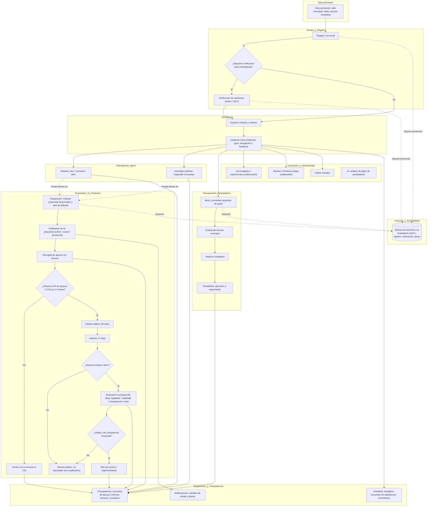

**user**: Si tuvieras que explicar paso a paso el Journey del Ciudadano basado en Decide Madrid, cómo le harías: 

[Context: Notes: Git-Obs-HA/06-Projects/_SIC-Q/Decide Madrid.md]
[Timestamp: 2025/12/08 09:30:18]

**ai**: Aquí tienes un Journey del Ciudadano, paso a paso, basado en lo documentado en [[Decide Madrid]]. Lo puedes pegar tal cual en una nota y ampliarlo según tu caso.

1) Descubrimiento
- Objetivo: Enterarse de que puede participar en decisiones de la ciudad.
- Disparadores: web municipal, redes sociales, medios, boca a boca, campañas de presupuestos participativos.
- Touchpoints: página principal de Decide Madrid (web/móvil), notas de prensa, newsletters.

2) Acceso y Registro
- Acción: Crear cuenta con email.
- Si desea votar o apoyar propuestas: verificación como residente de Madrid.
- Inclusión digital: posibilidad de hacerlo en Oficinas de Atención a la Ciudadanía (OAC) sin conexión.
- Fricciones: verificación de residencia; resolución: apoyo en OAC.

3) Orientación inicial
- Acción: Explorar módulos y normas básicas.
- Ayuda: Asistente virtual Clara para dudas, navegación y guía de procesos (texto y voz). Encuesta breve para mejorar el servicio.
- Touchpoints: icono de Clara en todas las páginas; páginas de ayuda/guías.

4) Participación ligera (entrada rápida)
- Debates (Tú Propones): leer, comentar, abrir debates para medir opinión pública.
- Consultas Públicas: responder encuestas y cuestionarios sobre temas concretos.
- Valor: baja barrera de entrada; visibilidad inmediata de opiniones agregadas.

5) Participación proactiva: Propuestas ciudadanas (Tú Propones)
5.1 Preparación
- Acción: Redactar propuesta (texto, video), revisar directrices de calidad.
- Apoyos: planear difusión (redes, asociaciones, foros de barrio, OAC).

5.2 Publicación
- Acción: Publicar la propuesta en la plataforma (o presentar por correo/en persona).
- Estado visible: ficha pública con contenido, etiquetas y estado.

5.3 Recogida de apoyos
- Ventana: 12 meses para alcanzar al menos el 1% de residentes registrados mayores de 16 años (~27 000 apoyos).
- Acción del ciudadano/autor: difundir, responder preguntas, mejorar claridad.
- Touchpoints: botón “Apoyar”, contador público de apoyos.
- Riesgo: umbral exigente; mitigar con alianzas vecinales y comunicación continua.

5.4 Debate y votación
- Si alcanza el umbral: 45 días de debate público online.
- Luego: 7 días de votación entre usuarios verificados (mayoría simple).
- Acción: el ciudadano vota a favor/en contra y puede seguir el avance.

5.5 Evaluación municipal
- Si se aprueba en votación: el Ayuntamiento evalúa en 30 días legalidad, viabilidad, competencia y coste.
- Entrega: informe técnico publicado.
- Resultado: plan de acción para implementación o explicación pública de por qué no se ejecuta.

5.6 Cierre o archivo
- Si no alcanza el 1% en 12 meses: la propuesta se archiva (visible, pero sin avance).
- Transparencia: clasificación por actividad/valoración/fecha/etiquetas.

6) Presupuestos Participativos
- Acción: Proponer proyectos de gasto, debatir y votar según campaña anual (plazos definidos publicados en la plataforma).
- Proceso: presentación → evaluación técnica municipal → votación → publicación de resultados → ejecución y seguimiento.
- Valor: resultados tangibles de inversión en barrios/ciudad.

7) Innovación y herramientas complementarias
- Comunidades y experiencias: colaborar y compartir conocimiento.
- Diseña tu Territorio: mapa colaborativo para sugerir mejoras urbanas.
- Visitas virtuales: exploración del patrimonio.
- IA: análisis de datos de participación para mejorar servicios.

8) Inclusión y accesibilidad continua
- Soporte presencial en OAC para registro, verificación, apoyo en procesos.
- Clara como canal de ayuda constante (texto/voz), con feedback de utilidad.

9) Seguimiento y transparencia
- Notificaciones: cambios de estado de propuestas, apertura de consultas, fases de presupuestos.
- Publicación de datos: recuentos de apoyos, informes técnicos, resultados de votaciones.
- Feedback: encuesta de satisfacción (Clara), comentarios en debates.

10) Momentos de valor y fricciones clave
- Valor:
  - Baja barrera para opinar (debates/consultas).
  - Resultados visibles en presupuestos participativos.
  - Transparencia en estados e informes.
  - Asistencia presencial y asistente Clara.
- Fricciones:
  - Umbral del 1% de apoyos en 12 meses es difícil.
  - Tiempos y etapas múltiples pueden desanimar.
  - Propuestas fuera de competencia municipal.
- Mitigación:
  - Guías de calidad de propuestas y plantillas.
  - Campañas y alianzas comunitarias para difusión.
  - Claridad sobre competencias desde el inicio (Clara/FAQ).
  - Calendarios visibles y recordatorios.

KPIs sugeridos por etapa
- Descubrimiento: visitas únicas a portal, CTR de campañas.
- Registro: tasa de conversión a cuenta/verificación.
- Participación ligera: tasa de respuesta en consultas, número de comentarios en debates.
- Propuestas: % propuestas que superan 10%, 50% y 100% del umbral; tiempo medio hasta alcanzar hitos; ratio de apoyo por día.
- Votación: tasa de participación, mayoría obtenida.
- Evaluación: tiempo a informe técnico; % propuestas viables.
- Presupuestos participativos: número de proyectos presentados/ganadores; ejecución presupuestaria.
- Satisfacción: NPS/CSAT de Clara y de procesos; tiempos de resolución en OAC.

Si quieres, convierto esto en una plantilla reutilizable para tus notas (con checklists por etapa y campos de métricas) o lo adapto a un caso de uso concreto. ¿Quieres que lo añada a esta nota de [[Decide Madrid]] o en una nueva?
[Timestamp: 2025/12/08 09:31:15]

**user**: HAz un código mermaid que lo explique cabalmente:
[Context: Notes: Git-Obs-HA/06-Projects/_SIC-Q/Decide Madrid.md]
[Timestamp: 2025/12/08 09:31:37]

**ai**: Aquí tienes el diagrama en Mermaid del Journey del Ciudadano basado en Decide Madrid:

[Timestamp: 2025/12/08 09:33:16]

**user**: Arregla la numeración de la tabla 
[Context: Notes: Git-Obs-HA/06-Projects/_SIC-Q/Citizens Journey.md]
[Timestamp: 2025/12/08 16:19:36]

**ai**: 
<errorChunk>Your input exceeds the context window of this model. Please adjust your input and try again.</errorChunk>
[Timestamp: 2025/12/08 16:19:48]

**user**: Arregla en markdown
[Context: Notes: cepaciqqro.com.md]
[Timestamp: 2025/12/08 17:00:43]

**ai**: 
<errorChunk>Your input exceeds the context window of this model. Please adjust your input and try again.</errorChunk>
[Timestamp: 2025/12/08 17:01:00]