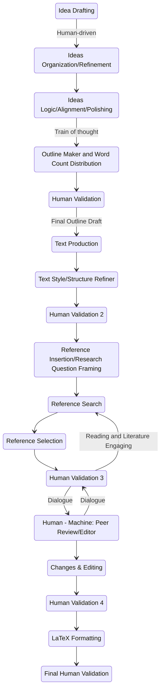

# Automated Academic Paper Generation Process

## 1. Idea Drafting (A)
- Use an AI idea generator trained on recent academic literature and trends
- Implement a topic modeling algorithm to suggest novel research directions

## 2. Ideas Organization/Refinement (B)
- Employ natural language processing (NLP) to categorize and cluster ideas
- Use a knowledge graph to establish connections between concepts

## 3. Ideas Logic/Alignment/Polishing (C)
- Implement an AI system to check logical consistency and argument strength
- Use sentiment analysis to ensure neutral, academic tone

## 4. Outline Maker and Word Count Distribution (D)
- Develop an AI-powered outline generator based on standard academic paper structures
- Use NLP to distribute word count based on section importance and topic complexity

## 5. Human Validation (E)
- Create a user-friendly interface for human experts to review and approve/modify the outline
- Implement a feedback system to improve the AI's outline generation over time

## 6. Text Production (F)
- Use advanced language models (like GPT-4 or more advanced versions) to generate initial draft text
- Implement domain-specific models trained on academic papers in the relevant field

## 7. Text Style/Structure Refiner (G)
- Develop AI tools to check and refine academic writing style, ensuring consistency and clarity
- Use automated readability indexes and style checkers

## 8. Human Validation 2 (H)
- Implement a system for human experts to review and edit the generated text
- Use diff tools to track changes and feed them back into the AI system for learning

## 9. Reference Insertion/Research Question Framing (I)
- Develop an AI system to identify areas requiring citations
- Use NLP to generate appropriate research questions based on the content

## 10. Reference Search (J)
- Implement an automated academic database search tool (integrating with Scopus, Web of Science, etc.)
- Use AI to rank search results based on relevance and impact factor

## 11. Reference Selection (K)
- Develop an AI system to select the most relevant references based on content similarity and citation impact
- Implement a plagiarism checker to ensure originality

## 12. Human Validation 3 (M)
- Create an interface for human experts to review and approve selected references
- Implement a system for experts to suggest additional references

## 13. Human - Machine: Peer Review/Editor (L)
- Develop an AI system to simulate peer review, identifying potential weaknesses or areas for improvement
- Create a collaborative interface for human-AI editing, with the AI suggesting changes and humans approving them

## 14. Changes & Editing (N)
- Implement an AI system to make suggested changes based on the peer review
- Use NLP to ensure consistency across the document after changes

## 15. Human Validation 4 (O)
- Develop a comprehensive review interface for final human checks
- Implement a checklist system to ensure all necessary elements are present and refined

## 16. LaTeX Formatting (P)
- Create an AI tool to automatically format the paper in LaTeX
- Implement journal-specific formatting rules

## 17. Final Human Validation (Q)
- Develop a final review interface with side-by-side comparisons of original and formatted versions
- Implement a submission preparation checklist

Throughout the process:
- Implement version control to track changes and allow for rollbacks if needed
- Develop a centralized dashboard to monitor the progress of multiple papers
- Implement strict data security and privacy measures to protect unpublished research
- Create an ethical AI use disclaimer to be included in the final paper

#Pre_Production 