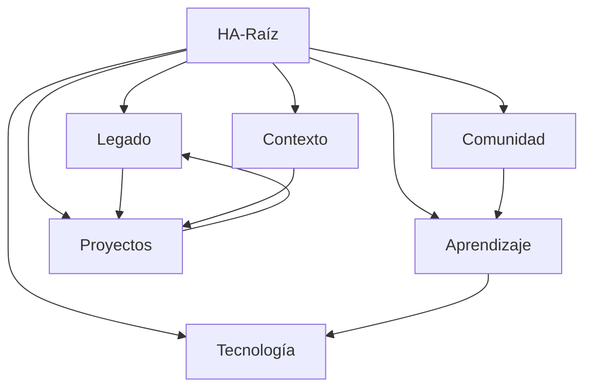

# HA-Raíz

El agente raíz coordina las 6 dimensiones y mantiene coherencia del sistema.

## Dimensiones

- [[1-Legado]] — Driver estratégico
- [[2-Comunidad]] — Habilitador social
- [[3-Aprendizaje]] — Motor evolutivo
- [[4-Tecnología]] — Infraestructura
- [[5-Contexto]] — Sensibilidad del entorno
- [[6-Proyectos]] — Ejecución

## Funciones del Agente Raíz

1. Coordinar agentes dimensionales
2. Gestionar permisos y trazabilidad
3. Asegurar alineación con el [[1-Legado]]
4. Activar escenarios desde [[5-Contexto]]
5. Orquestar [[6-Proyectos]]

## Conexiones Clave

---

*Este nodo es el punto central del grafo HA*
