## Cómo funciona Decide Madrid

### Antecedentes y Propósito

Decide Madrid es el portal de participación digital creado por el Ayuntamiento de Madrid en 2015. Según la guía ciudadana de la plataforma, su objetivo es **involucrar a la gente en la toma de decisiones y mejorar la vida de la ciudad**. El portal está abierto a todo el mundo (residentes, visitantes o personas interesadas en Madrid) y está diseñado para ser accesible desde cualquier dispositivo con conexión web. El sitio forma parte de una nueva generación de tecnologías cívicas de código abierto basadas en la plataforma **Consul**; su objetivo es aumentar la **transparencia** en la toma de decisiones municipales y ampliar la participación pública en los procesos de planificación, presupuestación y políticas.

---

### Registro y Acceso

Las personas que deseen participar deben registrarse en el portal. Para la mayoría de las actividades basta con un simple registro con una dirección de correo electrónico, mientras que algunos módulos (por ejemplo, la votación) requieren la verificación como residente de Madrid. Las **Oficinas de Atención a la Ciudadanía** de toda la ciudad ofrecen apoyo presencial a quienes no tienen acceso a Internet, garantizando que el registro y la participación puedan completarse también **sin conexión**.

---

### Secciones Principales de la Plataforma

El portal Decide Madrid está organizado en varios módulos, cada uno adaptado a una forma diferente de participación ciudadana:

- **Tú Propones** – comprende debates y propuestas ciudadanas. Permite a los participantes plantear ideas o debatir temas que consideren importantes. Los usuarios registrados pueden apoyar o comentar propuestas y unirse a debates.
    
- **Consultas Públicas** – espacios en los que el Ayuntamiento plantea preguntas específicas y recoge la opinión pública a través de encuestas y cuestionarios. La participación en esta sección influye en la toma de decisiones municipales.
    
- **Presupuestos Participativos** – un módulo de presupuestos participativos en el que los residentes deciden directamente cómo asignar una parte del presupuesto de la ciudad proponiendo y votando proyectos.
    
- **Innovación** – una colección de herramientas y proyectos que promueven la innovación urbana colaborativa. Incluye comunidades virtuales, una herramienta de mapeo "Diseña tu Territorio", visitas virtuales y otros experimentos.
    

---

### Debates y Propuestas en _Tú Propones_

La sección de debates ofrece un foro donde cualquier usuario registrado puede abrir temas, intercambiar puntos de vista y medir la opinión pública. Los debates no se traducen en acciones políticas directas, pero dan a la ciudad una idea del sentimiento público. La sección de propuestas es más formal: permite a los ciudadanos presentar ideas para nuevas leyes o iniciativas locales y buscar el apoyo de otros residentes. Nesta describe esta estructura como una de las cuatro funciones principales de Decide Madrid: propuestas y votos, debates, presupuestos participativos y consultas.

El flujo de trabajo de las propuestas es el siguiente:

1. **Presentación** – Los usuarios registrados crean una "propuesta ciudadana" en el sitio web (también pueden presentar propuestas por correo o en persona). Las propuestas pueden incluir texto y videos, y se proporcionan directrices y consejos para ayudar a los autores a preparar propuestas de calidad.
    
2. **Recogida de apoyos** – Una vez publicada, una propuesta tiene doce meses para conseguir el apoyo de otros residentes verificados. Cada persona que apoya hace clic en un botón del sitio web para indicar su respaldo. Para seguir adelante, la propuesta debe recibir el apoyo de al menos el **1 % de los residentes registrados de Madrid mayores de 16 años** (unas 27 000 personas), un umbral establecido por la legislación española.
    
3. **Debate público y votación** – Cuando se alcanza el umbral del 1 % de apoyo, se inicia un periodo de debate en línea de 45 días. Después, los usuarios verificados tienen 7 días para votar a favor o en contra de la propuesta. Una mayoría simple en esta votación permite que la propuesta siga adelante.
    
4. **Evaluación del Ayuntamiento** – Las propuestas aprobadas mediante votación pública se envían al Ayuntamiento, que dispone de 30 días para evaluar su legalidad, viabilidad, competencia y coste. El ayuntamiento publica un informe técnico con sus conclusiones y, o bien crea un plan de acción para aplicar la propuesta, o bien explica por qué no puede ejecutarse.
    
5. **Clasificación y archivo** – Las propuestas que no alcanzan el umbral del 1 % de apoyo en un plazo de doce meses se archivan. La plataforma permite clasificar las propuestas por actividad, valoración, fecha o etiquetas temáticas como "cultura", "movilidad" o "derechos sociales".
    

> El proceso subraya la **transparencia** mediante la publicación de propuestas, recuentos de apoyos e informes municipales en la plataforma. También complementa la participación digital con asistencia presencial en las oficinas ciudadanas.

---

### Consultas Públicas

El módulo de consultas públicas permite a los residentes responder a encuestas sobre políticas o proyectos específicos. El Ayuntamiento plantea preguntas y recoge ideas y opiniones; esta retroalimentación influye en la toma de decisiones. La guía señala que las consultas públicas son espacios donde se expresa la opinión sobre temas concretos. La participación aquí está abierta a todos los usuarios registrados.

### Presupuestos Participativos

En los presupuestos participativos, los residentes proponen y votan cómo debe gastarse parte del presupuesto municipal. La guía explica que los participantes pueden decidir directamente cómo se utiliza una parte del presupuesto municipal y votar los proyectos que les resulten más interesantes. La ciudad organiza campañas con plazos definidos y publica la información pertinente en la plataforma.

### Innovación y Herramientas Adicionales

La sección de Innovación alberga herramientas experimentales destinadas a fomentar la colaboración y los enfoques creativos para los problemas urbanos. Según la guía, incluye:

- **Comunidades y Experiencias:** comunidades virtuales donde la gente comparte conocimientos y colabora en proyectos, aportando ideas para mejorar Madrid.
    
- **Diseña tu Territorio:** una herramienta de mapeo colaborativo que permite a los usuarios sugerir mejoras urbanas, explorar mapas y contribuir al desarrollo de sus barrios.
    
- **Visitas Virtuales:** recorridos virtuales que permiten a los usuarios explorar los monumentos y el patrimonio cultural de la ciudad desde casa.
    
- **Inteligencia Artificial:** la IA se utiliza para analizar los datos de participación, identificar patrones y mejorar los servicios de la ciudad.
    

---

### Asistente Virtual “Clara” y Funciones de IA

Una innovación notable en Decide Madrid es **Clara**, una **asistente virtual impulsada por IA** integrada en el portal. Se accede a Clara a través de un icono en cada página. Al hacer clic, se abre una ventana de chat donde los usuarios pueden escribir o pronunciar preguntas. Clara proporciona orientación, responde a preguntas sobre la plataforma y ofrece un menú de opciones para ayudar a los usuarios a navegar por el sitio. Los usuarios pueden interactuar mediante texto o activar el reconocimiento de voz; la asistente puede solicitar acceso al micrófono y, a continuación, escuchar y responder. Después de cada interacción, Clara pregunta si la respuesta fue útil para que el sistema pueda aprender y mejorar. La asistente también incluye una breve encuesta anónima en la que se pregunta la edad, el sexo y la valoración del servicio del usuario para ayudar a perfeccionar el servicio.

---

### Tecnología Subyacente y Replicación

Decide Madrid se basa en el **software de código abierto Consul**, que ha sido adoptado por más de 70 ciudades de todo el mundo. La plataforma demuestra cómo las herramientas digitales pueden ampliar la participación cívica en la gobernanza local. Su apertura permite a otros municipios replicar o adaptar la plataforma para presupuestos participativos, consultas, propuestas y debates.

---

### Beneficios y Desafíos

#### Beneficios:

- Decide Madrid ofrece un proceso claro y sencillo para que los ciudadanos se inscriban, presenten propuestas y voten.
    
- Las oficinas de asistencia ciudadana presenciales garantizan la **inclusión digital** para quienes no tienen acceso a Internet.
    
- La plataforma proporciona al gobierno una **visión en tiempo real de la opinión pública** a través de debates y consultas.
    
- Los presupuestos participativos permiten a los residentes ver **resultados tangibles** de su participación, reforzando la confianza y el interés.
    
- La **naturaleza de código abierto de Consul** permite a otras ciudades adoptar herramientas similares y fomenta la transparencia.
    

#### Desafíos:

- El requisito legal de que una propuesta obtenga el apoyo de al menos el **1 % de los residentes registrados** (alrededor de 27 000 firmas) en un plazo de doce meses es **difícil de alcanzar**; históricamente, muy pocas propuestas cumplen este umbral.
    
- Las propuestas que no alcanzan el umbral se **archivan** sin que se tomen medidas adicionales.
    
- Incluso las propuestas que alcanzan el umbral deben superar múltiples etapas (debate público, votación y evaluación del ayuntamiento) antes de su aplicación, lo que puede **retrasar o impedir su promulgación**.
    
- Algunas propuestas pueden estar mal formuladas o quedar fuera de la jurisdicción del Ayuntamiento, lo que limita su viabilidad y conduce a su eventual rechazo.
    

---

### Conclusión

Decide Madrid ejemplifica cómo las plataformas digitales pueden ampliar la participación pública en la gobernanza municipal. Al combinar **tecnología de código abierto**, flujos de trabajo de propuestas estructurados, presupuestos participativos, consultas públicas, foros de debate y un **asistente impulsado por IA**, proporciona múltiples vías para que los residentes influyan en la política y el gasto urbano. Aunque los estrictos umbrales de apoyo y los pasos procesales pueden ralentizar la transformación de las propuestas en políticas, la plataforma ha involucrado a cientos de miles de personas y ha inspirado iniciativas similares en todo el mundo. Su continua evolución —incluyendo innovaciones como la asistente Clara— pone de relieve el potencial de combinar la tecnología cívica con la inteligencia artificial para hacer la participación más accesible y eficaz.

Aquí tienes el diagrama en Mermaid del Journey del Ciudadano basado en Decide Madrid:

```mermaid
graph LR

%% ===== 1) Descubrimiento =====
subgraph Descubrimiento
A1["Descubrimiento: web municipal, redes, prensa, campañas"]
end

%% ===== 2) Acceso y Registro =====
subgraph Acceso_y_Registro
A2["Registro con email"]
A3{"¿Requiere verificación para votar/apoyar?"}
A4["Verificación de residencia (online / OAC)"]
A2 --> A3
A3 -- "Sí" --> A4
end

%% ===== 3) Orientación =====
subgraph Orientacion
B1["Explorar módulos y normas"]
B2["Asistente Clara (chat/voz): guía, navegación y feedback"]
end

%% ===== 4) Participación ligera =====
subgraph Participacion_ligera
C1["Debates: leer / comentar / abrir"]
C2["Consultas públicas: responder encuestas"]
end

%% ===== 5) Propuestas (Tú Propones) =====
subgraph Propuestas_Tu_Propones
P1["Preparación: redactar propuesta (texto/video) y plan de difusión"]
P2["Publicación de la propuesta (online / correo / presencial)"]
P3["Recogida de apoyos (12 meses)"]
D1{"¿Alcanza ≥1% de apoyos (~27k) en 12 meses?"}
P4["Debate público (45 días)"]
P5["Votación (7 días)"]
D2{"¿Mayoría simple a favor?"}
P6["Evaluación municipal (30 días): legalidad / viabilidad / competencia / coste"]
D3{"¿Viable y de competencia municipal?"}
P7["Plan de acción e implementación"]
P8["Informe público: no ejecutable (con explicación)"]
P9["Archivo (si no alcanza el 1%)"]
end

%% ===== 6) Presupuestos Participativos =====
subgraph Presupuestos_Participativos
BPP1["Idear y presentar proyectos de gasto"]
BPP2["Evaluación técnica municipal"]
BPP3["Votación ciudadana"]
BPP4["Resultados, ejecución y seguimiento"]
end

%% ===== 7) Innovación y herramientas =====
subgraph Innovacion_y_Herramientas
I1["Comunidades y experiencias (colaboración)"]
I2["Diseña tu Territorio (mapa colaborativo)"]
I3["Visitas virtuales"]
I4["IA: análisis de datos de participación"]
end

%% ===== 8) Inclusión y accesibilidad =====
subgraph Inclusion_y_Accesibilidad
OAC[("Oficinas de Atención a la Ciudadanía (OAC): registro, verificación, apoyo")]
end

%% ===== 9) Seguimiento y transparencia =====
subgraph Seguimiento_y_Transparencia
S1["Notificaciones: cambios de estado y plazos"]
S2["Transparencia: recuentos de apoyos, informes técnicos, resultados"]
S3["Feedback ciudadano: encuestas de satisfacción, comentarios"]
end

%% Flujo principal
A1 --> A2
A3 -- "No" --> B1
A4 --> B1
B1 --> B2
B2 --> C1
B2 --> C2
B2 --> BPP1
B2 --> I1
B2 --> I2
B2 --> I3

%% Debates/Consultas pueden derivar en propuesta
C1 -. "Puede derivar en" .-> P1
C2 -. "Puede derivar en" .-> P1

%% Propuestas: flujo detallado
P1 --> P2 --> P3 --> D1
D1 -- "No" --> P9
D1 -- "Sí" --> P4 --> P5 --> D2
D2 -- "No" --> P8
D2 -- "Sí" --> P6 --> D3
D3 -- "No" --> P8
D3 -- "Sí" --> P7

%% Presupuestos participativos
BPP1 --> BPP2 --> BPP3 --> BPP4

%% Inclusión y soporte presencial
A2 -. "Soporte presencial" .-> OAC
A4 -. "Soporte presencial" .-> OAC
P1 -. "Asesoría" .-> OAC
BPP1 -. "Asesoría" .-> OAC

%% Seguimiento y transparencia (notificaciones, datos, feedback)
P2 --> S1
P3 --> S2
P6 --> S2
P7 --> S2
P9 --> S2
BPP4 --> S2
C1 --> S2
C2 --> S2
B2 --> S3
```

