```mermaid
flowchart TB
    subgraph TITULO[" "]
        direction LR
        T["🏛️ SISTEMA DE INTELIGENCIA COLECTIVA DE QUERÉTARO (SIC-Q)<br/>Cambio de Cultura Cívica y de Gobernanza"]
    end

    subgraph DISENO["1. DISEÑO"]
        D1["Integrar actores desde el inicio<br/>(legitimidad)"]
        D2["API de Consulta"]
        D3["API de Servicios Gubernamentales"]
    end

    subgraph DESCUBRIMIENTO["2. DESCUBRIMIENTO"]
        direction LR
        DESC1["📱 DIGITAL<br/>• WhatsApp<br/>• Redes sociales<br/>• Web"]
        DESC2["🏛️ ANÁLOGO<br/>• Talleres<br/>• Charlas<br/>• Encuestas presenciales"]
    end

    subgraph REGISTRO["3. REGISTRO"]
        REG_TITLE["'Conoce qué piensa colectivamente Querétaro'"]
        REG1["👁️ EXPLORA<br/>Visitante sin registro<br/>→ Conoce qué pasa"]
        REG2["✋ PARTICIPA<br/>Email / Celular / Seudónimo<br/>CURP / CP / INE o Llave MX<br/>→ Propón, vota, impulsa"]
    end

    subgraph ORIENTACION["4. ORIENTACIÓN (IA)"]
        ORI["🤖 ¿Cómo te gustaría participar?"]
        ORI1["💡 PROPONER<br/>'Tengo una idea'<br/>Crea con ayuda de IA"]
        ORI2["👍 VOTAR<br/>'Quiero opinar'<br/>Apoyar ideas que<br/>me importan"]
        ORI3["🚀 IMPULSAR<br/>'Quiero que avance'<br/>Adopta y comparte<br/>'34 votaron por mí'"]
    end

    subgraph PARTICIPACION["5. PARTICIPACIÓN"]
        PART1["Diálogo con IA<br/>Estructurar propuesta<br/>Publicar"]
        PART2["Explorar mapa<br/>Votar 👍👎<br/>Comentar"]
        PART3["Adoptar propuesta<br/>Enlace personal<br/>Compartir<br/>Ver impacto"]
        DB[("🗄️ BASE DE DATOS<br/>• Propuestas<br/>• Votos<br/>• Clusters<br/>• Usuarios")]
    end

    subgraph CONOCIMIENTO["6. BASE DE CONOCIMIENTO"]
        CON1["📄 Documentos de Planeación"]
        CON2["📊 Encuestas"]
        CON3["👥 Datos sociodemográficos QRO"]
        CON4["💾 Datos Plataforma SIC-Q"]
        CON5["📁 PDFs, reportes, históricos"]
    end

    subgraph SENSEMAKING["7. SENSE MAKING"]
        SM["🧠 Motor de Inteligencia Colectiva<br/>• Clustering semántico<br/>• Detección de consensos<br/>• Priorización emergente<br/>• Análisis de tendencias<br/>• Síntesis de propuestas"]
    end

    subgraph SICQ_HA["8. SIC-Q + HORIZONS ARCHITECTURE"]
        SICQ["📋 SIC-Q<br/>Informes de<br/>Inteligencia Colectiva"]
        HA["🔷 HA - Fractal Dimensional Taxonomy"]
        HA1["Legado"]
        HA2["Comunidad"]
        HA3["Aprendizaje"]
        HA4["Tecnología"]
        HA5["Contexto"]
        HA6["Proyectos"]
    end

    subgraph GOBIERNO["9. GOBIERNO"]
        GOB1["🏢 SECRETARÍA DE PLANEACIÓN<br/>Y PARTICIPACIÓN CIUDADANA<br/>• Recibe informes de IC<br/>• Evalúa viabilidad técnica<br/>• Implementa propuestas<br/>• Da feedback"]
        GOB2["🏛️ INSTITUTO DEL FUTURO<br/>• Órgano autónomo<br/>• Trasciende administraciones<br/>• Garantiza continuidad<br/>• Vincula IC con política pública"]
    end

    subgraph FEEDBACK["10. FEEDBACK"]
        FB["📬 FEEDBACK AL CIUDADANO<br/>'Tu propuesta fue evaluada.<br/>Esto es lo que pasó...'<br/>→ Cierre del loop<br/>→ Genera confianza"]
    end

    CICLO["🔄 CICLO VIRTUOSO<br/>Confianza → Más participación"]

    %% Conexiones principales
    TITULO --> DISENO
    DISENO --> DESCUBRIMIENTO
    DESCUBRIMIENTO --> REGISTRO
    REG_TITLE --> REG1
    REG_TITLE --> REG2
    REG2 --> ORIENTACION
    ORI --> ORI1
    ORI --> ORI2
    ORI --> ORI3
    ORI1 --> PART1
    ORI2 --> PART2
    ORI3 --> PART3
    PART1 --> DB
    PART2 --> DB
    PART3 --> DB
    DB --> CONOCIMIENTO
    CONOCIMIENTO --> SENSEMAKING
    SENSEMAKING --> SICQ_HA
    SICQ --> HA
    HA --> HA1
    HA --> HA2
    HA --> HA3
    HA --> HA4
    HA --> HA5
    HA --> HA6
    SICQ_HA --> GOB1
    SICQ_HA --> GOB2
    GOB1 --> FB
    GOB2 --> FB
    FB --> CICLO
    CICLO -.->|"Regresa a participar"| REGISTRO

    %% Estilos
    style TITULO fill:#1a365d,color:#fff,stroke:#2c5282,stroke-width:3px
    style T fill:#1a365d,color:#fff
    
    style DISENO fill:#e2e8f0,stroke:#4a5568,stroke-width:2px
    style DESCUBRIMIENTO fill:#e2e8f0,stroke:#4a5568,stroke-width:2px
    style REGISTRO fill:#ebf8ff,stroke:#3182ce,stroke-width:2px
    style ORIENTACION fill:#faf5ff,stroke:#805ad5,stroke-width:2px
    style PARTICIPACION fill:#f0fff4,stroke:#38a169,stroke-width:2px
    style CONOCIMIENTO fill:#fffaf0,stroke:#dd6b20,stroke-width:2px
    style SENSEMAKING fill:#fff5f5,stroke:#e53e3e,stroke-width:2px
    style SICQ_HA fill:#e6fffa,stroke:#319795,stroke-width:2px
    style GOBIERNO fill:#faf5ff,stroke:#805ad5,stroke-width:2px
    style FEEDBACK fill:#f0fff4,stroke:#38a169,stroke-width:2px

    style REG1 fill:#bee3f8,color:#1a365d,stroke:#3182ce
    style REG2 fill:#3182ce,color:#fff,stroke:#2c5282
    style ORI fill:#805ad5,color:#fff,stroke:#6b46c1
    style ORI1 fill:#faf089,color:#744210,stroke:#d69e2e
    style ORI2 fill:#9ae6b4,color:#22543d,stroke:#38a169
    style ORI3 fill:#feb2b2,color:#742a2a,stroke:#e53e3e
    style DB fill:#4a5568,color:#fff,stroke:#2d3748
    style SM fill:#fc8181,color:#fff,stroke:#e53e3e
    style SICQ fill:#4fd1c5,color:#234e52,stroke:#319795
    style HA fill:#319795,color:#fff,stroke:#285e61
    style GOB1 fill:#b794f4,color:#44337a,stroke:#805ad5
    style GOB2 fill:#805ad5,color:#fff,stroke:#6b46c1
    style FB fill:#68d391,color:#22543d,stroke:#38a169
    style CICLO fill:#38a169,color:#fff,stroke:#276749
```

══════════════════════════════════════════════════════════════════════════════════════════════════════
                                                                                                      
                        SISTEMA DE INTELIGENCIA COLECTIVA DE QUERÉTARO (SIC-Q)                       
                                                                                                      
                              Cambio de Cultura Cívica y de Gobernanza                                
                                                                                                      
══════════════════════════════════════════════════════════════════════════════════════════════════════

┌─────────────────────────────────────────────────────────────────────────────────────────────────────┐
│                                                                                                     │
│   FASE 1: DISEÑO                                                                                    │
│                                                                                                     │
│   • Necesitamos integrar a todos los actores desde el principio (diseño) (legitimidad)             │
│   • API de Consulta                                                                                 │
│   • API de [servicios gubernamentales]                                                              │
│                                                                                                     │
└─────────────────────────────────────────────────────────────────────────────────────────────────────┘
        │
        │
        ▼
┌─────────────────────────────────────────────────────────────────────────────────────────────────────┐
│                                                                                                     │
│   FASE 2: DESCUBRIMIENTO                                                                            │
│                                                                                                     │
│   ┌─────────────────────────────────┐    ┌─────────────────────────────────┐                        │
│   │ 📱 DIGITAL                      │    │ 🏛️ ANÁLOGO                       │                        │
│   │                                 │    │                                 │                        │
│   │ • WhatsApp                      │    │ • Talleres                      │                        │
│   │ • Redes sociales                │    │ • Charlas                       │                        │
│   │ • etc.                          │    │ • Encuestas presenciales        │                        │
│   │                                 │    │ • etc.                          │                        │
│   └─────────────────────────────────┘    └─────────────────────────────────┘                        │
│                                                                                                     │
│   "¿Cómo se enteran los ciudadanos de que existe la plataforma?"                                   │
│                                                                                                     │
└─────────────────────────────────────────────────────────────────────────────────────────────────────┘
        │
        │
        ▼
┌─────────────────────────────────────────────────────────────────────────────────────────────────────┐
│                                                                                                     │
│   FASE 3: REGISTRO                                                                                  │
│                                                                                                     │
│   ╔═══════════════════════════════════════════════════════════════════════════════════════════╗     │
│   ║                                                                                           ║     │
│   ║                    "Conoce qué piensa colectivamente Querétaro"                          ║     │
│   ║                                                                                           ║     │
│   ╚═══════════════════════════════════════════════════════════════════════════════════════════╝     │
│                                                                                                     │
│   ┌───────────────────────────────────────────────────────────────────────────────────────────┐     │
│   │                                                                                           │     │
│   │   [ ] EXPLORA        (Visitante sin registro)                                             │     │
│   │                       → Conoce qué pasa                                                   │     │
│   │                       → Ve el mapa de ideas                                               │     │
│   │                                                                                           │     │
│   │   [ ] PARTICIPA      (Email / Número de celular / Seudónimo asignado /                   │     │
│   │                       Contraseña / Google, etc.)                                          │     │
│   │                       (CURP / CP)                                                         │     │
│   │                       → Propón, vota, decide                                              │     │
│   │                                                                                           │     │
│   └───────────────────────────────────────────────────────────────────────────────────────────┘     │
│                                                                                                     │
│          ┌─────────────────────────────────────────────┐                                            │
│          │  Sistema de Inteligencia Colectiva QRO     │                                            │
│          │                                             │                                            │
│          │   ┌─────────┐  ┌───────────┐               │                                            │
│          │   │ Explora │  │ Participa │               │                                            │
│          │   ├─────────┤  ├───────────┤               │                                            │
│          │   │ Conoce  │  │ Propón    │               │                                            │
│          │   │ qué     │  │ Vota      │               │                                            │
│          │   │ pasa    │  │ Decide    │               │                                            │
│          │   └─────────┘  └───────────┘               │                                            │
│          │                                             │                                            │
│          └─────────────────────────────────────────────┘                                            │
│                                                                                                     │
└─────────────────────────────────────────────────────────────────────────────────────────────────────┘
        │
        │
        ▼
┌─────────────────────────────────────────────────────────────────────────────────────────────────────┐
│                                                                                                     │
│   FASE 4: ORIENTACIÓN (IA)                                                                          │
│                                                                                                     │
│   🤖 "¿Cómo te gustaría participar?"                                                                │
│                                                                                                     │
│   ┌─────────────────────┐  ┌─────────────────────┐  ┌─────────────────────────────────────────┐     │
│   │                     │  │                     │  │                                         │     │
│   │  💡 PROPONER        │  │  👍 VOTAR           │  │  🚀 IMPULSAR                            │     │
│   │                     │  │                     │  │                                         │     │
│   │  "Tengo una idea"   │  │  "Consultas,        │  │  "Adopta una propuesta que te          │     │
│   │                     │  │   priorización,     │  │   importa y ayúdala a avanzar"         │     │
│   │  Crea una idea con  │  │   apoyar ideas      │  │                                         │     │
│   │  ayuda de IA        │  │   que me importan"  │  │  "34 personas votaron por mí"          │     │
│   │                     │  │                     │  │                                         │     │
│   │  Ver mapa de ideas  │  │                     │  │                                         │     │
│   │  y apoyar           │  │                     │  │                                         │     │
│   │                     │  │                     │  │                                         │     │
│   └─────────────────────┘  └─────────────────────┘  └─────────────────────────────────────────┘     │
│                                                                                                     │
└─────────────────────────────────────────────────────────────────────────────────────────────────────┘
        │
        │
        ▼
┌─────────────────────────────────────────────────────────────────────────────────────────────────────┐
│                                                                                                     │
│   FASE 5: PARTICIPACIÓN                                                                             │
│                                                                                                     │
│   ┌─────────────────────────────────────────────────────────────────────────────────────────────┐   │
│   │                                                                                             │   │
│   │                              PLATAFORMA DE PARTICIPACIÓN                                    │   │
│   │                                                                                             │   │
│   │   ┌───────────────┐     ┌───────────────┐     ┌───────────────────────────────────────┐    │   │
│   │   │               │     │               │     │                                       │    │   │
│   │   │   PROPONER    │     │    VOTAR      │     │              IMPULSAR                 │    │   │
│   │   │               │     │               │     │                                       │    │   │
│   │   │  • Diálogo IA │     │  • Explorar   │     │  • Adoptar propuesta                  │    │   │
│   │   │  • Estructurar│     │    mapa       │     │  • Enlace personal                    │    │   │
│   │   │  • Publicar   │     │  • Votar 👍👎 │     │  • Compartir                          │    │   │
│   │   │               │     │  • Comentar   │     │  • Ver impacto                        │    │   │
│   │   │               │     │               │     │                                       │    │   │
│   │   └───────┬───────┘     └───────┬───────┘     └───────────────────┬───────────────────┘    │   │
│   │           │                     │                                 │                        │   │
│   │           └─────────────────────┴─────────────────────────────────┘                        │   │
│   │                                         │                                                  │   │
│   │                                         ▼                                                  │   │
│   │                            ┌─────────────────────────┐                                     │   │
│   │                            │                         │                                     │   │
│   │                            │     BASE DE DATOS       │                                     │   │
│   │                            │                         │                                     │   │
│   │                            │  • Propuestas           │                                     │   │
│   │                            │  • Votos                │                                     │   │
│   │                            │  • Clusters             │                                     │   │
│   │                            │  • Usuarios             │                                     │   │
│   │                            │                         │                                     │   │
│   │                            └─────────────────────────┘                                     │   │
│   │                                                                                             │   │
│   └─────────────────────────────────────────────────────────────────────────────────────────────┘   │
│                                                                                                     │
└─────────────────────────────────────────────────────────────────────────────────────────────────────┘
        │
        │
        ▼
┌─────────────────────────────────────────────────────────────────────────────────────────────────────┐
│                                                                                                     │
│   FASE 6: BASE DE CONOCIMIENTO                                                                      │
│                                                                                                     │
│   ┌─────────────────────────────────────────────────────────────────────────────────────────────┐   │
│   │                                                                                             │   │
│   │   → Documentos de Planeación                                                                │   │
│   │   → Encuestas                                                                               │   │
│   │   → Datos sociodemográficos de QRO                                                          │   │
│   │   → Datos Plataforma SIC-Q                                                                  │   │
│   │   → PDFs, reportes, históricos                                                              │   │
│   │                                                                                             │   │
│   └─────────────────────────────────────────────────────────────────────────────────────────────┘   │
│                                                                                                     │
└─────────────────────────────────────────────────────────────────────────────────────────────────────┘
        │
        │
        ▼
┌─────────────────────────────────────────────────────────────────────────────────────────────────────┐
│                                                                                                     │
│   FASE 7: SENSE MAKING (Motor de Inteligencia Colectiva)                                           │
│                                                                                                     │
│   ┌─────────────────────────────────────────────────────────────────────────────────────────────┐   │
│   │                                                                                             │   │
│   │                           ┌─────────────────────────────────┐                               │   │
│   │                           │                                 │                               │   │
│   │                           │        SENSE MAKING             │                               │   │
│   │                           │                                 │                               │   │
│   │                           │   • Clustering semántico        │                               │   │
│   │                           │   • Detección de consensos      │                               │   │
│   │                           │   • Priorización emergente      │                               │   │
│   │                           │   • Análisis de tendencias      │                               │   │
│   │                           │   • Síntesis de propuestas      │                               │   │
│   │                           │                                 │                               │   │
│   │                           └─────────────────────────────────┘                               │   │
│   │                                                                                             │   │
│   └─────────────────────────────────────────────────────────────────────────────────────────────┘   │
│                                                                                                     │
└─────────────────────────────────────────────────────────────────────────────────────────────────────┘
        │
        │
        ▼
┌─────────────────────────────────────────────────────────────────────────────────────────────────────┐
│                                                                                                     │
│   FASE 8: SIC-Q + HORIZONS ARCHITECTURE (HA)                                                       │
│                                                                                                     │
│   ┌─────────────────────────────────────────────────────────────────────────────────────────────┐   │
│   │                                                                                             │   │
│   │                                         ┌──────────────────────────────────────────┐        │   │
│   │                                         │                                          │        │   │
│   │   ┌───────────────────┐                 │              HA                          │        │   │
│   │   │                   │                 │    Fractal Dimensional Taxonomy          │        │   │
│   │   │      SIC-Q        │────────────────▶│                                          │        │   │
│   │   │                   │                 │    ┌────────┐  ┌───────────┐             │        │   │
│   │   │   Informes de     │                 │    │ Legado │  │ Comunidad │             │        │   │
│   │   │   Inteligencia    │                 │    └────────┘  └───────────┘             │        │   │
│   │   │   Colectiva       │                 │    ┌────────────┐  ┌────────────┐        │        │   │
│   │   │                   │                 │    │ Aprendizaje│  │ Tecnología │        │        │   │
│   │   └───────────────────┘                 │    └────────────┘  └────────────┘        │        │   │
│   │                                         │    ┌──────────┐  ┌───────────┐           │        │   │
│   │                                         │    │ Contexto │  │ Proyectos │           │        │   │
│   │                                         │    └──────────┘  └───────────┘           │        │   │
│   │                                         │                                          │        │   │
│   │                                         └──────────────────────────────────────────┘        │   │
│   │                                                                                             │   │
│   └─────────────────────────────────────────────────────────────────────────────────────────────┘   │
│                                                                                                     │
└─────────────────────────────────────────────────────────────────────────────────────────────────────┘
        │
        │
        ├───────────────────────────────────────────────┐
        │                                               │
        ▼                                               ▼
┌───────────────────────────────────┐   ┌───────────────────────────────────────────────────────────┐
│                                   │   │                                                           │
│   SECRETARÍA DE PLANEACIÓN        │   │   INSTITUTO DEL FUTURO                                    │
│   Y PARTICIPACIÓN CIUDADANA       │   │                                                           │
│                                   │   │   • Órgano autónomo                                       │
│   • Recibe informes de IC         │   │   • Trasciende administraciones                          │
│   • Evalúa viabilidad técnica     │   │   • Garantiza continuidad                                │
│   • Implementa propuestas         │   │   • Vincula IC con política pública                      │
│   • Da feedback a ciudadanos      │   │                                                           │
│                                   │   │                                                           │
└───────────────────────────────────┘   └───────────────────────────────────────────────────────────┘
        │                                               │
        │                                               │
        └───────────────────┬───────────────────────────┘
                            │
                            │
                            ▼
                ┌───────────────────────────┐
                │                           │
                │   FEEDBACK AL CIUDADANO   │
                │                           │
                │   "Tu propuesta fue       │
                │    evaluada. Esto es      │
                │    lo que pasó..."        │
                │                           │
                │   → Cierre del loop       │
                │   → Genera confianza      │
                │   → Motiva participación  │
                │                           │
                └───────────────────────────┘
                            │
                            │
                            ▼
                    REGRESA A PARTICIPAR
                    (Ciclo virtuoso)

══════════════════════════════════════════════════════════════════════════════════════════════════════
                                      RESUMEN DE FASES
══════════════════════════════════════════════════════════════════════════════════════════════════════

┌──────────────────────────────────────────────────────────────────────────────────────────────────────┐
│                                                                                                      │
│   FASE              QUÉ PASA                                      ACTORES                           │
│                                                                                                      │
│   1. Diseño         Integrar actores, definir APIs                Gobierno + Sociedad civil         │
│                                                                                                      │
│   2. Descubrimiento Difusión digital y análoga                    Marketing + Comunidad             │
│                                                                                                      │
│   3. Registro       Explora (sin cuenta) o Participa (verificado) Ciudadano                         │
│                                                                                                      │
│   4. Orientación    IA pregunta: ¿Proponer, Votar, Impulsar?      Ciudadano + IA                    │
│                                                                                                      │
│   5. Participación  Interacción activa en la plataforma           Ciudadano                         │
│                                                                                                      │
│   6. Base de        Datos de planeación + sociodemográficos       Sistema                           │
│      Conocimiento   + datos de la plataforma                                                        │
│                                                                                                      │
│   7. Sense Making   Clustering, consensos, priorización           Motor de IC (IA)                  │
│                                                                                                      │
│   8. SIC-Q + HA     Análisis multidimensional con framework HA    Sistema + Analistas               │
│                                                                                                      │
│   9. Gobierno       Recibe informes, evalúa, implementa           Secretaría + Instituto            │
│                                                                                                      │
│   10. Feedback      Cierra el loop con el ciudadano               Sistema → Ciudadano               │
│                                                                                                      │
└──────────────────────────────────────────────────────────────────────────────────────────────────────┘

══════════════════════════════════════════════════════════════════════════════════════════════════════
                                    FLUJO SIMPLIFICADO
══════════════════════════════════════════════════════════════════════════════════════════════════════

    CIUDADANO                           PLATAFORMA                              GOBIERNO
        │                                   │                                       │
        │   Se entera (digital/análogo)     │                                       │
        │ ─────────────────────────────────▶│                                       │
        │                                   │                                       │
        │   Explora o Participa             │                                       │
        │ ─────────────────────────────────▶│                                       │
        │                                   │                                       │
        │   Propone / Vota / Impulsa        │                                       │
        │ ─────────────────────────────────▶│                                       │
        │                                   │                                       │
        │                                   │   Sense Making + HA                   │
        │                                   │ ─────────────────────────────────────▶│
        │                                   │                                       │
        │                                   │   Informes de IC                      │
        │                                   │ ─────────────────────────────────────▶│
        │                                   │                                       │
        │                                   │                    Evalúa + Decide    │
        │                                   │◀─ ─ ─ ─ ─ ─ ─ ─ ─ ─ ─ ─ ─ ─ ─ ─ ─ ─ ─│
        │                                   │                                       │
        │   Feedback: "Esto pasó con tu idea"                                       │
        │◀──────────────────────────────────│                                       │
        │                                   │                                       │
        │                                   │                                       │
        └───────────────────────────────────┴───────────────────────────────────────┘
                            │
                            │
                            ▼
                    CICLO VIRTUOSO
              (Confianza → Más participación)

══════════════════════════════════════════════════════════════════════════════════════════════════════
                                          FIN
══════════════════════════════════════════════════════════════════════════════════════════════════════